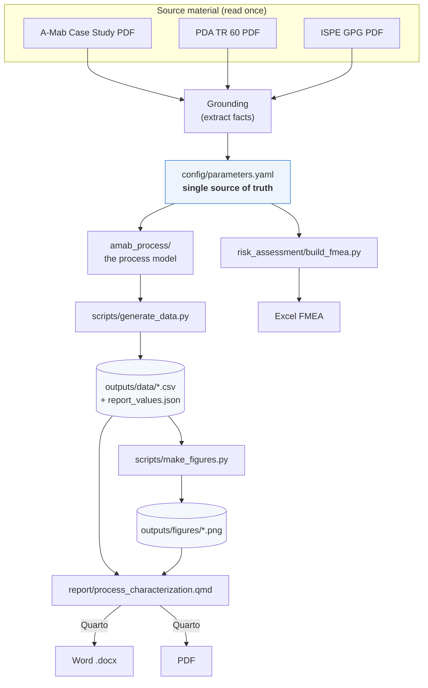
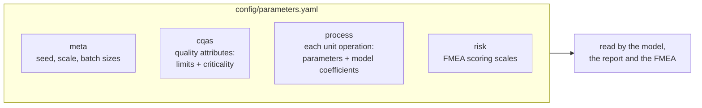
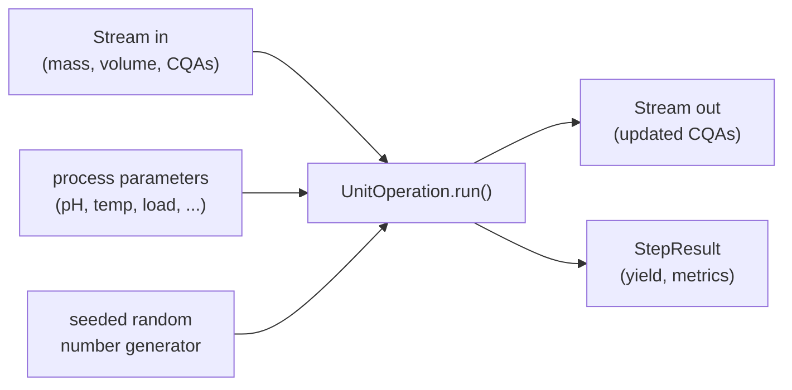
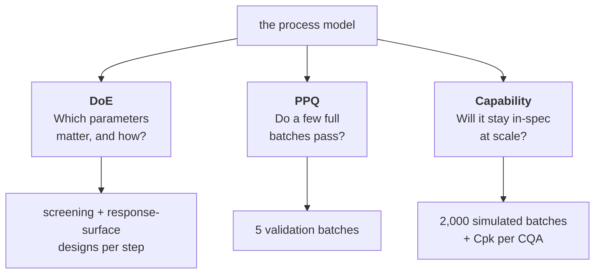
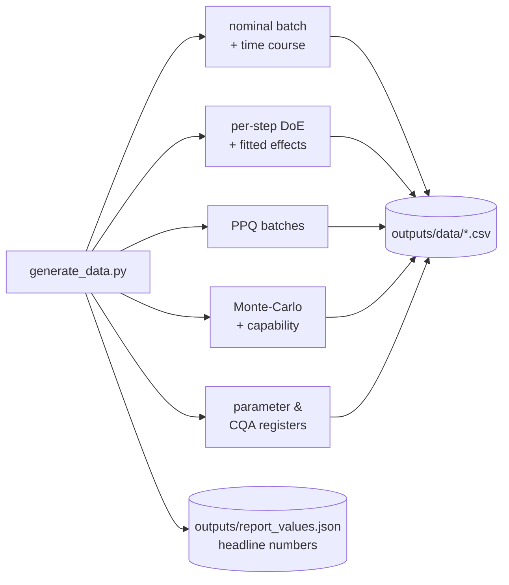
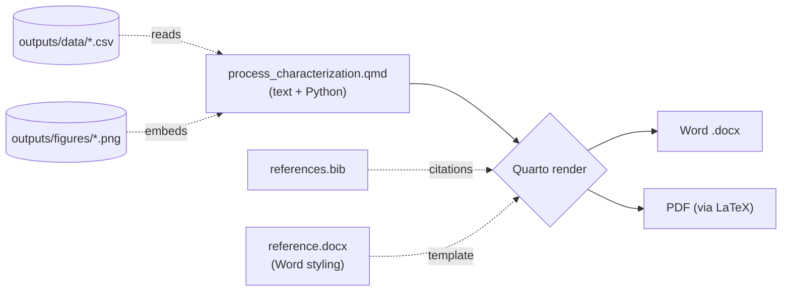
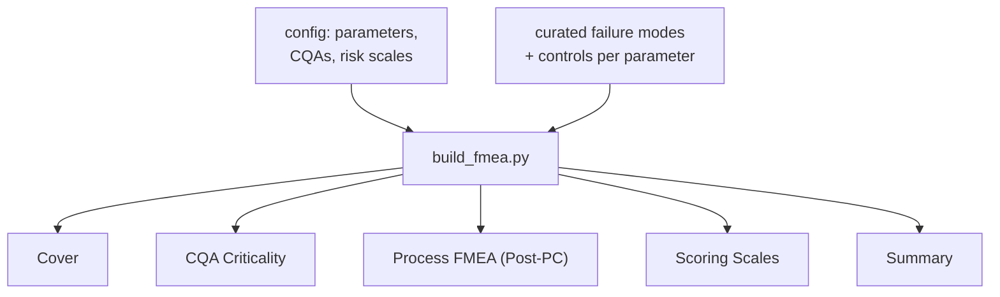
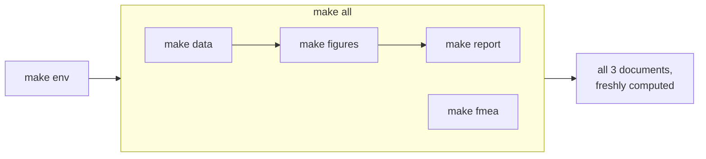
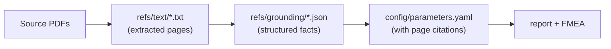
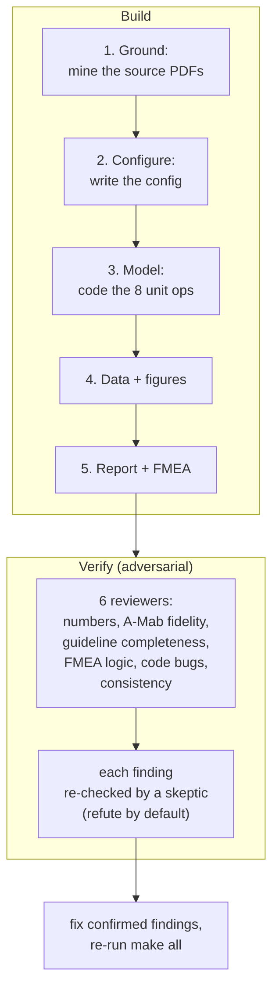

# A-Mab Process Characterization — How It All Works

This guide explains the whole project in plain language: what it produces, how the
pieces fit together, and how to reproduce or change anything. No prior knowledge of the
code is assumed.

**Contents**

1. [What this project does](#1-what-this-project-does)
2. [The big picture](#2-the-big-picture)
3. [The single source of truth: the config](#3-the-single-source-of-truth-the-config)
4. [The process model](#4-the-process-model)
5. [The studies engine (DoE, PPQ, Monte-Carlo)](#5-the-studies-engine-doe-ppq-monte-carlo)
6. [Generating the data](#6-generating-the-data)
7. [Making the figures](#7-making-the-figures)
8. [Building the report (Word + PDF)](#8-building-the-report-word--pdf)
9. [Building the risk assessment (Excel FMEA)](#9-building-the-risk-assessment-excel-fmea)
10. [How to reproduce everything](#10-how-to-reproduce-everything)
11. [How to change things (common tasks)](#11-how-to-change-things-common-tasks)
12. [Where the numbers come from (traceability)](#12-where-the-numbers-come-from-traceability)
13. [How this project was built and verified](#13-how-this-project-was-built-and-verified)
14. [Directory map](#14-directory-map)

---

## 1. What this project does

It produces three documents about the manufacturing process for **A-Mab**, a (fictional,
industry-standard case-study) monoclonal-antibody drug:

| Document | File | What it is |
|---|---|---|
| **PC Report (Word)** | `report/process_characterization.docx` | A ~26-page process characterization report |
| **PC Report (PDF)** | `report/process_characterization.pdf` | The same report as a PDF |
| **Risk Assessment (Excel)** | `risk_assessment/A-Mab_Post-PC_Process_Risk_Assessment.xlsx` | A post-characterization FMEA workbook |

The key idea: **every number, table and figure in those documents is *calculated* by a
computer model, not typed by hand.** A small Python model simulates each step of the
manufacturing process, generates data, draws the charts, and Quarto/openpyxl assemble the
documents. So you can regenerate the entire set from scratch with **one command**
(`make all`), and if you change a model assumption, the documents update automatically.

Think of it like a spreadsheet where the cells are formulas: change an input, and every
dependent result recomputes.

---

## 2. The big picture

Everything flows in one direction: source facts → configuration → model → data → documents.



The one command that runs this whole chain is `make all`. Each arrow is a script that
reads its inputs and writes its outputs — nothing is manual.

**Why a "single source of truth"?** All the real numbers (set-points, ranges, quality
limits, model coefficients) live in **one file**: `config/parameters.yaml`. The model, the
report and the FMEA all read from it, so they can never disagree with each other.

---

## 3. The single source of truth: the config

`config/parameters.yaml` holds every number the project uses. It has four parts:



- **`meta`** — global settings, including the **random seed** (`20240724`). The seed makes
  everything reproducible: same seed → identical results every run.
- **`cqas`** — the **Critical Quality Attributes** (the things that must be right about the
  drug: glycosylation, aggregates, host-cell protein, viral clearance, etc.), each with its
  acceptance range and how critical it is.
- **`process`** — one block per manufacturing step. Each lists its **process parameters**
  (e.g., pH, temperature) with set-point, normal operating range (NOR), proven acceptable
  range (PAR) and classification, plus the **coefficients** the model uses to turn those
  parameters into quality outcomes.
- **`risk`** — the Severity / Occurrence / Detection scoring scales for the FMEA.

> **Jargon:** *NOR* = the tight range you run at day-to-day. *PAR* = the wider range proven
> safe by experiments. *CQA* = a quality attribute that matters to the patient. *CPP* = a
> parameter that must be controlled because it affects a CQA.

---

## 4. The process model

The model lives in `amab_process/` and simulates the drug-substance process — the eight
steps that turn cells into purified antibody.

### 4a. The process train


Each step takes in a batch of material, changes it, and passes it on — exactly like the
real factory. The bioreactor *creates* the antibody and sets its quality; the later steps
*purify* it (removing impurities, inactivating/removing viruses).

### 4b. How material moves between steps

A batch of material is represented by a **`Stream`** object: how much antibody (grams), how
much liquid (litres), and a dictionary of quality-attribute values. Each step is a
**`UnitOperation`** that takes a `Stream` in and returns a new `Stream` out, plus a
**`StepResult`** recording what happened (yield, metrics).



The `Process` class (in `process.py`) simply chains the eight operations together: the
output of one becomes the input of the next.

### 4c. How a step turns parameters into quality

Two kinds of math are used ("semi-mechanistic hybrid"):

- **The bioreactor** uses **growth equations** (cells multiply, then die; antibody
  accumulates over ~17 days) for the time-course, and a **response-surface model** for
  quality. A response-surface model is just a formula: *quality = baseline + (effect of pH)
  + (effect of temperature) + (interactions) + ...*. The coefficients come straight from the
  A-Mab case study (its Table 3.16).
- **The purification steps** use **mass balances** (how much product is kept = yield) and
  **clearance factors** (how many-fold an impurity is reduced, or how many logs of virus are
  removed), again modulated by the step's parameters.

Example — the Protein A step's host-cell-protein (HCP) output:

```
HCP_out = baseline × exp( a·(coded load) + b·(coded elution pH) ) × random noise
```

Higher load and lower elution pH → more HCP, matching the real case study. The "coded"
values map a parameter's range to −1…+1 so the set-point sits at 0.

Each unit operation is one small file in `amab_process/unit_ops/`:

| File | Step | What it models |
|---|---|---|
| `bioreactor.py` | 3 | growth/titer + glycans, aggregate, charge variants, HCP/DNA load |
| `harvest.py` | 4 | clarification yield (no quality change) |
| `protein_a.py` | 5 | capture yield, HCP set, DNA cleared, leached Protein A added |
| `viral_inactivation.py` | 6 | XMuLV log-reduction + aggregate rise with time |
| `cex.py` | 7 | aggregate polish + HCP reduction |
| `aex.py` | 8 | HCP removal + XMuLV/MVM clearance |
| `virus_filtration.py` | 9 | MVM/XMuLV size-based removal |
| `ufdf.py` | 10 | concentrate to final drug-substance strength |

---

## 5. The studies engine (DoE, PPQ, Monte-Carlo)

`studies.py` uses the model to run the kinds of studies a real characterization needs. It
answers three questions:



- **DoE (Design of Experiments)** — instead of changing one parameter at a time, DoE changes
  several together in a planned pattern, so you can see effects *and* interactions. The code
  builds a **screening design** (a quick two-level pattern) and a **response-surface design**
  (a central-composite pattern that also captures curvature), runs each recipe through the
  step's model, and fits a statistical model to measure each parameter's **effect**.
- **PPQ** — runs a handful of complete batches at realistic operating conditions to show the
  whole process makes in-spec drug substance.
- **Monte-Carlo capability** — runs thousands of batches with parameters randomly wiggled
  within their normal ranges, then computes **Cpk** (a standard "how comfortably in-spec"
  score) for each quality attribute.

> **Why seeded randomness?** Every study draws random numbers from a generator seeded off the
> master seed. Same seed → identical "random" batches → identical results, every time.

---

## 6. Generating the data

`scripts/generate_data.py` is the conductor: it calls the model and the studies engine and
writes every dataset the documents need.



It produces **27 CSV files** plus a small `report_values.json` of headline numbers (overall
yield, minimum Cpk, viral-clearance totals, parameter counts). The report reads those
headline numbers directly, so the prose always matches the data.

**The CSV files, grouped:**

| Group | Files | Contents |
|---|---|---|
| Nominal run | `nominal_timecourse.csv`, `process_summary.csv`, `yield_waterfall.csv` | one set-point batch + per-step yields |
| DoE data | `doe_<step>_screening.csv`, `doe_<step>_rsm.csv` (6 steps) | the experimental runs |
| DoE effects | `effects_<step>.csv` (6 steps) | fitted parameter effects + p-values |
| Validation | `ppq_batches.csv` | 5 PPQ batches |
| Capability | `monte_carlo.csv`, `capability.csv` | 2,000 batches + Cpk table |
| Registers | `parameter_classification.csv`, `cqa_register.csv`, `viral_clearance.csv` | reference tables |

---

## 7. Making the figures

`scripts/make_figures.py` reads the CSVs and draws **13 charts** into `outputs/figures/`.
All charts share one accessible, colour-blind-safe palette defined in `amab_process/viz.py`.

The design-space and response-surface charts are drawn by **fitting a smooth model to the
DoE data and predicting over a grid** — the standard way these are shown in industry — then
overlaying the acceptance limits, the normal operating range and the set-point.

Figures include: the process flow diagram, the bioreactor time-course, DoE effect Paretos,
the bioreactor design space, per-step response surfaces (Protein A, CEX, AEX, viral steps),
the viral-clearance summary, the process-capability histograms, and the yield waterfall.

---

## 8. Building the report (Word + PDF)

The report is a **Quarto** document: `report/process_characterization.qmd`. Quarto is a tool
that mixes narrative text with live code. When it renders, it runs the Python code inside the
document, which loads the CSVs and prints tables and numbers — then Quarto turns the result
into **both Word and PDF** from the same source.



- The Python inside the `.qmd` reads the data and renders tables as it goes, so **you never
  copy-paste numbers**.
- The report's structure follows the industry guidelines (PDA TR 60 §3.11 and the ISPE
  Good Practice Guide): purpose/scope, product background, CQAs, risk strategy, scale-down
  models, per-step characterization, parameter classification, capability, control strategy,
  conclusions.
- `references.bib` supplies the citations (ICH, PDA, ISPE, FDA); `reference.docx` controls the
  Word look.

---

## 9. Building the risk assessment (Excel FMEA)

`risk_assessment/build_fmea.py` reads the config and writes a formatted Excel workbook with
five sheets. **FMEA** = Failure Mode and Effects Analysis: for each parameter, "what could go
wrong, how bad, how likely, how detectable?"



The core sheet scores each parameter:

```
RPN = Severity × Occurrence × Detection
```

and applies the case-study rule: **a parameter is a Critical Process Parameter (CPP) if
Severity ≥ 8 OR the initial RPN > 72.** The workbook shows the RPN **before** characterization
and **after** the control strategy is in place — making the risk reduction visible (the
median RPN drops from ~336 to ~48). Cells are colour-coded (red/amber/green) and the CPP
column, designation and residual-risk band are all kept consistent by construction.

---

## 10. How to reproduce everything

Everything is driven by the `Makefile`. From the repo root:

```bash
make env       # one time: install Python dependencies
make all       # rebuild data → figures → report (Word+PDF) → FMEA
```



Individual targets: `make data`, `make figures`, `make report`, `make fmea`, `make test`,
`make clean`. A full clean rebuild takes about **20 seconds**.

**Requirements:** Python 3.11+, Quarto (with a LaTeX engine for PDF). See `requirements.txt`.

Because of the fixed seed, `make clean && make all` reproduces byte-identical data every
time.

---

## 11. How to change things (common tasks)

Almost every change is a one-line edit to `config/parameters.yaml`, then `make all`.

| You want to… | Do this |
|---|---|
| Change a set-point or a range | Edit that parameter in `config/parameters.yaml` → `make all` |
| Change a quality limit | Edit the CQA's `acceptance` in `config/parameters.yaml` → `make all` |
| Make the process more/less robust | Adjust the model coefficients or `noise_cv` in the config → `make all` |
| Change how strongly a parameter affects a CQA | Edit that step's model coefficients in the config → `make all` |
| Reword the report | Edit `report/process_characterization.qmd` → `make report` |
| Change FMEA failure modes / controls | Edit the `CONTENT` map in `risk_assessment/build_fmea.py` → `make fmea` |
| Change the chart look | Edit the palette/style in `amab_process/viz.py` → `make figures` |
| Use a different random seed | Change `meta.seed` in the config → `make all` |

After any change, run `make test` (8 checks: reproducibility, mass balance, in-spec at
set-point, viral-clearance margin, capability, and correct effect directions).

> **One gotcha:** in the YAML, scientific notation needs a signed exponent — write `2.0e+5`,
> not `2.0e5` (the parser reads the latter as text).

---

## 12. Where the numbers come from (traceability)

Nothing is invented. Each number traces back to the A-Mab case study or the guidelines:



- `refs/text/` — the source PDFs extracted to searchable text (regenerate with
  `python scripts/extract_sources.py`).
- `refs/grounding/` — the facts pulled from those texts (process parameters, quality limits,
  risk scales, report structure), saved as JSON.
- `config/parameters.yaml` — carries those values with inline page citations (e.g., the
  bioreactor response-surface coefficients are the case study's Table 3.16).

So to check any number, follow it back: document → config → grounding JSON → source page.

---

## 13. How this project was built and verified

The project was built in stages, and the finished documents were checked by an **adversarial
verification pass** — independent reviewers that try to find and disprove errors.



The verification found and fixed real issues (for example, a chart that plotted a variable
the underlying model didn't actually depend on, and a quality range that used the
experimental span instead of the proven range) and correctly dismissed false alarms. The
test suite (`make test`) guards against regressions.

---

## 14. Directory map

```
synthetic_data/
├── config/
│   └── parameters.yaml          ← single source of truth (all numbers)
├── amab_process/                ← the process model (Python package)
│   ├── core.py                  ← Stream, StepResult, response-surface helpers
│   ├── config.py                ← loads parameters.yaml
│   ├── doe.py                   ← experimental designs
│   ├── process.py               ← chains the 8 steps into a batch
│   ├── studies.py               ← DoE, PPQ, Monte-Carlo, capability
│   ├── viz.py                   ← chart palette & style
│   └── unit_ops/                ← one file per manufacturing step
├── scripts/
│   ├── extract_sources.py       ← PDFs → text (grounding)
│   ├── generate_data.py         ← model → outputs/data/*.csv
│   └── make_figures.py          ← data → outputs/figures/*.png
├── report/
│   ├── process_characterization.qmd   ← the report source (text + Python)
│   ├── references.bib           ← citations
│   ├── reference.docx           ← Word styling template
│   └── process_characterization.{docx,pdf}   ← the rendered report
├── risk_assessment/
│   ├── build_fmea.py            ← builds the Excel FMEA
│   └── A-Mab_Post-PC_Process_Risk_Assessment.xlsx
├── outputs/
│   ├── data/                    ← 27 generated CSVs
│   ├── figures/                 ← 13 generated PNGs
│   └── report_values.json       ← headline numbers
├── refs/
│   ├── text/                    ← source PDFs as text
│   └── grounding/               ← structured facts from the sources
├── original_data/               ← the source PDFs
├── tests/                       ← reproducibility & correctness tests
├── Makefile                     ← `make all` builds everything
├── requirements.txt             ← Python dependencies
├── README.md                    ← quick start
└── docs/WORKFLOW.md             ← this document
```

---

**In one sentence:** edit numbers in `config/parameters.yaml`, run `make all`, and a seeded
Python model regenerates the data, charts, Word/PDF report and Excel FMEA — all traceable
back to the A-Mab case study and the PDA/ISPE guidelines.
