# A-Mab Process Characterization — How It All Works

This guide explains the whole project in plain language: what it produces, how the
pieces fit together, and how to reproduce or change anything. No prior knowledge of the
code is assumed.

**Contents**

1. [What this project does](#1-what-this-project-does)
2. [The big picture](#2-the-big-picture)
3. [The single source of truth: the config](#3-the-single-source-of-truth-the-config)
4. [The process model](#4-the-process-model)
5. [The studies engine (DoE, PPQ, Monte-Carlo)](#5-the-studies-engine-doe-ppq-monte-carlo)
6. [Generating the data](#6-generating-the-data)
7. [Making the figures](#7-making-the-figures)
8. [Building the documents (Word + PDF)](#8-building-the-documents-word--pdf)
9. [The risk-assessment content builder (Excel FMEA)](#9-the-risk-assessment-content-builder-excel-fmea)
10. [How to reproduce everything](#10-how-to-reproduce-everything)
11. [How to change things (common tasks)](#11-how-to-change-things-common-tasks)
12. [Where the numbers come from (traceability)](#12-where-the-numbers-come-from-traceability)
13. [How this project was built and verified](#13-how-this-project-was-built-and-verified)
14. [Directory map](#14-directory-map)
15. [Generating the NLP document corpus (`pc_package/`)](#15-generating-the-nlp-document-corpus-pc_package)

---

## 1. What this project does

It produces a **document corpus** about the manufacturing process for **A-Mab**, a
(fictional, industry-standard case-study) monoclonal-antibody drug — a set of
cross-referenced Quarto documents (Word + PDF), each paired with a machine-readable
ground-truth JSON annex (`pc_package/`, see §15):

| Output | Where | What it is |
|---|---|---|
| **Document corpus** (Word + PDF) | `pc_package/PCP-00N_*`, `PCR-00N_*`, … | per-unit-operation plans/reports + transfer/master documents |
| **Ground-truth annexes** (JSON) | `pc_package/ground_truth/*.json` | labelled entities/relations/summaries per document, for NLP |

> **History.** An earlier version produced a single consolidated PC report
> (`report/process_characterization.qmd`) and a rendered FMEA workbook. Those were
> superseded by the corpus and removed (recoverable from git history); the FMEA
> *builder* `risk_assessment/build_fmea.py` is kept as a content source for the
> Pre-Characterization Risk Assessment (`RA-001`). Sections 3–7 (config, model, data,
> figures) still apply unchanged; §8 is superseded by §15.

The key idea: **every number, table and figure is *calculated* by a computer model, not
typed by hand.** A small Python model simulates each step of the manufacturing process,
generates data, draws the charts, and Quarto assembles the documents. So you can
regenerate the entire set from scratch with **one command** (`make all`), and if you
change a model assumption the documents update automatically.

Think of it like a spreadsheet where the cells are formulas: change an input, and every
dependent result recomputes.

---

## 2. The big picture

Everything flows in one direction: source facts → configuration → model → data → documents.

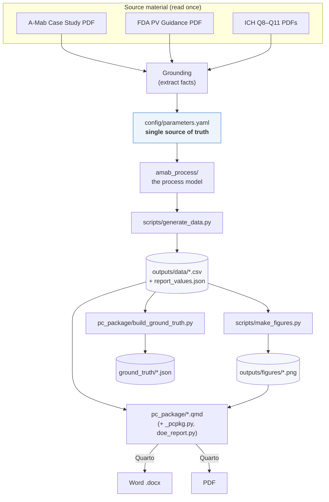

The corpus generator and the ground-truth annexes are described in detail in §15.

The one command that runs this whole chain is `make all`. Each arrow is a script that
reads its inputs and writes its outputs — nothing is manual.

**Why a "single source of truth"?** All the real numbers (set-points, ranges, quality
limits, model coefficients) live in **one file**: `config/parameters.yaml`. The model, the
report and the FMEA all read from it, so they can never disagree with each other.

---

## 3. The single source of truth: the config

`config/parameters.yaml` holds every number the project uses. It has four parts:

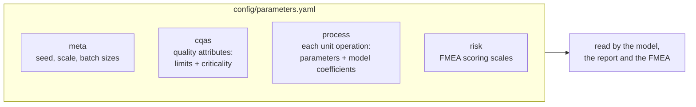

- **`meta`** — global settings, including the **random seed** (`20240724`). The seed makes
  everything reproducible: same seed → identical results every run.
- **`cqas`** — the **Critical Quality Attributes** (the things that must be right about the
  drug: glycosylation, aggregates, host-cell protein, viral clearance, etc.), each with its
  acceptance range and how critical it is.
- **`process`** — one block per manufacturing step. Each lists its **process parameters**
  (e.g., pH, temperature) with set-point, normal operating range (NOR), proven acceptable
  range (PAR) and classification, plus the **coefficients** the model uses to turn those
  parameters into quality outcomes.
- **`risk`** — the Severity / Occurrence / Detection scoring scales for the FMEA.

> **Jargon:** *NOR* = the tight range you run at day-to-day. *PAR* = the wider range proven
> safe by experiments. *CQA* = a quality attribute that matters to the patient. *CPP* = a
> parameter that must be controlled because it affects a CQA.

---

## 4. The process model

The model lives in `amab_process/` and simulates the drug-substance process — the eight
steps that turn cells into purified antibody.

### 4a. The process train

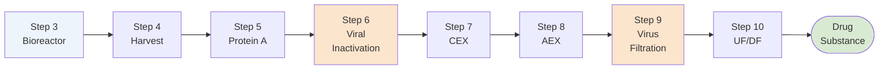

Each step takes in a batch of material, changes it, and passes it on — exactly like the
real factory. The bioreactor *creates* the antibody and sets its quality; the later steps
*purify* it (removing impurities, inactivating/removing viruses).

### 4b. How material moves between steps

A batch of material is represented by a **`Stream`** object: how much antibody (grams), how
much liquid (litres), and a dictionary of quality-attribute values. Each step is a
**`UnitOperation`** that takes a `Stream` in and returns a new `Stream` out, plus a
**`StepResult`** recording what happened (yield, metrics).

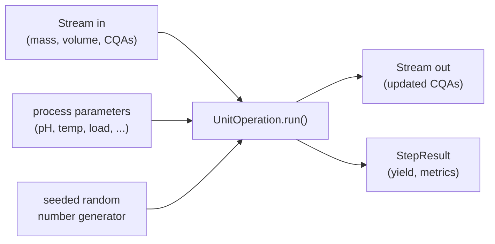

The `Process` class (in `process.py`) simply chains the eight operations together: the
output of one becomes the input of the next.

### 4c. How a step turns parameters into quality

Two kinds of math are used ("semi-mechanistic hybrid"):

- **The bioreactor** uses **growth equations** (cells multiply, then die; antibody
  accumulates over ~17 days) for the time-course, and a **response-surface model** for
  quality. A response-surface model is just a formula: *quality = baseline + (effect of pH)
  + (effect of temperature) + (interactions) + ...*. The coefficients come straight from the
  A-Mab case study (its Table 3.16).
- **The purification steps** use **mass balances** (how much product is kept = yield) and
  **clearance factors** (how many-fold an impurity is reduced, or how many logs of virus are
  removed), again modulated by the step's parameters.

Example — the Protein A step's host-cell-protein (HCP) output:

```
HCP_out = baseline × exp( a·(coded load) + b·(coded elution pH) ) × random noise
```

Higher load and lower elution pH → more HCP, matching the real case study. The "coded"
values map a parameter's range to −1…+1 so the set-point sits at 0.

Each unit operation is one small file in `amab_process/unit_ops/`:

| File | Step | What it models |
|---|---|---|
| `bioreactor.py` | 3 | growth/titer + glycans, aggregate, charge variants, HCP/DNA load |
| `harvest.py` | 4 | clarification yield (no quality change) |
| `protein_a.py` | 5 | capture yield, HCP set, DNA cleared, leached Protein A added |
| `viral_inactivation.py` | 6 | XMuLV log-reduction + aggregate rise with time |
| `cex.py` | 7 | aggregate polish + HCP reduction |
| `aex.py` | 8 | HCP removal + XMuLV/MVM clearance |
| `virus_filtration.py` | 9 | MVM/XMuLV size-based removal |
| `ufdf.py` | 10 | concentrate to final drug-substance strength |

---

## 5. The studies engine (DoE, PPQ, Monte-Carlo)

`studies.py` uses the model to run the kinds of studies a real characterization needs. It
answers three questions:

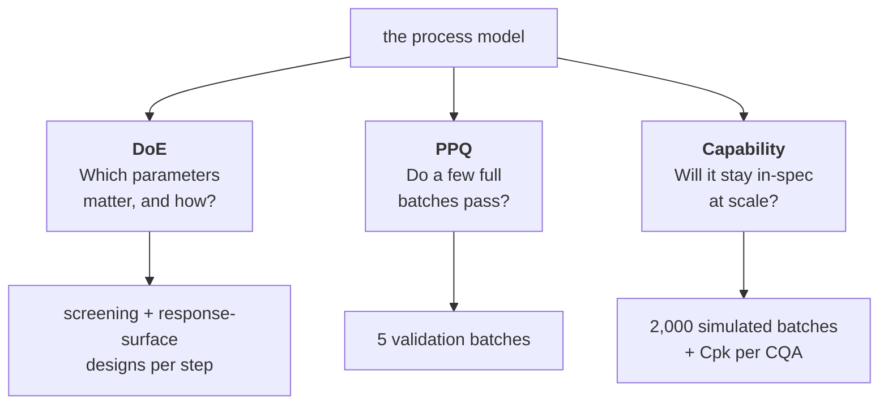

- **DoE (Design of Experiments)** — instead of changing one parameter at a time, DoE changes
  several together in a planned pattern, so you can see effects *and* interactions. The code
  builds a **screening design** (a quick two-level pattern) and a **response-surface design**
  (a central-composite pattern that also captures curvature), runs each recipe through the
  step's model, and fits a statistical model to measure each parameter's **effect**.
- **PPQ** — runs a handful of complete batches at realistic operating conditions to show the
  whole process makes in-spec drug substance.
- **Monte-Carlo capability** — runs thousands of batches with parameters randomly wiggled
  within their normal ranges, then computes **Cpk** (a standard "how comfortably in-spec"
  score) for each quality attribute.

> **Why seeded randomness?** Every study draws random numbers from a generator seeded off the
> master seed. Same seed → identical "random" batches → identical results, every time.

---

## 6. Generating the data

`scripts/generate_data.py` is the conductor: it calls the model and the studies engine and
writes every dataset the documents need.

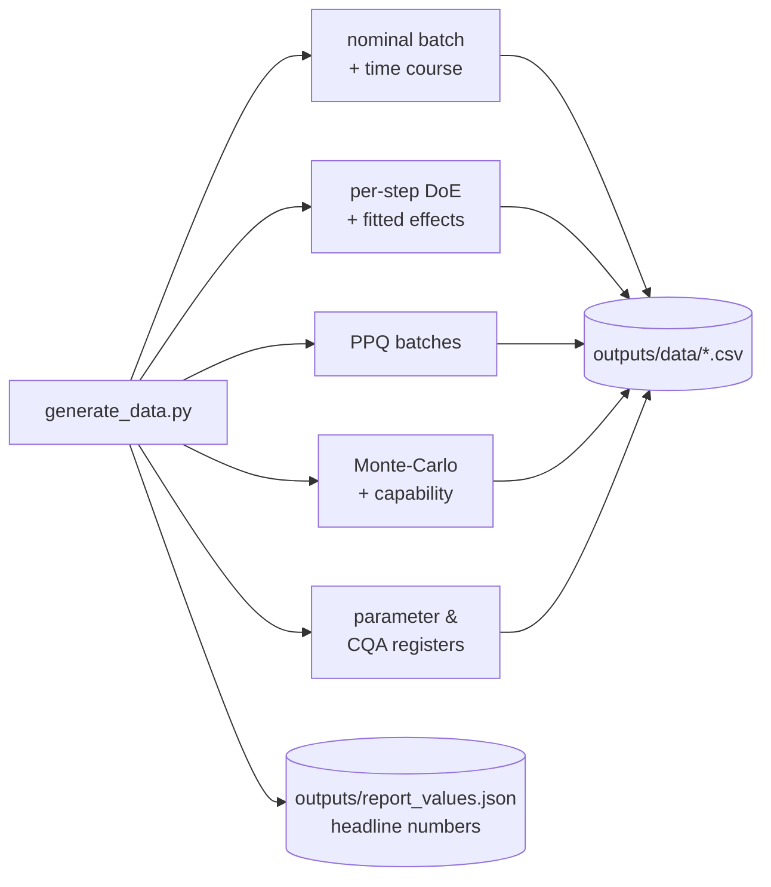

It produces **27 CSV files** plus a small `report_values.json` of headline numbers (overall
yield, minimum Cpk, viral-clearance totals, parameter counts). The report reads those
headline numbers directly, so the prose always matches the data.

**The CSV files, grouped:**

| Group | Files | Contents |
|---|---|---|
| Nominal run | `nominal_timecourse.csv`, `process_summary.csv`, `yield_waterfall.csv` | one set-point batch + per-step yields |
| DoE data | `doe_<step>_screening.csv`, `doe_<step>_rsm.csv` (6 steps) | the experimental runs |
| DoE effects | `effects_<step>.csv` (6 steps) | fitted parameter effects + p-values |
| Validation | `ppq_batches.csv` | 5 PPQ batches |
| Capability | `monte_carlo.csv`, `capability.csv` | 2,000 batches + Cpk table |
| Registers | `parameter_classification.csv`, `cqa_register.csv`, `viral_clearance.csv` | reference tables |

---

## 7. Making the figures

`scripts/make_figures.py` reads the CSVs and draws **13 charts** into `outputs/figures/`.
All charts share one accessible, colour-blind-safe palette defined in `amab_process/viz.py`.

The design-space and response-surface charts are drawn by **fitting a smooth model to the
DoE data and predicting over a grid** — the standard way these are shown in industry — then
overlaying the acceptance limits, the normal operating range and the set-point.

Figures include: the process flow diagram, the bioreactor time-course, DoE effect Paretos,
the bioreactor design space, per-step response surfaces (Protein A, CEX, AEX, viral steps),
the viral-clearance summary, the process-capability histograms, and the yield waterfall.

---

## 8. Building the documents (Word + PDF)

> **Superseded by §15.** The single consolidated report this section originally
> described was removed; the documents are now the `pc_package/` corpus. The
> mechanism below is unchanged — each corpus document is a **Quarto** `.qmd` that runs
> Python inline (via the shared `_pcpkg.py` / `doe_report.py` helpers), loads the CSVs,
> prints tables/numbers, and renders to **both Word and PDF** from the same source.

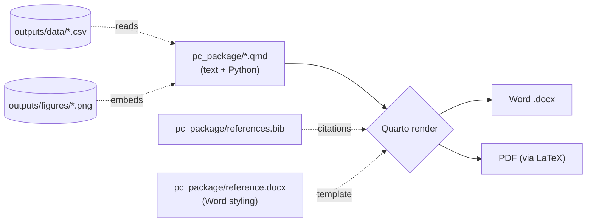

- The Python inside each `.qmd` reads the data and renders tables as it goes, so **you never
  copy-paste numbers**.
- Every document follows a fixed section template (see `CLAUDE.md`) so the set is consistent
  across unit operations; structure follows the FDA process-validation lifecycle (Stage 1 Process Design).
- `pc_package/references.bib` supplies the citations (ICH, FDA);
  `pc_package/reference.docx` controls the Word look. Build with `make corpus`.

---

## 9. The risk-assessment content builder (Excel FMEA)

`risk_assessment/build_fmea.py` reads the config and writes a formatted Excel workbook with
five sheets. **FMEA** = Failure Mode and Effects Analysis: for each parameter, "what could go
wrong, how bad, how likely, how detectable?" It is retained as the **content source** (its
curated per-parameter failure-mode/effect/control map) for the corpus's Pre-Characterization
Risk Assessment (`RA-001`); run `make fmea` to build the workbook (gitignored, not a shipped
deliverable).

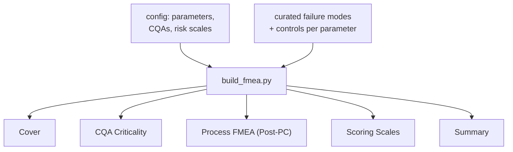

The core sheet scores each parameter:

```
RPN = Severity × Occurrence × Detection
```

and applies the case-study rule: **a parameter is a Critical Process Parameter (CPP) if
Severity ≥ 8 OR the initial RPN > 72.** The workbook shows the RPN **before** characterization
and **after** the control strategy is in place — making the risk reduction visible (the
median RPN drops from ~336 to ~48). Cells are colour-coded (red/amber/green) and the CPP
column, designation and residual-risk band are all kept consistent by construction.

---

## 10. How to reproduce everything

Everything is driven by the `Makefile`. From the repo root:

```bash
uv sync        # one time: install Python dependencies (or: make env, which uses pip)
make all       # rebuild data → figures → corpus (documents + ground-truth annexes)
```

The Makefile calls `python3`. If your environment is not on `PATH` — the usual case with
`uv` — pass the interpreter in: `make all PY="uv run python"`.

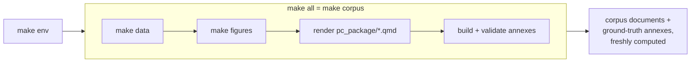

Individual targets: `make data`, `make figures`, `make corpus`, `make fmea` (optional
FMEA content source), `make test`, `make clean`. Data and figures rebuild in ~20 s;
rendering the documents adds a minute or two. To re-run the whole example with different
settings, edit `config/parameters.yaml` and run `make clean && make all`.

**Requirements:** Python 3.11+, Quarto (with a LaTeX engine for PDF). See `requirements.txt`.

Because of the fixed seed, `make clean && make all` reproduces byte-identical data every
time.

---

## 11. How to change things (common tasks)

Almost every change is a one-line edit to `config/parameters.yaml`, then `make all`.

| You want to… | Do this |
|---|---|
| Change a set-point or a range | Edit that parameter in `config/parameters.yaml` → `make all` |
| Change a quality limit | Edit the CQA's `acceptance` in `config/parameters.yaml` → `make all` |
| Make the process more/less robust | Adjust the model coefficients or `noise_cv` in the config → `make all` |
| Change how strongly a parameter affects a CQA | Edit that step's model coefficients in the config → `make all` |
| Reword a document | **Re-author it in one pass** (`authoring/RUNNER.md`), then rebuild its annex. Hand-editing paragraphs is what broke the register once, and it strands every annex quote in the text you changed. |
| Change FMEA failure modes / controls | Edit the `CONTENT` map in `risk_assessment/build_fmea.py` → `make fmea` |
| Change the chart look | Edit the palette/style in `amab_process/viz.py` → `make figures` |
| Use a different random seed | Change `meta.seed` in the config → `make all` |

After any change, run `make test` (20 checks: reproducibility, mass balance, in-spec at
set-point, viral-clearance margin, capability, correct effect directions, and agreement
between `config/parameters.yaml` and the generated CSVs).

> **One gotcha:** in the YAML, scientific notation needs a signed exponent — write `2.0e+5`,
> not `2.0e5` (the parser reads the latter as text).

---

## 12. Where the numbers come from (traceability)

Nothing is invented. Each number traces back to the A-Mab case study or the guidelines:


- `refs/text/` — the source PDFs extracted to searchable text (regenerate with
  `python scripts/extract_sources.py`).
- `refs/grounding/` — the facts pulled from those texts (process parameters, quality limits,
  risk scales, report structure), saved as JSON.
- `config/parameters.yaml` — carries those values with inline page citations (e.g., the
  bioreactor response-surface coefficients are the case study's Table 3.16).

So to check any number, follow it back: document → config → grounding JSON → source page.

---

## 13. How this project was built and verified

The project was built in stages, and the finished documents were checked by an **adversarial
verification pass** — independent reviewers that try to find and disprove errors.

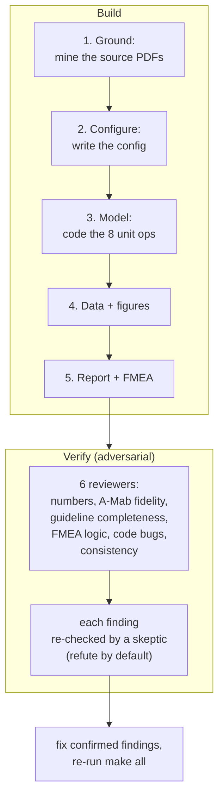

The verification found and fixed real issues (for example, a chart that plotted a variable
the underlying model didn't actually depend on, and a quality range that used the
experimental span instead of the proven range) and correctly dismissed false alarms. The
test suite (`make test`) guards against regressions.

---

## 14. Directory map

```
synthetic_data/
├── config/
│   └── parameters.yaml          ← single source of truth (all numbers)
├── amab_process/                ← the process model (Python package)
│   ├── core.py                  ← Stream, StepResult, response-surface helpers
│   ├── config.py                ← loads parameters.yaml
│   ├── doe.py                   ← experimental designs
│   ├── process.py               ← chains the 8 steps into a batch
│   ├── studies.py               ← DoE, PPQ, Monte-Carlo, capability
│   ├── viz.py                   ← chart palette & style
│   └── unit_ops/                ← one file per manufacturing step
├── scripts/
│   ├── extract_sources.py       ← PDFs → text (grounding)
│   ├── generate_data.py         ← model → outputs/data/*.csv
│   └── make_figures.py          ← data → outputs/figures/*.png
├── risk_assessment/
│   └── build_fmea.py            ← FMEA builder; content source for RA-001 (xlsx gitignored)
├── outputs/
│   ├── data/                    ← 27 generated CSVs
│   ├── figures/                 ← 13 generated PNGs
│   └── report_values.json       ← headline numbers
├── refs/
│   ├── text/                    ← source PDFs as text
│   └── grounding/               ← structured facts from the sources
│   # source PDFs are external: $SYNTHETIC_DATA_SOURCES (default Nextcloud path); extracts in refs/text/
├── pc_package/                  ← NLP document-corpus generator (see §15)
│   ├── _pcpkg.py                ← shared Quarto helpers + document registry
│   ├── doe_report.py            ← DoE analysis engine (see pc_package/DOE_ENGINE.md)
│   ├── schema_ext.py            ← ground-truth annex schema (reuses nlp_reports models)
│   ├── build_ground_truth.py    ← builds the JSON annexes from the seeded data
│   ├── validate_annex.py        ← validates the annexes against the schema
│   ├── PCP-00N_*.qmd / PCR-00N_*.qmd  ← per-unit-op plan/report documents
│   ├── reference.docx / references.bib ← Word styling + citations (shared by all documents)
│   └── ground_truth/*.json      ← per-document ground-truth annexes
├── tests/                       ← reproducibility & correctness tests
├── Makefile                     ← `make all` = `make corpus`; `make fmea` optional
├── requirements.txt             ← Python dependencies
├── CLAUDE.md                    ← conventions for regenerating everything consistently
├── README.md                    ← quick start
└── docs/WORKFLOW.md             ← this document
```

---

## 15. Generating the NLP document corpus (`pc_package/`)

This is what the project produces: **20 cross-referenced documents** plus a machine-readable
**ground-truth annex** for each, as a test corpus for the sibling `nlp_reports`
document-intelligence pipeline (named-entity recognition, entity linking, summarization,
long-document QA). Like everything else, the documents are computed from the seeded model —
no numbers are typed by hand — so the corpus regenerates consistently whenever the config
changes.

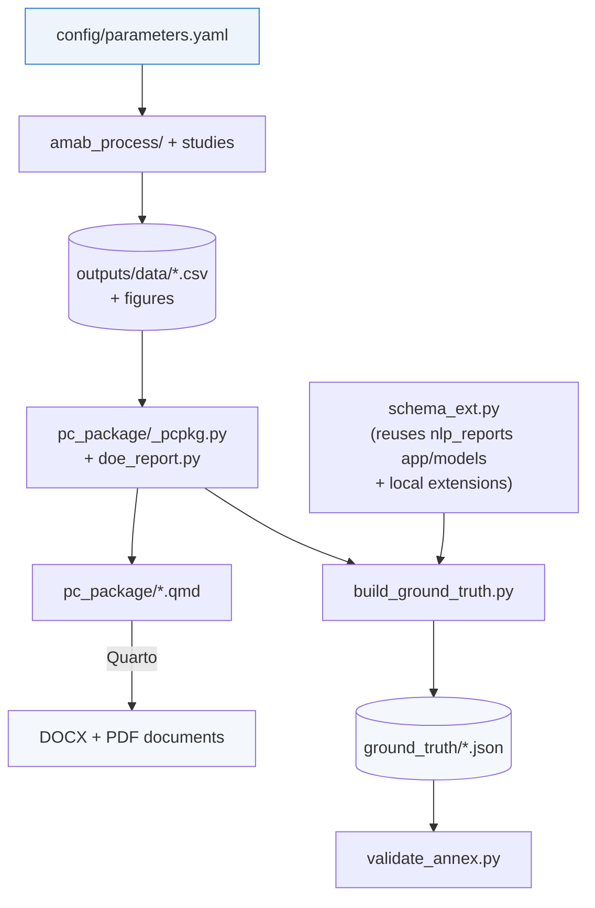

**The document set.** A Process Transfer Plan (`PTP-001`), a Pre-Characterization
Risk Assessment (`RA-001`), a Process Characterization Master Plan (`PCMP-001`), a
Plan/Report pair per unit operation numbered by process step (`PCP-003…010` /
`PCR-003…010`), and a Process Characterization Master Report (`PCMR-001`). Each
document has an ID/version/effective-date title block, a synthetic banner, and
cross-references to its siblings and to placeholder SOP/AMV numbers.

**The ground-truth annexes.** For each document, `build_ground_truth.py` writes
`ground_truth/<ID>.json` — a composite manifest whose blocks (document-type
classification, per-section entities, canonical concepts, DoE studies and design
space, extractive-summary statements, relation assertions) each validate against a
Pydantic model in the sibling `nlp_reports/app/models`, plus a few local extensions
in `schema_ext.py`. Every value is pulled from the same CSVs the documents render, and
every citation quote is verified to appear verbatim in the rendered text.

**The DoE engine.** The reports' statistical depth (effect tables, response-surface
models, ANOVA with lack-of-fit, design matrices, contour/diagnostic figures) is
produced by `pc_package/doe_report.py` — documented in
[`pc_package/DOE_ENGINE.md`](../pc_package/DOE_ENGINE.md).

**Build it.**

```bash
make corpus     # figures -> render all pc_package documents (docx+pdf) -> build & validate annexes
```

**Regenerate with different settings.** Because the whole corpus is config-driven,
changing `config/parameters.yaml` (e.g. `meta.seed`, a parameter range, a CQA limit)
and running `make clean && make data figures && make corpus` regenerates every
document and annex consistently, with no manual edits. See
[`pc_package/README.md`](../pc_package/README.md) for the package layout and
[`CLAUDE.md`](../CLAUDE.md) for the conventions that keep the documents consistent
across unit operations and across re-runs.

---

**In one sentence:** edit numbers in `config/parameters.yaml`, run `make all`, and a seeded
Python model regenerates the data, the charts, all 20 Word/PDF documents and their
ground-truth annexes — every value traceable back to the A-Mab case study and the FDA/ICH
guidelines.

> **One caveat about correctness.** Two documents carry *deliberate* defects, kept so a
> benchmark has something to find. They are listed precisely in
> [`../authoring/DISCREPANCIES.md`](../authoring/DISCREPANCIES.md). Everything else is
> grounded in the seeded model.
