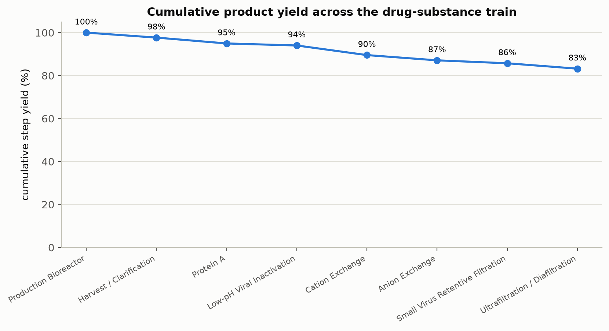
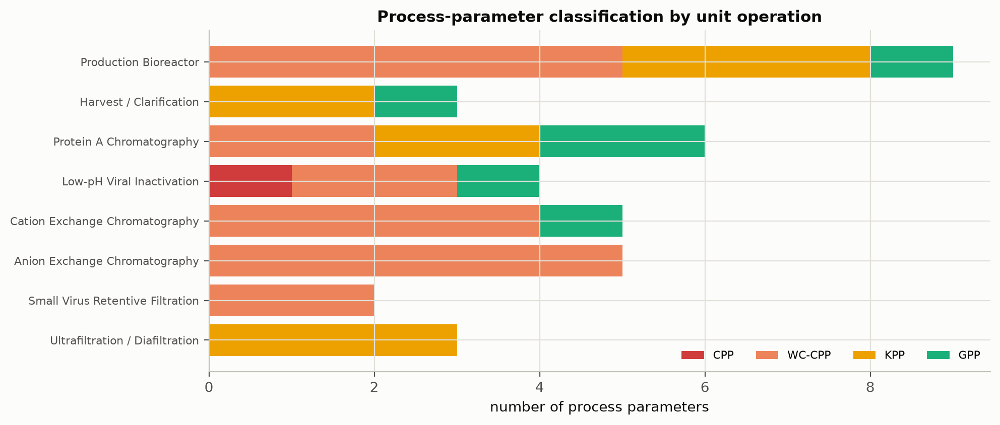
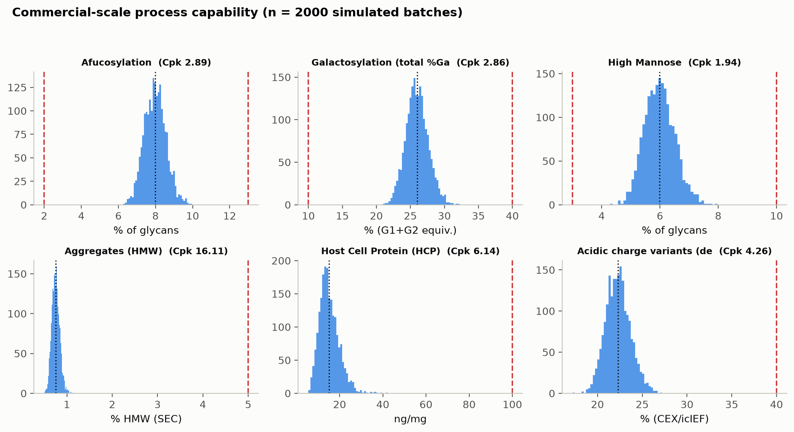
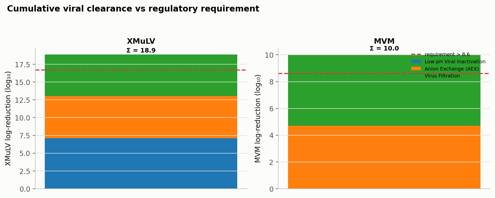

```{python}
#| tags: [setup]
import sys, os
sys.path.insert(0, os.path.abspath("."))
from _pcpkg import *  # noqa: F401,F403
import pandas as pd

DOC = "PCMR-001"

# Headline outcomes (grounded from the seeded model outputs).
scale_l = int(V["commercial_scale_l"])
titer = float(V["nominal_titer_g_per_l"])
overall_yield = float(V["overall_yield"])
ds_mass_kg = float(V["ds_mass_kg"])
ds_conc = float(V["ds_conc_g_per_l"])
min_cpk = float(V["min_cpk"])
all_ge = bool(V["all_cpk_ge_1_33"])
lrv_x = float(V["total_lrv_xmulv"])
lrv_m = float(V["total_lrv_mvm"])
n_params = int(V["n_parameters"])
n_cpp = int(V["n_cpp"])
n_mc = int(V["n_monte_carlo"])
n_ppq = int(V["n_ppq"])
n_steps = len(CFG.train_order)
cc = class_counts()
n_true_cpp = cc.get("CPP", 0)
n_wc = cc.get("WC-CPP", 0)
n_kpp = cc.get("KPP", 0)
n_gpp = cc.get("GPP", 0)
n_cqa = len(cqa_reg)

# The minimum-capability CQA (the process-limiting capability).
_minrow = cap.loc[cap["Cpk"].idxmin()]
min_cqa = _minrow["cqa"]

# Per-CQA outcomes: capability joined with the step that primarily sets/controls each CQA.
setby_title = {k: UNIT_OP_TITLES.get(k, k) for k in cqa_reg.set_by.unique()}
cap2 = cap.merge(cqa_reg[["key", "set_by"]], on="key")
cap2["Set/controlled by"] = cap2["set_by"].map(setby_title)
cap2["Acceptance"] = cap2.apply(lambda r: f"{r.acc_low:g}–{r.acc_high:g}", axis=1)
cap2["Mean ± SD"] = cap2.apply(lambda r: f"{r['mean']:.3g} ± {r['sd']:.2g}", axis=1)

# Per-unit-operation report register (PCR-003 … PCR-010).
rep_rows = []
for key in CFG.train_order:
    uo = CFG.unit_op(key)
    rep_rows.append([f"PCR-{uo.step:03d}", uo.step, UNIT_OP_TITLES.get(key, uo.name)])

vc = csv("viral_clearance.csv")
yw = csv("yield_waterfall.csv")
```

```{python}
#| output: asis
print(title_block(DOC))
print()
print(SYN_BANNER)
```

## Approvals {.unnumbered}

| Role | Function | Name (synthetic) | Signature | Date |
|---|---|---|---|---|
| Author | Process Development / MSAT | — | — | — |
| Reviewer | Analytical Development | — | — | — |
| Reviewer | Manufacturing Science | — | — | — |
| Reviewer | Statistics | — | — | — |
| Approver | Quality Assurance | — | — | — |

: Approval record (synthetic; signatures not applied). {#tbl-appr}

## Abbreviations {.unnumbered}

BLA, Biologics License Application · CPP, critical process parameter · CQA, critical quality
attribute · Cpk, process-capability index · DoE, design of experiments · DS, drug substance ·
GPP, general process parameter · HCP, host-cell protein · ICH, International Council for
Harmonisation · KPP, key process parameter · LRV, log-reduction value · MVM, minute virus of
mice · MSAT, Manufacturing Science and Technology · NOR, normal operating range · PPQ, process
performance qualification · QbD, Quality by Design · WC-CPP, well-controlled CPP · XMuLV,
xenotropic murine leukaemia virus.



# Executive summary {.unnumbered}

This Process Characterization Master Report (**PCMR-001**) consolidates the Stage 1 (Process
Design) characterization of the A-Mab drug-substance (DS) process, rolling up the
`{python} n_steps` per-unit-operation reports (**PCR-003 … PCR-010**) into an integrated
statement of process understanding, parameter classification, process capability, viral
clearance and the overall control strategy. The characterization was executed under the Process
Characterization Master Plan (**PCMP-001**) and the per-unit-operation plans, on qualified
scale-down models, following the lifecycle approach to process validation
[@fda2011; @pdatr60; @ispegpg2023], the Quality-by-Design principles of ICH Q8, Q9, Q10 and Q11
[@ichq8; @ichq9; @ichq10; @ichq11] and the viral-safety expectations of ICH Q5A(R2) [@ichq5a],
with the process model and quality-attribute framework of the A-Mab case study [@amab2009].

```{python}
#| output: asis
print(f"""
**Headline outcomes**

- All `{n_params}` process parameters across the `{n_steps}` unit operations were classified on
  the A-Mab continuum: **{n_true_cpp} CPP, {n_wc} WC-CPP, {n_kpp} KPP and {n_gpp} GPP**
  ({n_cpp} critical parameters in total). Every classification is supported by data from the
  characterization studies.
- All `{n_cqa}` drug-substance CQAs meet their acceptance criteria at commercial scale with a
  process capability of **Cpk ≥ {min_cpk:.2f}** ({'all CQAs Cpk ≥ 1.33' if all_ge else 'see capability table'}),
  the minimum being the cumulative {min_cqa} clearance.
- The modular viral clearance meets its requirements with margin: cumulative
  **{lrv_x:.2f} log₁₀ (XMuLV)** and **{lrv_m:.2f} log₁₀ (MVM)**, delivered orthogonally across
  the low-pH inactivation, anion-exchange and virus-filtration steps.
- The integrated process delivers an overall DS yield of **{pct(overall_yield)}**
  (~**{ds_mass_kg:.1f} kg** of drug substance at {ds_conc:g} g/L) from the
  {scale_l:,}-L production culture.
- Multivariate design spaces were established for the DoE unit operations; the production
  bioreactor forms the glycan, charge-variant and aggregate CQAs, and the purification train
  clears the process-related impurities and provides the viral clearance.
""")
```

The A-Mab drug-substance process is demonstrated to be well understood, robust and in control
across its `{python} n_steps` unit operations. The parameter classifications, design spaces,
proven acceptable ranges and per-CQA control strategy support the Stage 2 operating ranges and
the receiving-site validation (**PTP-001**); the process is **ready for Stage 2 (Process
Performance Qualification)**.

# Introduction

## Purpose

This master report consolidates the per-unit-operation characterization reports into a single
statement of the drug-substance process understanding and control strategy suitable to support a
Biologics License Application. It summarizes, across the whole train, the process description and
performance, the CQA outcomes, the parameter classification, the process capability, the viral
clearance and the overall control strategy, and it establishes Stage-2 readiness. The detailed
studies, effects, models and design spaces are in the per-unit-operation reports cited herein.

## Regulatory and scientific basis

The characterization follows the lifecycle approach to process validation [@fda2011; @pdatr60;
@ispegpg2023] and the enhanced (QbD) approach of ICH Q8, Q9, Q10 and Q11
[@ichq8; @ichq9; @ichq10; @ichq11]; viral clearance is credited per ICH Q5A(R2) [@ichq5a].
Criticality is treated as a continuum (ICH Q9). The report consolidates the Stage 1 Process
Design outputs of PDA TR 60 §3.11 across the unit operations.

# Process description and performance

The A-Mab DS process comprises the `{python} n_steps` unit operations of @tbl-steps, operated at
`{python} f"{scale_l:,}"` L with a nominal titre of `{python} f"{titer:g}"` g/L. The process
flow and the principal quality impact of each step are shown in @fig-flow.

```{python}
#| output: asis
show(process_steps_df())
```

: The A-Mab drug-substance process train (Steps 3–10) and each step's principal role in the control strategy. {#tbl-steps}

{#fig-flow width=100%}

The integrated process delivers an overall DS yield of `{python} pct(overall_yield)`,
approximately `{python} f"{ds_mass_kg:.1f}"` kg of drug substance at `{python} f"{ds_conc:g}"`
g/L. The cumulative step-yield across the train is shown in @fig-yield.

{#fig-yield width=85%}

# Consolidated CQA outcomes

The `{python} n_cqa` drug-substance CQAs, the unit operation that primarily sets or controls
each, and the commercial-scale outcome (mean ± SD and capability against the acceptance
criterion) are consolidated in @tbl-cqa. Every CQA meets its acceptance criterion with a
capability of Cpk ≥ `{python} f"{min_cpk:.2f}"`.

```{python}
#| output: asis
d = cap2.rename(columns={"cqa": "CQA", "criticality": "Crit.", "spec_type": "Spec"})
show(d[["CQA", "Crit.", "Set/controlled by", "Acceptance", "Mean ± SD", "Cpk"]], floatfmt=".2f")
```

: Consolidated drug-substance CQA outcomes — the step that primarily sets/controls each CQA and the commercial-scale capability. {#tbl-cqa}

The glycan and charge-variant CQAs (afucosylation, galactosylation, high mannose, acidic
variants) are formed and controlled in the production bioreactor within its multivariate design
space; the aggregate is formed upstream, can rise during the low-pH hold, and is polished at
cation exchange; the process-related impurities (HCP, residual DNA, leached Protein A) are formed
upstream and cleared modularly across Protein A, cation exchange and anion exchange; and the
viral clearance is delivered orthogonally across the low-pH inactivation, anion-exchange and
virus-filtration steps.

# Parameter classification summary

All `{python} n_params` process parameters were classified on the A-Mab continuum (@tbl-class,
@fig-class). Of these, `{python} n_cpp` are critical (`{python} n_true_cpp` CPP and
`{python} n_wc` WC-CPP), `{python} n_kpp` are KPP and `{python} n_gpp` are GPP. The single true
CPP is the low-pH viral-inactivation pH — a narrow, high-consequence parameter — while the
remaining critical parameters are well-controlled CPPs whose impact is reliably controlled within
the operating region.

```{python}
#| output: asis
cnt = pd.DataFrame([[k, cc.get(k, 0)] for k in ["CPP", "WC-CPP", "KPP", "GPP"]],
                   columns=["Classification", "Parameters"])
show(cnt)
```

: Parameter-classification summary across the train (detail in the per-unit-operation reports). {#tbl-class}

{#fig-class width=100%}

# Process capability

Commercial-scale process capability was estimated by Monte-Carlo simulation of
`{python} f"{n_mc:,}"` batches with every parameter varied within its NOR (@fig-cap). Every CQA
meets its acceptance criterion, with the minimum capability at the cumulative
`{python} min_cqa` clearance (**Cpk = `{python} f"{min_cpk:.2f}"`**); all CQAs achieve
Cpk ≥ 1.33. The capability is confirmed at commercial scale by the Stage-2 PPQ campaign
(`{python} n_ppq` qualification batches as the capability basis).

{#fig-cap width=100%}

# Viral clearance summary

The modular viral clearance is delivered by three orthogonal mechanisms — low-pH inactivation,
anion-exchange adsorption and small-virus size-exclusion filtration — and credited per ICH
Q5A(R2) [@ichq5a]. The per-step and cumulative log-reductions are consolidated in @tbl-viral and
@fig-viral. The cumulative clearance is `{python} f"{lrv_x:.2f}"` log₁₀ for XMuLV (enveloped
retrovirus) and `{python} f"{lrv_m:.2f}"` log₁₀ for MVM (small non-enveloped parvovirus), both
above their cumulative requirements with margin.

```{python}
#| output: asis
show(vc, floatfmt=".2f")
```

: Modular viral clearance by step and cumulative (log₁₀), for XMuLV and MVM. {#tbl-viral}

{#fig-viral width=90%}

# Overall control strategy

The overall control strategy is the sum of the individual per-CQA control strategies established
across the unit operations. It comprises: control of the `{python} n_true_cpp` CPP and
`{python} n_wc` WC-CPPs to their NORs within the established design spaces, with enhanced control
of the low-pH-inactivation pH; control of the `{python} n_kpp` KPPs for process performance and
of the `{python} n_gpp` GPPs as general parameters; in-process controls and monitoring at each
step; resin and membrane life-cycle control; the modular, orthogonal viral-clearance strategy;
and the release and characterization testing of the `{python} n_cqa` CQAs. The per-unit-operation
contributions are detailed in the reports of @tbl-reports and are the basis of the drug-substance
control strategy transferred to the commercial site (**PTP-001**).

```{python}
#| output: asis
show(pd.DataFrame(rep_rows, columns=["Report", "Step", "Unit operation"]))
```

: The per-unit-operation Process Characterization Reports consolidated in this master report. {#tbl-reports}

# Conclusions and Stage-2 readiness

The Stage 1 characterization demonstrates that the A-Mab drug-substance process is well
understood, robust and in control across its `{python} n_steps` unit operations. All
`{python} n_params` parameters are classified with a data-supported rationale; multivariate
design spaces are established for the DoE unit operations; all `{python} n_cqa` CQAs meet their
acceptance criteria at commercial scale with Cpk ≥ `{python} f"{min_cpk:.2f}"`; and the modular
viral clearance meets its requirements with margin (`{python} f"{lrv_x:.2f}"` /
`{python} f"{lrv_m:.2f}"` log₁₀ for XMuLV / MVM). The parameter classifications, design spaces,
proven acceptable ranges and per-CQA control strategy support the Stage 2 operating ranges and
the receiving-site validation. The process is **ready for Stage 2 (Process Performance
Qualification)**; the post-characterization process risk assessment finalizes the CPP selection
and the residual-risk position from these outcomes.

# References {.unnumbered}

::: {#refs}
:::
