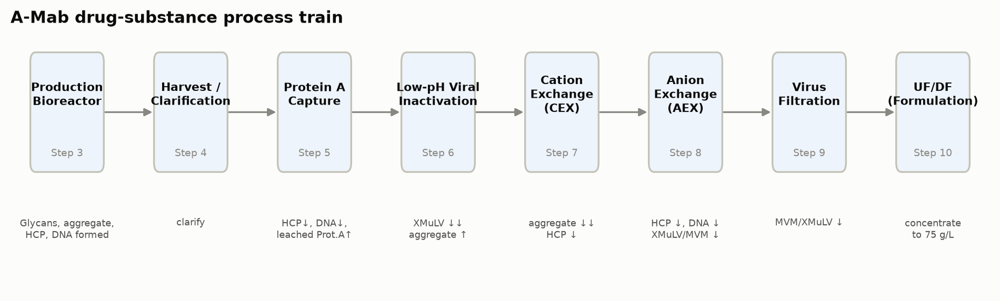

```{python}
#| tags: [setup]
import sys, os
sys.path.insert(0, os.path.abspath("."))
from _pcpkg import *  # noqa: F401,F403
import doe_report as D
import matplotlib.pyplot as plt
import scipy.stats as sstat

DOC = "PCP-005"
UO = "protein_a"
UO_TITLE = "Protein A Chromatography (Step 5)"

# --- doc-local derived scalars (pulled from config/outputs; never typed) ---
uo_cfg = CFG.unit_op(UO)
pp = plan_params(UO)
n_params = len(pp)
n_mv = int((pp["Study type"] == "multivariate").sum())
n_uv = int((pp["Study type"] == "univariate").sum())

scr_f = D.screening_factors(UO)
rsm_f = D.rsm_factors(UO)
k_scr, k_rsm = len(scr_f), len(rsm_f)
resp_keys = D.responses(UO)
n_resp = len(resp_keys)

# design STRUCTURE only (a plan may show no result): run types and counts
scr_design = csv(f"doe_{UO}_screening.csv")
rsm_design = csv(f"doe_{UO}_rsm.csv")
n_scr, n_rsm = doe_runs(UO, "screening"), doe_runs(UO, "rsm")
n_scr_cen = doe_centre_points(UO, "screening")
n_rsm_cen = doe_centre_points(UO, "rsm")
n_scr_fact = int((scr_design.run_type == "factorial").sum())
n_rsm_fact = int((rsm_design.run_type == "factorial").sum())
n_rsm_ax = int((rsm_design.run_type == "axial").sum())

# model sizes implied by the designs (structure, not data)
n_2fi = k_scr * (k_scr - 1) // 2
n_terms_scr = 1 + k_scr + n_2fi
n_terms_rsm = 1 + 2 * k_rsm + k_rsm * (k_rsm - 1) // 2
df_res_scr = n_scr - n_terms_scr
df_res_rsm = n_rsm - n_terms_rsm
df_pe_rsm = n_rsm_cen - 1
df_lof_rsm = df_res_rsm - df_pe_rsm

# characterization range width relative to the NOR width, per parameter
nor_exp = {p.key: (p.prange[1] - p.prange[0]) / (p.nor[1] - p.nor[0])
           for p in uo_cfg.parameters}
exp_lo, exp_hi = min(nor_exp.values()), max(nor_exp.values())
ph_lo = uo_cfg.param("elution_ph").prange[0]

# acceptance criteria (pre-specified, not results)
acc_hcp = D.acceptance_for(UO, "pool_hcp_ng_mg")
acc_lpa = D.acceptance_for(UO, "leached_protein_a_ppm")
n_par_cqa = sum(1 for r in resp_keys if D.acceptance_for(UO, r) is not None)
n_par_pairs = n_par_cqa * k_rsm

# validated method performance for the responses that carry an acceptance criterion
_resp_amv = {"pool_hcp_ng_mg": "AMV-3012", "leached_protein_a_ppm": "AMV-3016"}
_amv_ids = [a for r, a in _resp_amv.items() if D.acceptance_for(UO, r) is not None]
pa_meth = method_perf_df()
pa_meth = pa_meth[pa_meth["Method"].isin(_amv_ids)].reset_index(drop=True)
_m = csv("dev_methods.csv").set_index("id")
vf_hcp = float(_m.loc["AMV-3012", "variance_fraction"])
loq_lpa = float(_m.loc["AMV-3016", "loq"])
```

```{python}
#| output: asis
print(title_block(DOC, UO_TITLE))
print()
print(SYN_BANNER)
```

## Approvals {.unnumbered}

| Role | Function | Name (synthetic) | Signature | Date |
|---|---|---|---|---|
| Author | Process Development / MSAT | — | — | — |
| Reviewer | Analytical Development | — | — | — |
| Reviewer | Manufacturing Science | — | — | — |
| Reviewer | Statistics | — | — | — |
| Approver | Quality Assurance | — | — | — |

: Approval record (synthetic; signatures not applied). {#tbl-appr}

## Abbreviations {.unnumbered}

ALCOA+, attributable, legible, contemporaneous, original, accurate and complete;
AMV, analytical method validation; CPP, critical process parameter; CQA, critical
quality attribute; CV, column volume; DNA, deoxyribonucleic acid; DoE, design of
experiments; ELISA, enzyme-linked immunosorbent assay; GPP, general process parameter;
HCP, host cell protein; HMW, high molecular weight; KPP, key process parameter; LOQ,
limit of quantitation; MSAT, Manufacturing Science and Technology; NOR, normal operating
range; PAR, proven acceptable range; PCP, process characterization plan; PCR, process
characterization report; PRESS, predicted residual error sum of squares; qPCR,
quantitative polymerase chain reaction; LIMS, laboratory information management
system; RSD, relative standard deviation; SEC,
size-exclusion chromatography; SOP, standard operating procedure; WC-CPP, well-controlled
critical process parameter.



<!-- ========================= BODY START (author here) =========================
     Write every section in authoring/section_plan.yaml order for this doc-type,
     each with its scaffold / register / rigor obligations. Numbers = inline exprs.
     ========================================================================== -->

# Purpose and scope

The A-Mab drug substance process is being transferred to the commercial manufacturing site, and every unit operation has to be characterized (Stage 1, process design) before qualification runs begin [@fda2011]. Protein A chromatography is the capture step of that process. Its platform operating conditions are well established, but the ranges that will be registered for commercial manufacture of A-Mab are not yet bounded by data on this product. This plan defines the study that will bound them.

The study covers the `{python} n_params` process parameters of the capture step, at the set-points and ranges given in @tbl-params, on a scale-down model qualified under SOP-1001, of which `{python} n_mv` will be studied in a multivariate design and `{python} n_uv` will be assessed one at a time, following the risk ranking in RA-001. Every run of the designed experiments will measure `{python} n_resp` responses, namely pool host cell protein (HCP), step yield and leached Protein A, and from them the study delivers the operating region, the proven acceptable ranges, the parameter classification and the capability estimate that PCR-005 will report (§11).

Four things sit outside the scope of this plan. Resin lifetime, re-use and sanitization are controlled under SOP-2008 and are supported by a separate resin life-cycle study, and an alternate Protein A resin is excluded as well, since RA-004 has already concluded that such a resin would need independent characterization with no bridging from platform data. Confirmation at commercial scale belongs to Stage 2, and no viral clearance claim is made for the capture step, since the cumulative clearance claim of the drug substance process rests on low-pH inactivation, anion exchange and virus filtration (PCP-006, PCP-008 and PCP-009).

# Objectives

The study has five objectives, and they follow the enhanced development approach of ICH Q8 [@ichq8] together with the classification logic of SOP-4001.

1. Quantify the effect of each multivariate parameter, and of the interactions between them, on pool HCP, step yield and leached Protein A across the characterization ranges in @tbl-params.
2. Fit a response-surface model to each response (pool HCP, step yield and leached Protein A) and define the multivariate region within which the governed quality attributes meet the acceptance basis set out in §7.
3. Establish a proven acceptable range for each combination of governed attribute and multivariate parameter whose criterion is met at the set-point, record the reason where it is not, and confirm that the NOR of each parameter lies inside the range established.
4. Support the ranges of operating temperature and bed height by univariate study, without adding two factors to the multivariate design.
5. Classify every parameter of the step under SOP-4001 and state what the step contributes to the control strategy.

The study is not designed to demonstrate viral clearance and it does not qualify commercial-scale equipment, and both of those are covered elsewhere in the package (PCP-006 and PTP-001).

# Related documents

@tbl-related lists the documents this plan depends on and the report it delivers.

```{python}
#| output: asis
print(related_docs_md(DOC))
```

: Position of this plan in the A-Mab characterization package. {#tbl-related}

The controlled procedures and the validated analytical methods that govern the work are listed in @tbl-sops. Each modelled quality response is measured by one of the validated methods in that table, and step yield is calculated from mass balance using the protein concentration method named in §5.3.

```{python}
#| output: asis
print(sop_table(sops=PROTEIN_A_SOP_REFS, amvs=PROTEIN_A_AMV_REFS))
```

: Controlled procedures and validated analytical methods for the capture step. {#tbl-sops}

# Prior knowledge and quality risk basis

## Unit-operation description and prior knowledge

Protein A chromatography is the first chromatographic unit operation of the purification process, and it uses an immobilized Protein A resin that binds the antibody from clarified harvest, so that process impurities such as HCP, DNA and small molecules pass into the flow-through or are removed in the wash. A low pH buffer then elutes the antibody, and the low pH eluate pool feeds the viral inactivation step, where it is held at low pH and neutralized after the hold (@fig-train). Two things happen to product quality across the step, since host cell protein and residual DNA are cleared and a small amount of the Protein A ligand leaches from the resin into the pool.

{#fig-train width=100%}

The downstream process for A-Mab is a platform process with an extensive performance history [@amab2009]. The same capture step, with the same resin chemistry, the same buffer system and the same mode of operation, has been used for three previously licensed antibodies (X-Mab, Y-Mab and Z-Mab) and throughout A-Mab clinical manufacture. Across those programmes the step has performed consistently within the ranges run in manufacture [@amab2009]. That experience is the reason this study is designed to confirm and bound the behaviour of the step instead of to discover it, but it is not a reason to leave the ranges unsupported, since the ranges registered for commercial manufacture must be justified by A-Mab data at the ranges claimed.

The design of the study rests on mechanistic expectations for each of the `{python} k_scr` parameters carried into the multivariate design, and the data can confirm or refute every one of them. The report will state which of them held.

Protein load is expected to be the dominant parameter for pool HCP, since as the load approaches the dynamic binding capacity of the resin the column loses selectivity, and impurities that co-adsorb with the antibody or are entrained in the bed are then carried into the eluate. Yield is expected to fall when a high load is combined with a high linear velocity, because the residence time available for mass transfer is then shortest.

Elution buffer pH is expected to act on pool HCP in the opposite direction, because a lower elution pH strips more of the tightly associated impurity from the column together with the product, and it is also the condition under which the immobilized ligand is least stable. Leached Protein A is expected to rise as elution pH falls, for the same reason.

The end of pool collect fixes how far into the descending edge of the elution peak the pool is taken, and collecting further recovers more product while it also collects the late-eluting material in the tail, so the parameter trades yield against pool purity. Its effect on the pool concentration is a process performance question and not a product quality question.

One assumption sits outside that list, and the study does not test it. Pool HCP at this step is set mainly by the operating conditions of the step and not by the HCP burden of the feed, and platform experience shows robust performance when affinity capture is challenged with a wide range of feed inputs [@amab2009]. Feed quality is for that reason not carried into the design as a factor, and the variability of the feed is bounded by the characterization of the upstream steps (PCR-003 and PCR-004).

## Quality attributes in scope

The step sets one quality attribute of the drug substance and acts on three others. @tbl-cqa-set gives the attribute the step sets, with its acceptance criterion and its position on the criticality continuum (the A-Mab scale runs from very low to very high).

```{python}
#| output: asis
show(cqas_for(UO))
```

: The drug substance quality attribute set by the capture step. {#tbl-cqa-set}

Leached Protein A is a process impurity that the step introduces, and it is the only attribute in the A-Mab register whose origin is the capture step, with a criterion that is a ceiling on the drug substance. Criticality is treated as a continuum and not as a binary split into critical and non-critical attributes [@ichq9]. The Tool #1 score in @tbl-cqa-set places leached Protein A below the attributes that the A-Mab framework calls critical, which is a statement about impact and uncertainty together, and not a reason to leave the attribute uncontrolled.

The three attributes that the step has to clear, or carry through unchanged, are given in @tbl-cqa-clear.

```{python}
#| output: asis
show(cqas_by_keys(["hcp", "residual_dna", "aggregates_hmw"]))
```

: Drug substance quality attributes cleared or carried through the capture step. {#tbl-cqa-clear}

Host cell protein is the attribute that drives the design of this study, since its criterion is a limit on the drug substance and three chromatography steps in series contribute to meeting it. Affinity capture provides the principal clearance, and cation exchange and anion exchange clear further (PCP-007 and PCP-008). Residual DNA is cleared by a mechanism that does not depend on the parameters in @tbl-params, and the clearance is claimed from platform data. Aggregate carries a higher criticality than either impurity, but affinity capture under platform conditions does not modify it, so aggregate is monitored across the step and is polished at cation exchange (PCP-007).

## Risk-based prioritization of parameters

The scope of this study is set by RA-001. That assessment ranked every parameter of the step on two axes, the potential impact on a quality attribute and the potential for interaction with other parameters, and it used the combined score to assign a study type (multivariate, univariate or no study) [@amab2009]. The outcome for the capture step is the split shown in the last column of @tbl-params.

Protein load and elution buffer pH were ranked highest, because both act directly on the impurity content of the pool and because their effects are expected to interact. Load flow rate and end of pool collect were carried into the multivariate design for a different reason, since neither is expected to move product quality on its own, but both change the performance of the step, and flow interacts with load through residence time. Studying all `{python} k_scr` parameters together costs `{python} n_scr` runs and removes the need to assume that any pair of them is independent.

Operating temperature and bed height were assigned univariate studies, because RA-001 ranked both on process performance alone and expected no impact on the quality of the pool, and because neither has shown such an effect in platform manufacture. The mechanism through which each of them acts on the step is given in §6.4. A univariate study over the range in @tbl-params supports the range of each without spending runs on interactions that prior knowledge does not expect, and should the univariate data contradict that expectation, the parameter will be carried into a follow-up multivariate study and the change will be recorded as a deviation in PCR-005.

The characterization ranges are wider than the normal operating ranges, by a factor of between `{python} f"{exp_lo:.1f}"` and `{python} f"{exp_hi:.1f}"` on the individual parameters, and wide ranges expose an edge of failure where one exists and leave room for the operating point to move inside the design space without further study [@amab2009]. Two of the edges are set by prior knowledge instead of by a multiple of the NOR. The low edge of elution buffer pH is pH `{python} f"{ph_lo:g}"`, which is the lowest pH at which the platform has shown no antibody precipitation, and the high edge of protein load is set to challenge the column above the loading used in routine manufacture.

# Materials and methods

## Scale-down model and its qualification

The study will be executed on a scale-down model of the commercial capture column, qualified under SOP-1001 before any design run is executed. The model is built on the established principles of chromatography scaling. Bed height, linear velocity, load per litre of resin, and the wash and elution volumes expressed in column volumes (CV) are held at the commercial-scale values, so that the residence time and the number of column volumes seen by the product are preserved across scales. Column diameter, and with it the column volume, is the quantity that is deliberately scaled. Bed height is matched to the commercial column for the qualification runs and for every run of the multivariate designs, and it is varied only in the univariate study of §6.4.

Qualification will compare replicate runs of the scale-down model at the set-point against the at-scale data recorded for the same step in clinical manufacture, on step yield, pool volume, pool HCP, residual DNA and leached Protein A, together with the column efficiency measures of SOP-2008 (plate count and peak asymmetry). The model is accepted as qualified when no statistically significant difference is found on the performance parameters at the significance level given in §5.5, and when column efficiency meets the packing criteria of SOP-2008. The qualification result will be reported in PCR-005, and the raw data are retained under §9.

Two limits of the model will be stated in the report. The model is qualified at the set-point and not at the corners of the characterization ranges, so it supports the fitted response surface without confirming performance at commercial scale at those corners. The model is also conditioned on the materials of this study, since one resin lot and one harvest campaign supply every run (§5.2 and §12). Confirmation at scale belongs to Stage 2.

The centre point of each design is replicated, and those replicates give an estimate of pure error that does not depend on the fitted model, which is what makes the lack-of-fit test of §5.5 possible.

## Operation

Each run is one complete chromatographic cycle on the scale-down column, executed under SOP-2007. The column is equilibrated, loaded with clarified harvest (the output of Step 4) to the protein load of the run at the linear velocity of the run, washed, and eluted with the low pH elution buffer. The eluate is collected from a fixed trigger on the ascending edge of the peak to the end of pool collect volume set for that run, measured in column volumes. The pool is held at low pH for the viral inactivation step, which is characterized separately under PCP-006, and it is neutralized after that hold.

Inputs that are controlled to platform specification are not characterized here. Resin, buffers and clarified harvest are released against their identity and quality specifications, and buffer preparation follows SOP-2103. One resin lot supplies the whole study, and the cycle number of the column is recorded for every run and kept inside a defined band, so that resin age cannot be confounded with a factor effect.

The order of the runs within each design will be randomized, and the randomization will be generated and recorded under SOP-1002. Runs will be spread across operators and days as evenly as the design allows, so that no day effect can align with a factor.

## Analytical methods

Each modelled quality response is measured by a validated method (@tbl-sops). Pool HCP is measured on the eluate pool by the host cell protein ELISA of AMV-3012, and leached Protein A is measured on the same pool sample by the ELISA of AMV-3016. Step yield is calculated from the product mass in the pool relative to the product mass in the load, using the pool volume and the protein concentration measured by ultraviolet absorbance under AMV-3019.

Residual DNA (AMV-3014) and size variants by SEC (AMV-3011) are measured on the load and on the pool of the centre-point runs. Neither is modelled as a response. DNA clearance across affinity capture is claimed from platform data, and the platform capture step does not modify size variants, so both measurements confirm prior knowledge and do not feed a model.

The validated performance of the methods that carry the acceptance-linked responses is summarized in @tbl-methods.

```{python}
#| output: asis
show(pa_meth)
```

: Validated performance of the analytical methods for the acceptance-linked responses. {#tbl-methods}

About `{python} pct(vf_hcp)` of the variability observed in a pool HCP result is attributable to the method itself (@tbl-methods). Effect estimates for pool HCP will be judged against that noise as well as against the significance level of §5.5. For leached Protein A the quantitation limit of AMV-3016 is `{python} f"{loq_lpa:g}"` ppm against an acceptance ceiling of `{python} f"{acc_lpa[1]:g}"` ppm, so the method resolves the attribute across the whole range that matters to the decision. Performance beyond the summary in @tbl-methods is held in the method validation reports and is not reproduced here.

## Sampling plan

Sampling is identical for every run of both designs. A sample of the clarified harvest is taken before loading, and the flow-through and the wash are collected as composites and retained. The eluate pool is sampled once, and that sample carries the analytical responses of the run.

The centre point of the screening design is executed `{python} n_scr_cen` times and the centre point of the response-surface design `{python} n_rsm_cen` times. The replicates use the same material, the same column and the same methods as every other run, so the variability they measure is the variability of the process and the assay together.

Retained samples are stored under the conditions of SOP-2007 until PCR-005 is approved. Where a result falls outside the validated range of a method, the sample is re-assayed on dilution before the result is accepted, and the re-assay is recorded in the study record.

## Statistical methods

All analysis will be performed on coded factors under SOP-1002. Each parameter carried into a designed experiment is coded so that the midpoint of its characterization range is 0 and the edges of that range are ±1. For every one of those parameters the set-point is also the midpoint (@tbl-params), so the coded centre of the design and the process set-point are the same condition.

The screening data will be fitted by ordinary least squares with all `{python} k_scr` main effects and all `{python} n_2fi` two-factor interactions. That model consumes `{python} n_terms_scr` of the `{python} n_scr` degrees of freedom the design carries and leaves `{python} df_res_scr` for the residual. An effect is reported as twice the corresponding coded coefficient, so that it reads as the change in the response between the low and the high edge of the characterization range. Effects are declared significant at α = 0.05.

The screening design identifies which parameters matter. It is not the predictive model. The response-surface data will be fitted with the full quadratic model in the same `{python} k_rsm` parameters, which has `{python} n_terms_rsm` terms and leaves `{python} df_res_rsm` residual degrees of freedom, of which `{python} df_pe_rsm` are pure error from the replicated centre point and `{python} df_lof_rsm` carry lack of fit. The response-surface model is the predictive model of this study, and both the operating region and the proven acceptable ranges are derived from it.

Model adequacy will be judged on four things: the significance of the model F test, the agreement between the adjusted R² and the predicted R² computed from PRESS, the residual standard error against the standard deviation of the centre-point runs, and a lack-of-fit F test against pure error. Residual diagnostics will be reported for every response that carries an acceptance criterion.

Capability at commercial scale will be estimated by Monte-Carlo simulation of `{python} f"{V['n_monte_carlo']:,}"` batches of the whole drug substance process, with every process parameter drawn about its set-point at a spread set by its normal operating range and held inside its characterization range. Capability is reported as a one-sided Cpk (an upper-limit capability) against the drug substance acceptance criterion of each attribute, because the attributes governed here are impurities with no lower limit of clinical relevance. Host cell protein reaches the drug substance through two further chromatography steps, so PCR-005 will state what the capture step contributes to that capability and will not present the batch simulation as a capability of the capture pool.

# Study design

## Factors, ranges and study type

@tbl-params gives the parameters of the capture step with their set-points, the ranges to be studied, the normal operating ranges and the study type assigned to each.

```{python}
#| output: asis
show(plan_params(UO))
```

: Process parameters of the capture step, the ranges to be studied and the study type assigned by RA-001. {#tbl-params}

The `{python} n_mv` multivariate parameters carry the letter codes of @tbl-legend throughout this plan and PCR-005.

```{python}
#| output: asis
show(D.factor_legend_df(UO))
```

: Coded factor legend for the multivariate designs. {#tbl-legend}

Two features of @tbl-params matter to the design. Every NOR sits inside the corresponding characterization range with margin on both sides, so the study brackets the operating point instead of ending at it. The two univariate parameters are studied over ranges of comparable width in proportion to their operating ranges. A univariate study supports the range of a parameter on its own and makes no claim about its interactions, which is a narrower claim over a comparable range.

## Screening design

The screening study is a two-level full factorial in the `{python} k_scr` multivariate parameters with replicated centre points. It has `{python} n_scr_fact` factorial runs at the corners of the characterization ranges and `{python} n_scr_cen` centre-point runs, so `{python} n_scr` runs in total, and a full factorial was chosen over a fractional design because `{python} k_scr` factors need only `{python} n_scr_fact` corner runs, and no interaction is then aliased with another interaction or with a main effect.

The purpose of the screening study is to identify the parameters that have a real effect on each response and the pairs of parameters that interact. It resolves all `{python} k_scr` main effects and all `{python} n_2fi` two-factor interactions, and it does not estimate curvature. The centre points show whether curvature is present, through the difference between the mean of the centre-point runs and the mean of the factorial runs, but they cannot attribute that curvature to a parameter.

The planned settings and run identifiers are given in Appendix A in coded form.

## Response-surface design

The response-surface study is a face-centred central composite design in the same `{python} k_rsm` parameters. It adds `{python} n_rsm_ax` axial runs and `{python} n_rsm_cen` centre-point runs to a factorial block of `{python} n_rsm_fact` runs, for `{python} n_rsm` runs in total. The axial points sit on the faces of the design cube and not outside it, so that no run is executed beyond the characterization range of any parameter and the fitted model is never asked to extrapolate.

All `{python} k_scr` parameters are carried forward into the response-surface design. With this few multivariate parameters there is nothing to gain from dropping one after screening, and a parameter with no significant effect still contributes to the region claim as evidence of robustness. A parameter that screening finds inactive will be kept in the response-surface model and reported as such in PCR-005.

This design is the basis of the operating region. The full quadratic model it supports estimates the curvature that the screening design can only detect, and every predicted response in PCR-005 is computed from it. The planned matrix is given in Appendix B.

## Univariate assessment

Operating temperature and bed height will be assessed one parameter at a time, at the low edge, the set-point and the high edge of the ranges in @tbl-params, with the remaining parameters held at their set-points. The set-point condition will be replicated so that the comparison carries an error estimate of its own.

Both parameters were kept out of the multivariate design deliberately. Bed height acts on the step through residence time, and residence time is already varied in the multivariate design through the load flow rate, so a second factor acting through the same mechanism would add runs without adding much information. Operating temperature acts on binding kinetics and on the stability of the immobilized ligand, and platform manufacture has not shown an effect of temperature on pool quality across the range in @tbl-params.

A univariate range is supported when the measured responses meet the criteria that apply to them under §7 at both edges of the range, and when the trend across the three levels does not approach a limit. The evidence and the decision for each parameter will be reported in PCR-005 alongside the multivariate results.

# Acceptance and decision criteria

This section states the decisions the study will make and the rules by which it will make them, and every rule is fixed before execution, so any change to a rule after approval of this plan is a revision under §13.

The scale-down model is accepted when the qualification runs show no statistically significant difference from the at-scale data on the performance parameters of §5.1 and column efficiency meets the packing criteria of SOP-2008. Should the model fail on any performance parameter, no design run will be executed. The model will be modified and requalified, and both the failure and the modification will be reported in PCR-005.

A fitted model is adequate when its F test is significant at α = 0.05, its lack-of-fit F test is not significant against pure error, and its adjusted and predicted R² are close enough that the model predicts about as well as it fits. A model that fails the lack-of-fit test will not be used to define an operating region for the response concerned, and the operating range for that response would then be set from the univariate evidence and from the screening effects, with the limitation stated in the report.

An effect is significant when its p-value is below 0.05, and statistical significance is not on its own a reason to control a parameter tightly. An effect that is significant but small will be compared against the precision of the method (§5.3) and against the margin between the predicted response and its acceptance limit, and PCR-005 will give both comparisons before it classifies the parameter [@amab2009].

The operating region will be declared acceptable when the response-surface models predict that every governed attribute meets the criterion that applies to it across the region, and when the NOR of all `{python} k_rsm` multivariate parameters lies inside it. That region is the design space PCR-005 will report for the capture step. It will be reported together with the ranges that were studied, since it is bounded by them. The response-surface model predicts mean levels, so the report will state the assurance attached to the prediction and will not claim a reliability at the edge of the region that a mean-level model cannot support [@amab2009].

The governed attributes are not judged on the same basis. Leached Protein A is set at the capture step, so the drug substance ceiling applies to the eluate pool directly and it binds the region. Pool HCP is judged against the drug substance ceiling as an in-process reference, since cation exchange and anion exchange clear host cell protein before the drug substance is produced (PCP-007 and PCP-008). Where the pool does not meet that reference across the region, the region will be declared on leached Protein A alone, and PCR-005 will report the predicted host cell protein levels with the clearance they leave to the downstream steps, for resolution across the train in PCMR-001 (§8).

Every parameter will be classified under SOP-4001 into one of four classes (CPP, WC-CPP, KPP or GPP). A parameter whose variability affects a quality attribute is a critical process parameter, and it is classified as well controlled when the risk of leaving the design space is low, judged on the control capability of the equipment and on the width of the acceptable range. A parameter that affects process performance but no quality attribute is a key process parameter. A parameter that affects neither is a general process parameter. The classification follows from the effects measured in this study and not from the risk ranking that scoped it [@amab2009].

Capability will be reported for every attribute that has an acceptance criterion, by the method of §5.5, with the margin between the estimated mean and the limit. This plan fixes no numeric capability threshold, because the capability of a drug substance attribute is a property of the whole train and not of one step. Each estimate will be judged against the acceptance framework of PCMP-001, and PCR-005 will state the basis of that judgement for every attribute.

A result that fails any of these criteria is a deviation from this plan. Deviations will be investigated for root cause before the affected data are used, and the disposition of each will be recorded in PCR-005. Where a deviation invalidates a design, the affected runs will be repeated on requalified material, and the superseded data will be retained and referenced in the report without being used to define an operating region.

# Proven acceptable ranges (planned analysis)

The operating region of §7 is multivariate. It does not on its own tell an operator how far a single parameter may move while the others hold their normal values. The study will for that reason also determine a proven acceptable range for each combination of governed attribute and multivariate parameter, which is `{python} n_par_pairs` combinations in all.

The acceptance basis of each attribute is fixed before the analysis runs, and both governed responses are process impurities with a ceiling on the drug substance. Pool HCP is judged against the drug substance limit of `{python} f"{acc_hcp[1]:g}"` ng/mg and leached Protein A against `{python} f"{acc_lpa[1]:g}"` ppm (@tbl-cqa-set and @tbl-cqa-clear). Step yield carries no drug substance specification, so no proven acceptable range is determined for it. Applying a drug substance limit to an in-process pool is conservative for both impurities, because cation exchange and anion exchange clear host cell protein and leached Protein A before the drug substance is produced (PCP-007 and PCP-008).

Two analyses will be run for every combination. The first holds the other parameters at their set-points and evaluates the fitted response-surface model across the characterization range of the parameter of interest. The second propagates the normal operating ranges of the other parameters, on a grid of `{python} D.PAR_GRID` points across the characterization range of the parameter of interest. At each grid point it takes `{python} f"{D.PAR_MC_N:,}"` draws with the other parameters sampled about their set-points across their normal operating ranges and with the residual variability of the fitted model added, and it compares the 95% predictive interval of the response against the acceptance criterion. The second analysis is the robustness form of the first, and it is the reproducible default reported in PCR-005.

The decision rule is the same for both analyses. The proven acceptable range is the contiguous interval of the parameter, containing the set-point, over which the criterion holds. Where the criterion is not met at the set-point itself, no proven acceptable range is reported for that combination, and PCR-005 will say so and give the reason. For pool HCP such an outcome would not mean that the step is out of control. It would mean that the drug substance limit is met across the purification train and not at the capture pool, and the position for host cell protein would then be resolved at the level of the train in PCMR-001.

Each proven acceptable range will be reported with a two-panel plot for the parameter that governs the attribute concerned. The parameter is on the x axis and the response on the y axis, the acceptance limit is drawn, the acceptable region is shaded green, and the set-point and the NOR are marked. The left panel carries the analysis at set-point and the right panel the analysis with the other parameters varying inside their normal operating ranges.

The relationship between these ranges and the operating region will be stated in the report. A proven acceptable range is a claim about one parameter while the others sit at their set-points or inside their normal operating ranges. The operating region is a claim about all `{python} k_rsm` parameters together. Where a whole characterization range is proven acceptable, the binding constraint on the process is the corner of the multivariate region and not any single range.

# Data management and integrity

Data from this study are managed under the site data integrity procedures, and the ALCOA+ principles apply to every record. Chromatography data are acquired in the chromatography data system with the audit trail enabled. Analytical results are entered in the laboratory information management system (LIMS) against the sample identity assigned at sampling. The design settings, the run order and the executed conditions of each run are recorded in the electronic notebook entry for that run.

The statistical analysis is performed in a controlled environment under SOP-1002. The analysis script, the input data set and the output tables are held under version control, and the analysis is repeated independently by a second statistician before any result is released to the report. Raw chromatograms, assay data and analysis outputs are retained for the period defined in the site records procedure.

A second reviewer checks every transcription between the notebook, the analysis input and the report. Corrections are made by the original recorder, with the reason and the date, and the original entry stays legible.

# Roles and responsibilities

Six functions carry work under this plan. Process Development owns the plan and the report and executes the design runs. Analytical Development runs the assays and owns the method performance stated in §5.3. MSAT owns the scale-down model and its qualification and is the link to the receiving site. Statistics owns the designs, the analysis and the assessment of model adequacy. Manufacturing Science reviews the commercial equivalence of the operating conditions. Quality Assurance approves this plan and the report and dispositions any deviation.

| Activity | Responsible | Reviewed or approved by |
|---|---|---|
| Preparation and revision of this plan | Process Development | Analytical Development, MSAT, Statistics, Quality Assurance |
| Scale-down model qualification | MSAT | Process Development, Quality Assurance |
| Execution of the design runs | Process Development | MSAT |
| Analytical testing and data review | Analytical Development | Process Development |
| Design generation and statistical analysis | Statistics | Process Development |
| Review of commercial equivalence of the operating conditions | Manufacturing Science | MSAT, Process Development |
| Deviation investigation and disposition | Process Development | Quality Assurance |
| Reporting in PCR-005 | Process Development | All reviewing functions; Quality Assurance approves |

: Assignment of the activities of this plan by function. {#tbl-roles}

# Deliverables and schedule

The deliverable of this plan is PCR-005, the characterization report of the capture step. That report will present the executed designs, the fitted models and their diagnostics, the operating region, the proven acceptable ranges, the capability estimate, the parameter classification and the contribution of the step to the control strategy. It will also record every deviation from this plan.

The work runs in five phases (qualification, screening, response surface, ranges and reporting), and each phase gates the one after it. The scale-down model is qualified first. The screening design is executed and analysed next, and that analysis is reviewed before the response-surface design starts. The response-surface design is then executed and analysed. The proven acceptable ranges follow from the fitted models, and the capability estimate follows from the batch simulation of §5.5. The report is written last, and it is approved before PCMR-001 cites it.

No calendar dates are fixed here. The campaign schedule is held in PCMP-001, and the sequence above is the constraint that matters, since every phase depends on the outcome of the phase before it.

# Risks and assumptions

Four risks could affect the conclusions of this study. Each is managed in a defined way, and each will be revisited in the discussion of PCR-005.

The scale-down model may not represent the commercial column at the edges of the characterization ranges. Qualification is performed at the set-point, so the evidence for representativeness is strongest there and weakest at the corners of the design. A design space is not confirmed at scale at the edges of the ranges studied, and the report will state that limit rather than leave it implied.

The study is executed on clarified harvest produced under a defined set of upstream conditions, so the fitted model is conditioned on that feed quality. Platform experience shows that pool HCP is governed by the operating conditions of the step and is robust to variation in the feed, which is why feed quality is not a factor here (§4.1). The bound on feed quality comes from the upstream characterization (PCR-003 and PCR-004), and the assumption will be restated in PCR-005.

Assay variability may mask a small effect. The share of the observed variance that comes from the host cell protein ELISA is given in @tbl-methods, and the response-surface design carries `{python} n_rsm_cen` centre-point replicates to measure the combined process and assay noise. An effect that cannot be separated from that noise will be reported as not detected over the range studied.

Material supply is the fourth risk. One resin lot and one harvest campaign supply the whole study, so a supply failure would split the study across materials and add a block to the design. Should that happen, the material will be recorded for every run, the block will be carried in the fitted model, and the change will be reported as a deviation.

Three assumptions underlie the plan. Platform behaviour established for the earlier products (X-Mab, Y-Mab and Z-Mab) transfers to A-Mab, because the resin chemistry, the buffer system and the mode of operation are unchanged. The parameter list of @tbl-params is complete, in the sense that RA-001 considered every parameter of the step and excluded the remainder on documented grounds. The acceptance criteria of @tbl-cqa-set and @tbl-cqa-clear are the criteria that will apply at the time of filing. Failure of any of the three would invalidate the affected part of the study, which would then be repeated.

# Approvals

This plan takes effect when the approval record in @tbl-appr has been signed by every named function. Execution may not begin before that date. Any change to the design, to the ranges or to the acceptance and decision criteria after approval requires a revision of this plan under change control, approved by the same functions.

# Appendices A-B — Planned design matrices

The two appendices give the designs as they will be executed, in coded form. A coded setting of −1, 0 or +1 is the low edge, the set-point or the high edge of the characterization range of that parameter in @tbl-params, and the factor letters are those of @tbl-legend. No response columns appear, because the study has not been executed.

## Appendix A — Planned screening design matrix

@tbl-appa gives the `{python} n_scr` planned runs of the screening design. Run order will be randomized at execution, so the run numbers are identifiers and not the order of execution.

```{python}
#| output: asis
show(D.planned_matrix_df(UO, "screening", coded=True))
```

: Planned coded screening design matrix (two-level full factorial with centre points). {#tbl-appa}

## Appendix B — Planned response-surface design matrix

@tbl-appb gives the `{python} n_rsm` planned runs of the response-surface design. The axial runs carry one parameter at an edge with the others at their set-points, and they are what separate the quadratic terms of the model.

```{python}
#| output: asis
show(D.planned_matrix_df(UO, "rsm", coded=True))
```

: Planned coded response-surface design matrix (face-centred central composite design). {#tbl-appb}

<!-- ========================= BODY END ======================================== -->

# References {.unnumbered}

::: {#refs}
:::
