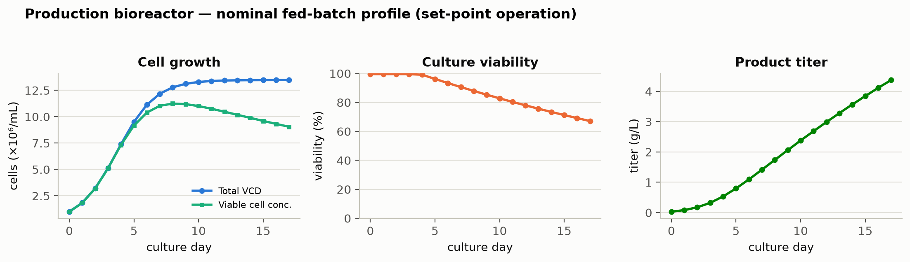
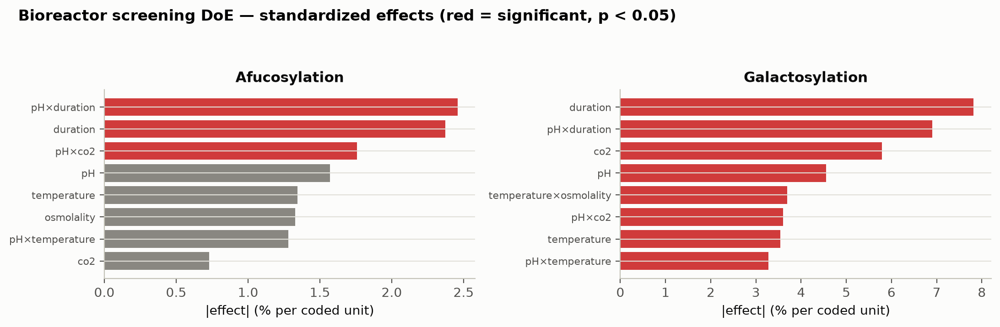
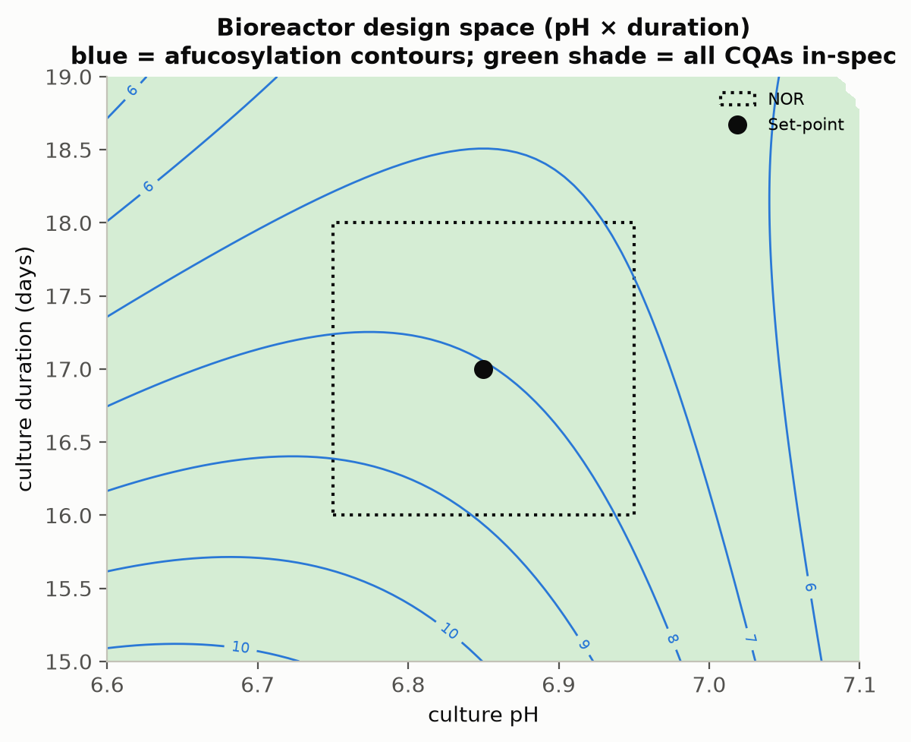

```{python}
#| tags: [setup]
import sys, os
sys.path.insert(0, os.path.abspath("."))
from _pcpkg import *  # noqa: F401,F403
import doe_report as D
import matplotlib.pyplot as plt
import scipy.stats as sstat
import itertools as it
import pandas as pd

DOC = "PCR-003"
UO = "bioreactor"
UO_TITLE = "Production Bioreactor (Step 3)"

# --- doc-local derived scalars (pulled from the model; never typed) -----------------
alpha = 0.05
step_no = CFG.unit_op(UO).step
resps = list(D.responses(UO))
scr_f = list(D.screening_factors(UO))
rsm_f = list(D.rsm_factors(UO))
L = D.factor_letters(UO)
par = {p.key: p for p in CFG.unit_op(UO).parameters}
PNAME = {k: p.name for k, p in par.items()}


def fnm(k, lower=False):
    n = PNAME[k].replace(" (pCO2)", "")
    return (n[0].lower() + n[1:]) if lower else n


def rnm(r, lower=True):
    n = D.RESP_LABEL.get(r, r).replace(" (HMW)", "")
    return (n[0].lower() + n[1:]) if lower else n


def jn(items):
    items = list(items)
    if len(items) == 1:
        return items[0]
    return ", ".join(items[:-1]) + " and " + items[-1]


def fjoin(keys, lower=True):
    return jn([fnm(k, lower) for k in keys])


def rjoin(keys, lower=True):
    return jn([rnm(k, lower) for k in keys])


def rng_str(k):
    p = par[k]
    return f"{p.prange[0]:g}–{p.prange[1]:g}"


def nor_str(k):
    p = par[k]
    return f"{p.nor[0]:g}–{p.nor[1]:g}"


# design structure -------------------------------------------------------------------
scr_df = csv(f"doe_{UO}_screening.csv")
rsm_df = csv(f"doe_{UO}_rsm.csv")
n_scr = doe_runs(UO, "screening")
n_rsm = doe_runs(UO, "rsm")
cp_scr = doe_centre_points(UO, "screening")
cp_rsm = doe_centre_points(UO, "rsm")
n_cube_scr = int((scr_df.run_type == "factorial").sum())
n_cube_rsm = int((rsm_df.run_type == "factorial").sum())
n_ax_rsm = int((rsm_df.run_type == "axial").sum())
n_scr_f = len(scr_f)
n_rsm_f = len(rsm_f)
n_resp = len(resps)

sf = {r: D.fit(UO, "screening", r) for r in resps}
pr = {r: D.fit(UO, "rsm", r) for r in resps}
n_scr_terms = len(sf[resps[0]]["names"]) + 1
n_rsm_terms = len(pr[resps[0]]["names"]) + 1
df_res_scr = int(sf[resps[0]]["model"].df_resid)
df_res_rsm = int(pr[resps[0]]["model"].df_resid)

# parameters -------------------------------------------------------------------------
rp = report_params(UO)
n_par = len(rp)
n_mv = int((rp["Study"] == "multivariate").sum())
n_uv = n_par - n_mv
_cls = rp["Class"].value_counts().to_dict()
n_wc = int(_cls.get("WC-CPP", 0))
n_kpp = int(_cls.get("KPP", 0))
n_gpp = int(_cls.get("GPP", 0))
n_cpp = int(_cls.get("CPP", 0))
uv_keys = [k for k in par if par[k].study == "univariate"]
_widen = [(par[k].prange[1] - par[k].prange[0]) / (par[k].nor[1] - par[k].nor[0]) for k in par]
widen_lo = min(_widen)
widen_hi = max(_widen)

# model adequacy ---------------------------------------------------------------------
r2_lo = min(pr[r]["R2"] for r in resps)
r2_hi = max(pr[r]["R2"] for r in resps)
adj_lo = min(pr[r]["adjR2"] for r in resps)
pred_lo_key = min(resps, key=lambda r: pr[r]["predR2"])
pred_lo = pr[pred_lo_key]["predR2"]
pred_lo_resp = rnm(pred_lo_key)
pred_hi_key = max(resps, key=lambda r: pr[r]["predR2"])
pred_hi = pr[pred_hi_key]["predR2"]
pred_hi_resp = rnm(pred_hi_key)
lof_lo_key = min(resps, key=lambda r: pr[r]["p_lof"])
lof_p_lo = pr[lof_lo_key]["p_lof"]
lof_p_lo_resp = rnm(lof_lo_key)
p_rsm_hi = max(pr[r]["p"] for r in resps)
scr_r2_lo = min(sf[r]["R2"] for r in resps)
scr_pred_lo = min(sf[r]["predR2"] for r in resps)
scr_p_hi_key = max(resps, key=lambda r: sf[r]["p"])
scr_p_hi = sf[scr_p_hi_key]["p"]
scr_p_hi_resp = rnm(scr_p_hi_key)
n_scr_ns = sum(1 for r in resps if sf[r]["p"] >= alpha)

# centre-point reproducibility -------------------------------------------------------
cv_r = D.center_cv_df(UO, "rsm")
cv_s = D.center_cv_df(UO, "screening")
cv_rsm_max = float(cv_r["%CV"].max())
cv_rsm_max_resp = rnm(resps[int(cv_r["%CV"].idxmax())])
cv_rsm_min = float(cv_r["%CV"].min())
cv_rsm_min_resp = rnm(resps[int(cv_r["%CV"].idxmin())])
cv_scr_max = float(cv_s["%CV"].max())
cv_scr_max_resp = rnm(resps[int(cv_s["%CV"].idxmax())])


# effect / coefficient accessors ------------------------------------------------------
def eff(r, t):
    d = D.screening_effects_df(UO, r)
    return float(d.loc[d["Term"] == t, "Effect"].iloc[0])


def eff_p(r, t):
    d = D.screening_effects_df(UO, r)
    return float(d.loc[d["Term"] == t, "p-value"].iloc[0])


def cf(r, t):
    d = D.rsm_coeff_df(UO, r)
    return float(d.loc[d["Term"] == t, "Coef."].iloc[0])


def cf_p(r, t):
    d = D.rsm_coeff_df(UO, r)
    return float(d.loc[d["Term"] == t, "p-value"].iloc[0])


def n_sig_scr(r):
    d = D.screening_effects_df(UO, r)
    return int((d["p-value"] < alpha).sum())


def n_sig_rsm(r):
    d = D.rsm_coeff_df(UO, r)
    d = d[d["Term"] != "Intercept"]
    return int((d["p-value"] < alpha).sum())


def n_resp_sig_rsm(k):
    return sum(1 for r in resps if cf_p(r, L[k]) < alpha)


def n_resp_sig_scr(k):
    return sum(1 for r in resps if eff_p(r, L[k]) < alpha)


def fmax(k):
    """Largest significant screening main effect of one factor, across the responses."""
    vals = [abs(eff(r, L[k])) for r in resps if eff_p(r, L[k]) < alpha]
    return max(vals) if vals else 0.0


osmo_key = [k for k in scr_f if k not in rsm_f][0]
osmo_max = fmax(osmo_key)
rsm_min_key = min(rsm_f, key=fmax)
rsm_min_max = fmax(rsm_min_key)

# capability ---------------------------------------------------------------------------
cqa_keys = list(cqa_reg[cqa_reg.set_by == UO]["key"])
capd = cap[cap.key.isin(cqa_keys)].set_index("key")
cqan = cqa_reg.set_index("key")


def cpk(k):
    return float(capd.loc[k, "Cpk"])


def cmean(k):
    return float(capd.loc[k, "mean"])


def csd(k):
    return float(capd.loc[k, "sd"])


def cmargin(k):
    r = capd.loc[k]
    if str(r["spec_type"]) == "two_sided":
        return float(min(r["acc_high"] - r["mean"], r["mean"] - r["acc_low"]))
    return float(r["acc_high"] - r["mean"])


def cqa_name(k):
    return str(cqan.loc[k, "cqa"])


def tool1(k):
    return float(cqan.loc[k, "tool1_score"])


cpk_min_key = min(cqa_keys, key=cpk)
cpk_min = cpk(cpk_min_key)
cpk_max_key = max(cqa_keys, key=cpk)
cpk_2nd_key = sorted(cqa_keys, key=cpk)[1]

# in-process acceptance ----------------------------------------------------------------
ipc_sigma = float(CFG.ipc_limits["capability_alert_sigma"])
ipc_cfg = CFG.ipc_limits["steps"][UO]
cap_based = [r for r in resps if "from_capability" in (ipc_cfg.get(r) or {})]
bc_based = [r for r in resps if "from_ds_backcalc" in (ipc_cfg.get(r) or {})]
agg_margin = float(ipc_cfg[bc_based[0]]["from_ds_backcalc"]["margin"])


def ipc_hi(r):
    return float(D.effective_acceptance(UO, r)[1])


def ds_hi(r):
    return float(D.acceptance_for(UO, r)[1])


def ds_lo(r):
    return float(D.acceptance_for(UO, r)[0])


# design space --------------------------------------------------------------------------
dsg = D.design_space_grid(UO)
ds_frac = dsg["fraction"]
ds_n = dsg["n_points"]
ds_bind_key = dsg["binding"]
ds_bind = rnm(ds_bind_key)
ds_bind_rej = dsg["per_response"][ds_bind_key]
ds_free_key = min(dsg["per_response"], key=dsg["per_response"].get)
ds_free = rnm(ds_free_key)
ds_free_rej = dsg["per_response"][ds_free_key]


def _pred_at(combos):
    coded = {f: [float(c[i]) for c in combos] for i, f in enumerate(rsm_f)}
    return {r: D.predict(UO, r, coded=coded) for r in resps}


def _ok(r, y, ds=False):
    lo, hi, st = (D.acceptance_for(UO, r) if ds else D.effective_acceptance(UO, r))
    if st == "upper":
        return y <= hi
    if st == "lower":
        return y >= lo
    return (y >= lo) & (y <= hi)


CORNERS = list(it.product([-1.0, 1.0], repeat=n_rsm_f))
_cy = _pred_at(CORNERS)
corner_fail = [[r for r in resps if not bool(_ok(r, _cy[r])[i])] for i in range(len(CORNERS))]
corner_fail_ds = [[r for r in resps if not bool(_ok(r, _cy[r], True)[i])] for i in range(len(CORNERS))]
n_corner = len(CORNERS)
n_corner_ok = sum(1 for f in corner_fail if not f)
worst_i = max(range(len(CORNERS)), key=lambda i: len(corner_fail[i]))
worst_n = len(corner_fail[worst_i])
worst_names = rjoin(corner_fail[worst_i])
eof_i = [i for i in range(len(CORNERS)) if corner_fail_ds[i]]
eof_names = rjoin(corner_fail_ds[eof_i[0]]) if eof_i else ""
eof_key = corner_fail_ds[eof_i[0]][0] if eof_i else None


def corner_str(i):
    parts = []
    for f, c in zip(rsm_f, CORNERS[i]):
        p = par[f]
        v = float(D.to_natural(UO, f, c))
        u = "" if p.unit == "pH" else f" {p.unit}"
        parts.append(f"{fnm(f, True)} {v:g}{u}")
    return jn(parts)


def corner_val(i, r):
    return float(_cy[r][i])


NOR_C = list(it.product([0, 1], repeat=n_rsm_f))
_nc = [tuple(float(D.to_coded(UO, f, par[f].nor[b])) for f, b in zip(rsm_f, c)) for c in NOR_C]
_ny = _pred_at(_nc)
nor_fail = [[r for r in resps if not bool(_ok(r, _ny[r])[i])] for i in range(len(_nc))]
nor_fail_ds = [[r for r in resps if not bool(_ok(r, _ny[r], True)[i])] for i in range(len(_nc))]
n_nor = len(NOR_C)
n_nor_alert = sum(1 for f in nor_fail if f)
n_nor_ds = sum(1 for f in nor_fail_ds if f)
nor_alert_names = rjoin(sorted({r for f in nor_fail for r in f}))

corner_tbl = pd.DataFrame(
    [[*[f"{float(D.to_natural(UO, f, c)):g}" for f, c in zip(rsm_f, CORNERS[i])],
      len(corner_fail[i]),
      rjoin(corner_fail[i], False) if corner_fail[i] else "none"]
     for i in range(len(CORNERS))],
    columns=[*[(fnm(f) if par[f].unit == "pH" else f"{fnm(f)} ({par[f].unit})") for f in rsm_f],
             "Limits breached", "Attribute"])

# proven acceptable ranges ----------------------------------------------------------------
_pn_cache = {}


def pn(r, f):
    k = (r, f)
    if k not in _pn_cache:
        _pn_cache[k] = D.par_nor_propagated(UO, r, f)
    return _pn_cache[k]


def pn_lo(r, f):
    return pn(r, f)["par_nat"][0]


def pn_hi(r, f):
    return pn(r, f)["par_nat"][1]


def pn_frac(r, f):
    lo, hi = pn(r, f)["par_nat"]
    p = par[f]
    return (hi - lo) / (p.prange[1] - p.prange[0])


def ps_frac(r, f):
    d = D.par_at_design_centre(UO, r, f)["par_nat"]
    p = par[f]
    return (d[1] - d[0]) / (p.prange[1] - p.prange[0])


PAIRS = [(r, f) for r in resps for f in rsm_f]
n_pairs = len(PAIRS)
n_full_sp = sum(1 for r, f in PAIRS if ps_frac(r, f) > 0.999)
n_full_nor = sum(1 for r, f in PAIRS if pn_frac(r, f) > 0.999)
tight_r, tight_f = min(PAIRS, key=lambda t: pn_frac(*t))
tight_frac = pn_frac(tight_r, tight_f)


def isect_lo(f):
    return max(pn_lo(r, f) for r in resps)


def isect_hi(f):
    return min(pn_hi(r, f) for r in resps)


def isect_lo_key(f):
    return max(resps, key=lambda r: pn_lo(r, f))


def isect_hi_key(f):
    return min(resps, key=lambda r: pn_hi(r, f))


# deviations -------------------------------------------------------------------------------
co2_half = (par["co2"].prange[1] - par["co2"].prange[0]) / 2
co2_shift = dev_003_01_offset_mmhg / co2_half
feed_actual = par["feed_vol"].setpoint * (1 - dev_003_02_feed_deficit_pct / 100)

# analytical methods -----------------------------------------------------------------------
AMV_BY_ATTR = {"afucosylation": "AMV-3010", "galactosylation": "AMV-3010",
               "high_mannose": "AMV-3010", "acidic_variants": "AMV-3013",
               "aggregates_hmw": "AMV-3011", "hcp": "AMV-3012",
               "residual_dna": "AMV-3014"}
_amv_title = dict(AMV_REFS)
methods_tbl = pd.DataFrame(
    [[cqa_name(k), AMV_BY_ATTR[k], _amv_title[AMV_BY_ATTR[k]], str(cqan.loc[k, "unit"])]
     for k in cqa_keys],
    columns=["Quality attribute", "Method validation", "Technique", "Reportable unit"])
_dm = csv("dev_methods.csv").set_index("id")
perf_tbl = _dm.loc[[i for i in _dm.index if i in set(AMV_BY_ATTR.values())]].reset_index().rename(
    columns={"id": "Method validation", "name": "Method", "precision_pct": "Precision (%RSD)",
             "loq": "LOQ", "loq_unit": "LOQ unit", "accuracy_pct": "Accuracy (%)",
             "variance_fraction": "Assay share of variance"})
perf_tbl = perf_tbl[["Method validation", "Method", "Precision (%RSD)", "LOQ", "LOQ unit",
                     "Accuracy (%)", "Assay share of variance"]]
n_perf = len(perf_tbl)
n_amv = len(AMV_REFS)
glyc_prec = float(_dm.loc["AMV-3010", "precision_pct"])
glyc_var = float(_dm.loc["AMV-3010", "variance_fraction"])

# lack-of-fit summary ------------------------------------------------------------------------
lof_tbl = pd.DataFrame(
    [[rnm(r, False), pr[r]["F_lof"], pr[r]["p_lof"], pr[r]["df_lof"], pr[r]["df_pe"], pr[r]["rmse"]]
     for r in resps],
    columns=["Response", "F (lack of fit)", "p-value", "df (lack of fit)",
             "df (pure error)", "RMSE"])


# appendix matrices ---------------------------------------------------------------------------
def _split_matrix(kind, factors):
    m = D.coded_matrix_df(UO, kind)
    setcols = ["Run", "Type"] + [L[f] for f in factors]
    respcols = ["Run"] + [D.RESP_LABEL.get(r, r) for r in resps]
    return m[setcols], m[respcols]


appa_set, appa_resp = _split_matrix("screening", scr_f)
appb_set, appb_resp = _split_matrix("rsm", rsm_f)
```

```{python}
#| output: asis
print(title_block(DOC, UO_TITLE))
print()
print(SYN_BANNER)
```

## Approvals {.unnumbered}

| Role | Function | Name (synthetic) | Signature | Date |
|---|---|---|---|---|
| Author | Process Development / MSAT | — | — | — |
| Reviewer | Analytical Development | — | — | — |
| Reviewer | Manufacturing Science | — | — | — |
| Reviewer | Statistics | — | — | — |
| Approver | Quality Assurance | — | — | — |

: Approval record (synthetic; signatures not applied). {#tbl-appr}

## Abbreviations {.unnumbered}

2-AB, 2-aminobenzamide; ADCC, antibody dependent cell mediated cytotoxicity; AMV, analytical
method validation; ANOVA, analysis of variance; BLA, Biologics License Application; CCD,
central composite design; CDC, complement dependent cytotoxicity; CEX, cation exchange
chromatography; CQA, critical quality attribute; CPP, critical process parameter; Cpk,
process capability index; DoE, design of experiments; DS, drug substance; GPP, general
process parameter; HCP, host cell protein; HILIC, hydrophilic interaction liquid
chromatography; HMW, high molecular weight; icIEF, imaged capillary isoelectric focusing;
iVCC, initial viable cell concentration; KPP, key process parameter; MSAT, Manufacturing
Science and Technology; NOR, normal operating range; OLS, ordinary least squares; PAR,
proven acceptable range; pCO2, dissolved carbon dioxide partial pressure; PPQ, process
performance qualification; PRESS, prediction error sum of squares; qPCR, quantitative
polymerase chain reaction; RMSE, root mean square error; RSM, response surface methodology;
SD, standard deviation; SDM, scale-down model; SEC, size exclusion chromatography; SOP,
standard operating procedure; UPLC, ultra performance liquid chromatography; WC-CPP, well
controlled critical process parameter.



<!-- ========================= BODY START ========================= -->

# Executive summary {.unnumbered}

The production bioreactor forms the glycan, charge variant and aggregate quality attributes of
A-Mab, which places the widest part of the drug substance control strategy at this one step.
The characterization of that step is recorded here against the approved plan PCP-003. Although the characterization studies were executed at small scale, they were run on a scale-down model qualified against
the commercial `{python} f"{V['commercial_scale_l']:,}"` L vessel under SOP-1001, within the
lifecycle approach to process validation [@fda2011] and the enhanced development approach of
ICH Q8, Q9 and Q11 [@ichq8; @ichq9; @ichq11]. The attribute framework and the risk ranking approach were taken from the A-Mab case study [@amab2009]. The scope of the study was fixed in advance by the pre-characterization risk assessment RA-001.

`{python} n_par` process parameters were characterized over ranges
`{python} f"{widen_lo:.1f}"` to `{python} f"{widen_hi:.1f}"` times as wide as the intended
commercial control ranges, which puts the edge of the knowledge space well outside the region the commercial process is expected to occupy under routine operation (@tbl-params). `{python} n_mv` of those parameters were varied together in a multivariate design, while `{python} n_uv` were assessed one at a time. The `{python} n_mv` parameters studied together entered a resolution V screening design of `{python} n_scr` runs, in which every main effect is estimated clear of every two-factor interaction. The
`{python} n_rsm_f` factors retained from screening were then studied in a face centred central
composite design of `{python} n_rsm` runs, which supports a full quadratic model over three
levels of every factor it carries. On every run of both designs the same `{python} n_resp` quality attributes were measured at harvest: `{python} rjoin(resps)`.

Over the ranges studied, the response surface models fitted to those runs describe the data adequately, with R² between `{python} f"{r2_lo:.3f}"` and `{python} f"{r2_hi:.3f}"`, a lowest adjusted R² of `{python} f"{adj_lo:.3f}"`, and no lack of fit test reaching significance against the pure error measured on the `{python} cp_rsm` centre-point replicates (@tbl-lof). Predicted R² separates the five responses more sharply than R² does. The weakest response on that measure is `{python} pred_lo_resp`, at `{python} f"{pred_lo:.3f}"`. In this report both the predictive claim for those responses and the basis of the design space in §6 rest on the response surface models, whereas the factors that matter were identified by screening.

Culture pH, the first of those factors, moves more attributes than any other parameter, at
`{python} f"{cf('high_mannose', L['pH']):+.2f}"` percentage points per coded unit on high
mannose and `{python} f"{cf('aggregates_hmw', L['pH']):+.2f}"` on aggregates, while
afucosylation runs the other way at `{python} f"{cf('afucosylation', L['pH']):+.2f}"`. Because
the same parameter pushes different attributes in opposite directions, the operating region is
defined multivariately in §6 instead of as a set of independent one-dimensional ranges. Over the characterized space, `{python} f"{100*ds_frac:.0f}"` % of the region meets every in-process limit the step governs. The region is bound most tightly by `{python} ds_bind` (§6).

Commercial-scale capability of the seven attributes was estimated by Monte-Carlo simulation of `{python} f"{V['n_monte_carlo']:,}"` batches, with every parameter drawn independently from inside its own normal operating range. On that basis all `{python} len(cqa_keys)` attributes the step sets are shown to meet the drug substance acceptance criteria at commercial scale (@tbl-cap). Among the seven, the tightest of those indices reaches `{python} f"{cpk_min:.2f}"` for `{python} cqa_name(cpk_min_key)`, which sits
`{python} f"{cmargin(cpk_min_key):.2f}"` percentage points inside the nearer acceptance limit on
a simulated standard deviation of `{python} f"{csd(cpk_min_key):.2f}"`. Two deviations were recorded during execution of the two designs (@tbl-dev). Both of them were investigated, root caused and retained, and neither altered a fitted effect, a proven acceptable range or a parameter classification (§12).

Of the `{python} n_par` parameters characterized, `{python} n_wc` were classified WC-CPP, `{python} n_kpp` KPP and `{python} n_gpp` GPP, while none required classification as a CPP (§9). The step does not
control host cell protein or residual DNA on its own, because both are formed in the culture and
cleared downstream, with the clearance credited in PCR-005, PCR-007 and PCR-008. Throughout this report, every claim made about those parameters rests on a qualified scale-down model with each of them held inside the normal operating range. Confirmation at commercial scale is the work of Stage 2. Once that confirmation is complete, this report rolls up into PCMR-001 alongside the reports covering the other seven steps of the train.

# Introduction

## Product and unit operation

A-Mab is a humanized IgG1 monoclonal antibody produced by fed-batch mammalian cell culture and
purified on a platform train. The primary mechanism of action of that antibody is antibody dependent cell mediated cytotoxicity, which makes the N-linked glycan attributes efficacy linked and places them among the attributes of highest criticality in the drug substance [@amab2009]. Downstream of the culture, the purification train for that antibody runs Protein A capture (PCR-005), low-pH viral inactivation (PCR-006), cation
exchange (PCR-007), anion exchange (PCR-008), small virus retentive filtration (PCR-009) and
ultrafiltration with diafiltration (PCR-010), each of them covered by a characterization plan
and report pair of its own (@tbl-related).

The production bioreactor occupies Step `{python} step_no` of that drug substance process. Within the drug substance train, that step opens the characterization campaign this package documents. The culture in that bioreactor is grown at a working volume of
`{python} f"{V['commercial_scale_l']:,}"` L, fed on a defined schedule, and harvested after
about `{python} f"{par['duration'].setpoint:g}"` days at a nominal titer of
`{python} f"{V['nominal_titer_g_per_l']:.2f}"` g/L. The production bioreactor is the only step
of the drug substance process at which product quality attributes are formed. Those quality attributes, the glycosylation and charge variant distributions, are established inside the cell and in the culture fluid.
Neither distribution is modified by the platform purification train, which separates on
affinity, charge and size without discriminating between glycoforms of the same antibody.

Five of the attributes formed in that culture were measured as responses of the characterization studies:
`{python} rjoin(resps)`. Two further attributes, host cell protein and residual DNA, are also formed in the culture.
Because the purification train clears both by several orders of magnitude, neither was carried
as a response of this study; the clearance is characterized in PCR-005, PCR-007 and PCR-008,
while the commercial-scale outcome for both attributes appears in the capability table of §8 (@tbl-cap).

## Objectives

The characterization studies were performed to meet the five objectives listed below, each of which is answered in a section of this report.

(i) Quantify the relationship between each process parameter and each quality attribute the step
    forms, over ranges wider than the intended commercial control ranges.
(ii) Define the multivariate operating region within which every attribute the step governs
     stays inside its acceptance criterion.
(iii) Establish a proven acceptable range for each response surface factor against each governed
      attribute, both at the set-point and under normal operating range variation of the
      remaining factors.
(iv) Classify each parameter from the demonstrated effect on quality and from the risk of
     operating outside the region.
(v) Justify the Stage 2 ranges and the control strategy contribution of the step, for roll-up
    into PCMR-001.

## Regulatory and scientific basis

The characterization of the step was performed as Stage 1 process design work under the lifecycle approach to process validation [@fda2011]. The enhanced development approach of ICH Q8 supplies the design space
concept, ICH Q9 supplies the risk methodology, while ICH Q11 supplies the expectation that a process parameter be linked both to the quality attribute it moves and to the range over which that link was demonstrated [@ichq8; @ichq9; @ichq11].
Attribute criticality was treated throughout as a continuum instead of a binary label, consistent with ICH Q9 and with the assessment tools of the case study [@amab2009]. Attributes scoring high or
very high on those tools were called critical.

No viral clearance claim is made for this step, which places the viral safety framework of ICH Q5A outside the scope of this report. The
modular clearance claims belong to low-pH viral inactivation (PCR-006), anion exchange (PCR-008)
and small virus retentive filtration (PCR-009), and each of them is consolidated in PCMR-001.
At the procedural level, qualification of the scale-down model followed SOP-1001, while the design, execution and statistical analysis of the designed experiments followed SOP-1002.

## Related documents

As a set, the documents that scope, plan and consolidate this work appear in @tbl-related. RA-001 set the study scope and PCP-003 is the approved plan this report executes. That plan and this report both roll up into PCMR-001, in which the outcome of the step is consolidated with the outcome of the other seven steps of the drug substance train before Stage 2 begins.

```{python}
#| output: asis
print(related_docs_md(DOC))
print()
print(": Related documents. {#tbl-related}")
```

The controlled procedures governing the studies are listed in @tbl-sop, while the analytical method validations supporting the four assays are listed separately in @tbl-amv.

```{python}
#| output: asis
print(sop_table(sops=SOP_REFS, amvs=[]))
print()
print(": Controlled procedures governing the characterization of Step "
      f"{step_no}. " + "{#tbl-sop}")
```

# Prior knowledge and quality risk basis

## Platform and prior-product knowledge

Novacyte operates a single humanized IgG1 platform, on which A-Mab is the fourth product to be
developed. In development order, three products preceded A-Mab on that platform: X-Mab, Y-Mab and Z-Mab, all of them humanized IgG1 antibodies expressed in the same host cell line. The cell line lineage, the basal medium, the feed strategy and the control scheme of the production bioreactor run common to all four products, which means the mechanisms by which culture conditions move the glycan and charge variant distributions were established well before this study began. What the platform does not supply is the size of each effect for this molecule, or the shape of the region over which all five of the measured attributes stay simultaneously acceptable at commercial scale under normal operating range variation. For that reason, characterization of those mechanisms at this step confirms and bounds what the platform already establishes. It was not expected to discover a mechanism that the platform had not already established.

Of the seven attributes, several acceptance limits carried into this study come from X-Mab clinical experience, which the attribute register records as such (@tbl-cqa). Y-Mab and Z-Mab, the other two products of the X-Mab lineage, contribute platform process history without contributing clinical data of their own. Because the three prior products share the expression system, the medium and the control scheme, the mechanistic expectations below were treated as established knowledge and were used to set both the direction and the width of each of the factor ranges studied here (@tbl-params).

Among the glycan attributes, galactosylation tracks the activity of the Golgi galactosyltransferase and the supply of its nucleotide sugar donor, both of which decline as a culture ages, which made a lower galactosylation the expectation for a longer culture with every other condition held constant. High mannose behaves enzymatically in the same way and reflects how far mannosidase trimming has run, which makes the attribute sensitive both to lumenal pH and to the temperature at which the culture is held over the whole of the production stage. Unlike the other two glycans, afucosylation depends on a competition, between core fucosyltransferase activity and the rate at which antibody transits the Golgi. Afucosylation was expected on that basis to fall as the culture progresses. Aggregate in the same culture follows the one expectation of the five that is not enzymatic, because antibody that sits longer in an ageing broth aggregates more through simple physical association of the secreted material. Acidic variants in the same broth arise mainly by deamidation of the secreted antibody in the culture fluid, where the carbonate
system sets the local proton activity, which made dissolved CO2 the parameter expected to dominate that response over the ranges characterized here.

## Quality attributes in scope

In all, `{python} len(cqa_keys)` attributes of the drug substance are set at the bioreactor step, listed with acceptance criteria, criticality level and Tool #1 score in @tbl-cqa.

```{python}
#| output: asis
show(cqas_for(UO))
print()
print(": Quality attributes formed at the production bioreactor, with acceptance criteria, "
      "criticality and the Tool #1 score. {#tbl-cqa}")
```

High mannose ranks as the most consequential of those seven attributes, at a Tool #1 score of `{python} f"{tool1('high_mannose'):.0f}"`, because both the potential impact on clearance and the residual uncertainty about that impact are scored high. The second of the seven attributes, afucosylation, carries high criticality for a different reason. Through the same glycan route, it drives effector function directly, which means a shift in either direction changes potency. Galactosylation and aggregate follow those two attributes, both of high criticality and both scoring
`{python} f"{tool1('aggregates_hmw'):.0f}"` or below on the same tool. On the same tool, the remaining three attributes sit far lower, with acidic variants at `{python} f"{tool1('acidic_variants'):.0f}"`, the lowest
score anywhere in the register, and residual DNA at
`{python} f"{tool1('residual_dna'):.0f}"`.

Five of those seven attributes were measured as responses of the designed experiments. The other two attributes, host cell protein and residual DNA, were not measured as responses, for the reason given in §1.1: neither of them reaches the drug substance at a level the culture governs. Despite that exclusion, both attributes carry a drug substance acceptance criterion of their own. Both attributes are reported in the capability analysis of §8 on that basis, with the clearance credited to the steps that deliver it.

## Risk-based prioritization and parameter selection

Before any run was executed, every bioreactor parameter was ranked in RA-001 on two axes, the potential impact on a quality attribute and the potential to interact with other parameters. The ranked list was then filtered into study groups. `{python} n_mv` parameters were assigned to the multivariate design, on the
ground that each of them acts on the enzymatic and physicochemical environment that sets a
glycan or a charge variant. The remaining `{python} n_uv` parameters were assigned to univariate assessment instead, on the ground that each of them acts on the culture through growth and productivity rather than through that chemistry. No parameter was excluded from study altogether, which is the conservative default RA-001 applies wherever
the supporting rationale is judged incomplete.

The studied ranges of those parameters were widened well beyond the intended commercial control ranges, by a factor of
`{python} f"{widen_lo:.1f}"` to `{python} f"{widen_hi:.1f}"` across the nine parameters, in order that the characterized space would bound the operating region at every edge instead of coinciding with it (@tbl-params). Culture pH, the first of those parameters, was studied across `{python} rng_str('pH')` against a normal operating range of
`{python} nor_str('pH')`, culture temperature across `{python} rng_str('temperature')` °C
against `{python} nor_str('temperature')` °C, and dissolved CO2 across `{python} rng_str('co2')`
mmHg against `{python} nor_str('co2')` mmHg. Culture duration was studied across
`{python} rng_str('duration')` days, which brackets the scheduled harvest day by
`{python} f"{par['duration'].setpoint - par['duration'].prange[0]:g}"` days on each side. In
addition, widening the ranges in this way supports later movement within the design space, since
the knowledge space then extends beyond the region the commercial process is expected to occupy.

# Materials and methods

## Scale-down model and its qualification

The characterization studies were executed in stirred tank scale-down bioreactors qualified against the commercial vessel under SOP-1001. Although the scale-down bioreactors reproduce the geometry
class, the mixing and mass transfer behaviour and the control capability of the
`{python} f"{V['commercial_scale_l']:,}"` L vessel, the qualification rests on measured
comparability of the input and output attributes at set-point operation instead of on equipment
similarity alone. Scale-independent parameters, among them culture pH, temperature, dissolved
oxygen, initial viable cell concentration and culture duration, were operated at the target
values of commercial operation. Scale-dependent parameters, among them agitation, gas flow
rates, headspace pressure and the dissolved CO2 that follows from them, were set at small scale to match the process performance of the full-scale system instead of its equipment settings, which is the convention SOP-1001 requires.

At the qualification stage, the two scales were compared at set-point operation on growth, viability and titer trajectories, and on the five quality attributes measured at harvest. For the set-point condition, the nominal profile of the qualified scale-down model appears in @fig-timecourse, in which peak viable cell density reaches
`{python} f"{V['peak_vcd_e6']:.1f}"` × 10⁶ cells/mL and viability at harvest is
`{python} f"{V['final_viability_pct']:.0f}"` %. Because the conclusions of this report are applied directly to the commercial process at `{python} f"{V['commercial_scale_l']:,}"` L, that qualification is the warrant standing behind every operating range claim made in the sections below. Instead of reproducing them here, the comparability data supporting that qualification are held under SOP-1001.

The `{python} cp_rsm` centre-point replicates of the response surface design were distributed across the execution campaign instead of being run consecutively, which means the spread between them
carries culture-to-culture variation as well as assay variation. That spread is the pure error term against which the lack of fit tests of §5.3 are measured. The pure error term is reported per response in @tbl-cv.

{#fig-timecourse}

## Cell line, media and culture operation

The production culture of every run was inoculated from an N-1 seed bioreactor at an initial viable cell concentration of `{python} f"{par['ivcc'].setpoint:g}"` × 10⁶ cells/mL and operated under
SOP-2003. Chemically defined culture medium and nutrient feeds were prepared under SOP-2004 at a basal medium concentration of `{python} f"{par['medium_conc'].setpoint:g}"` X, with nutrient
feed-1 delivered at `{python} f"{par['feed_vol'].setpoint:g}"` % of working volume on the
platform schedule. Culture pH during the feed was held at `{python} f"{par['pH'].setpoint:g}"` by carbon dioxide
sparging and base addition, temperature at
`{python} f"{par['temperature'].setpoint:g}"` °C by jacket control, and dissolved oxygen at
`{python} f"{par['do'].setpoint:g}"` % of air saturation by cascaded gassing.

Raw materials controlled to the platform specification were treated as identity and quality controlled inputs, and none of those materials was characterized as a variable of this study. The one exception among those inputs is nutrient feed-1, whose delivered volume is a settable parameter and was assessed univariately for that reason (§4.4). The cell bank, the medium formulation and the nutrient feed formulation were held constant across every run of both designs, which is the assumption under which every fitted effect reported in §5 is attributed to a studied parameter rather than to a change in the raw materials.

## Analytical methods

Each of the five responses was measured by a validated method on the harvest sample. Of the four methods, the released N-glycan map by 2-AB HILIC-UPLC reports three responses from a single injection, namely afucosylation, galactosylation and high mannose, which removes any between-assay component from a comparison among the three glycan
responses. The charge variant response was measured on the same sample by imaged capillary isoelectric focusing (icIEF), with the acidic variant group reported as the summed area of the peaks eluting ahead of the main peak. The aggregate peak was measured as the high molecular weight fraction by SEC-HPLC, and the result was reported as a percentage of the total integrated peak area. The two process impurities were measured separately, host cell protein by ELISA and residual DNA by qPCR, both on the clarified harvest instead of on the bioreactor broth.

```{python}
#| output: asis
print(sop_table(sops=[], amvs=AMV_REFS))
print()
print(": Validated analytical methods supporting the study. {#tbl-amv}")
```

The attribute to method assignment is given in @tbl-methods and the recorded method performance
in @tbl-methodperf, both of them in Appendix D. Method performance is not restated in the body
of this report, because the validation reports listed in @tbl-amv hold the full data for each
method.

## Sampling plan

Every run of both designs was sampled once, at harvest, and each harvest sample was then split between the four validated methods listed in @tbl-amv. Sampling at harvest matches the point at which the attributes leave
the step, which is also the point the scale-down model was qualified against (§3.1). In-process samples were drawn from the same cultures daily, for growth, viability, titer, pH, dissolved oxygen and dissolved CO2.
In this report those daily in-process results are held with the operating record and are kept out of the response models.

Between them, the two designs were given `{python} cp_scr` and `{python} cp_rsm` centre-point replicates respectively, with the centre-point runs distributed through the execution sequence in each case. Run order within each design was randomized under SOP-1002, which
protects the effect estimates against any drift in the analytical methods or in the culture
system over the campaign.

## Statistical methods

Factors were coded so that the set-point maps to 0 and the edges of the characterization range
map to −1 and +1. By coding the factors in that way, the estimates are placed on a common scale, on which a coefficient is the change in the response over half the characterized range of that factor.
The screening data for each response were fitted on that coded scale by ordinary least squares, with all main effects and all two-factor interactions, which gives `{python} n_scr_terms` terms on `{python} n_scr` runs and
leaves `{python} df_res_scr` residual degrees of freedom. An effect is reported as twice the
coefficient on the coded factor, which is the change across the full characterized range. The
response surface data were fitted with a full quadratic model of `{python} n_rsm_terms` terms on
`{python} n_rsm` runs, leaving `{python} df_res_rsm` residual degrees of freedom.

Significance of every term was assessed at α = `{python} alpha` throughout both designs. That significance threshold was not adjusted for the number of terms estimated. Model adequacy was judged on R²,
adjusted R², predicted R² from the PRESS statistic, the overall F test, and an analysis of
variance partitioning the residual into lack of fit and pure error against the centre-point replicates of each design (@tbl-lof). A factor whose terms reach no significance in that analysis is reported as inactive over the range screened. Such a null result is retained in the knowledge space as evidence of robustness, because a parameter shown to be inactive over a wide range would otherwise have to be established again later in the lifecycle, at greater cost and with less supporting data behind it.

Commercial-scale capability was estimated on the same fitted models, by simulating `{python} f"{V['n_monte_carlo']:,}"` batches with every parameter drawn from inside its normal operating range and with the fitted models propagated through the train to the drug substance.
Capability is reported as a one-sided Cpk against the drug substance criterion, taken on the
binding side of the specification. No numerical acceptance threshold for Cpk is defined in this package. Each Cpk index is accordingly reported alongside the margin to the limit, which is what a reviewer needs in order to judge it directly.

# Study design

## Factors, ranges and the knowledge space

The `{python} n_par` parameters carried into the study are listed in @tbl-params with the
set-point, the normal operating range, the characterization range and the classification reached
in §9. For each parameter, the characterization range given there marks the knowledge-space edge. That edge is not a proven acceptable range, because the proven acceptable ranges are computed per attribute in §7 and run narrower than the characterization range in several cases.

```{python}
#| output: asis
show(report_params(UO))
print()
print(": Production bioreactor parameters, ranges, study type and final classification. "
      "{#tbl-params}")
```

`{python} n_mv` of the `{python} n_par` parameters were varied together. The coded letters used for those parameters throughout this report are given in @tbl-legend. The letters follow the screening order
and are reused for the response surface terms, which means term AE denotes the same factor pair in both designs and in the appendix tables that carry the full matrices (Appendices A and B).

```{python}
#| output: asis
show(D.factor_legend_df(UO))
print()
print(": Coded factor legend for the screening and response-surface designs. {#tbl-legend}")
```

## Screening design

As executed, a two-level fractional factorial in `{python} n_scr_f` factors at resolution V was used for screening, augmented with `{python} cp_scr` centre points, which gives `{python} n_cube_scr` factorial runs and `{python} n_scr` runs in total. At that resolution every main effect of the five factors stays clear of every two-factor interaction, while each two-factor interaction is aliased only with interactions of three factors or more, which platform experience does not support as active in this expression system at the ranges studied. In a campaign of this kind, a screening experiment is run to identify the parameters with the largest effect on the quality attributes. A screening design of this kind supports no predictive claim. By construction, this type of design cannot resolve curvature. It has to be augmented on the subset of factors shown to move an attribute, which is the purpose of the response surface stage described below. The full coded matrix of that design and the measured responses are given in Appendix A.

## Response-surface design

At the second stage, a face centred central composite layout was used in the `{python} n_rsm_f` factors retained from screening: `{python} fjoin(rsm_f)`. In total that layout is built from `{python} n_cube_rsm` factorial runs, `{python} n_ax_rsm` axial runs and `{python} cp_rsm` centre points, on `{python} n_rsm` runs. Face centred axial points were chosen so that no run falls outside the characterization range of any factor, which keeps every run of the design inside the space the scale-down model of §3.1 was qualified over, with no extrapolation involved. The design supports a full quadratic model, in
which curvature and two-factor interaction are estimated together over three levels of each
factor.

Osmolality was screened but was not carried into the response surface stage. The largest significant screening main effect of osmolality reached `{python} f"{osmo_max:.2f}"` percentage points across the characterized range, against `{python} f"{rsm_min_max:.2f}"` for the smallest
of the four factors that were carried forward. Because osmolality was left out of the response surface model, any interaction involving it is represented in this report by the screening estimate alone. That bound is stated again in §11, where it also explains why osmolality keeps a WC-CPP classification on screening evidence (§9).

## Univariate assessment

The remaining `{python} n_uv` parameters were assessed one at a time across the ranges in @tbl-params:
`{python} fjoin(uv_keys)`. Each of them acts on the culture through growth and productivity
instead of through the enzymatic chemistry that sets a glycan, which is why a multivariate design would have spent runs resolving interactions that platform experience does not support at this step.
Dissolved oxygen and initial viable cell concentration were varied to both edges of the characterization range given in @tbl-params, with every other parameter held at its set-point throughout. Across a further set of runs, basal medium concentration and nutrient feed-1 volume were varied over their own ranges in the same way. However, neither of them was combined with another parameter in a factorial run.

Over the ranges assessed, no univariate variation of those four parameters moved a quality attribute outside its acceptance criterion. The classification consequences of that univariate work appear in §9, where dissolved oxygen, initial
viable cell concentration and nutrient feed-1 volume are classified KPP on process performance
grounds, while basal medium concentration is classified GPP.

# Results

## Centre-point performance and reproducibility

Taken together, the centre-point replicates of both designs reproduce well enough to support the model adequacy tests that follow. The mean, the standard deviation and the coefficient of variation of each response across the `{python} cp_rsm` centre points of the response surface design are given in @tbl-cv.

```{python}
#| output: asis
show(D.center_cv_df(UO, "rsm"))
print()
print(": Centre-point reproducibility of the response-surface design: mean, standard "
      "deviation and coefficient of variation per response. {#tbl-cv}")
```

The least precise of those responses is `{python} cv_rsm_max_resp`, at
`{python} f"{cv_rsm_max:.1f}"` % of the mean, while the most precise is
`{python} cv_rsm_min_resp` at `{python} f"{cv_rsm_min:.1f}"` %. At the screening centre points, the same responses give a similar picture, with `{python} cv_scr_max_resp` least precise there at
`{python} f"{cv_scr_max:.1f}"` %. Because the scale-down runs were executed across the whole
campaign, these figures carry culture-to-culture variation as well as assay variation, which
makes them an upper bound on the assay contribution taken alone. Against those figures, the recorded intermediate precision of the glycan assay reaches `{python} f"{glyc_prec:.1f}"` % relative standard deviation. The validation summary for that method attributes `{python} f"{100*glyc_var:.0f}"` % of the observed variance on those responses to the assay itself (@tbl-methodperf). The remainder of that variance is culture variation, which is the quantity the lack of fit tests of §5.3 are measured against.

## Screening: factor effects

Across the five responses, only a small number of large effects was resolved by screening. The model summaries for all five responses are given in @tbl-fit-scr. The adjusted R² of those summaries runs high throughout, but the near-saturated design leaves only
`{python} df_res_scr` residual degrees of freedom, which drives the predicted R² negative for
every response and leaves the overall F test short of significance on `{python} n_scr_ns` of the
`{python} n_resp` responses. Consequently the fits from that design are read as effect estimates and never as predictive models of the step. Those magnitudes are refined by the response surface stage in §5.3, which is where the predictive claim of this report is made.

```{python}
#| output: asis
show(D.fit_summary_df(UO, "screening"))
print()
print(": Screening model summaries. Predicted R² is negative throughout, which is the "
      "expected behaviour of a near-saturated design. {#tbl-fit-scr}")
```

Of those five, galactosylation was found to be the most responsive attribute measured. `{python} n_sig_scr('galactosylation')` of the `{python} n_scr_terms - 1` terms estimable on that response reach significance at α = `{python} alpha`. The largest of them is culture duration at
`{python} f"{eff('galactosylation', L['duration']):+.2f}"` percentage points across the
characterized range (p = `{python} f"{eff_p('galactosylation', L['duration']):.4f}"`). Behind that term, dissolved CO2 follows at `{python} f"{eff('galactosylation', L['co2']):+.2f}"` and culture pH at
`{python} f"{eff('galactosylation', L['pH']):+.2f}"`, both in the same direction as duration.
The pH by duration interaction is larger than either of those main effects at
`{python} f"{eff('galactosylation', L['pH'] + L['duration']):+.2f}"`, which is the first indication in the study that the two factors cannot be ranged independently of one another within the operating region defined in §6 (@tbl-eff-gal).

```{python}
#| output: asis
show(D.screening_effects_df(UO, "galactosylation", top=6))
print()
print(": Screening effects on galactosylation, six largest by magnitude. {#tbl-eff-gal}")
```

Acidic variants are governed by dissolved CO2 above every other factor screened. That main effect reaches `{python} f"{eff('acidic_variants', L['co2']):+.2f}"` percentage points across the characterized range (p = `{python} f"{eff_p('acidic_variants', L['co2']):.4f}"`), which is roughly twice the
next largest term in the table. Behind that effect, culture pH and culture temperature follow with opposite signs, at `{python} f"{eff('acidic_variants', L['pH']):+.2f}"` and `{python} f"{eff('acidic_variants', L['temperature']):+.2f}"` respectively. Where a culture runs both warm and acidic, the two effects partly cancel.

```{python}
#| output: asis
show(D.screening_effects_df(UO, "acidic_variants", top=6))
print()
print(": Screening effects on acidic variants, six largest by magnitude. {#tbl-eff-ac}")
```

Afucosylation and aggregate each rest on `{python} n_sig_scr('afucosylation')` significant terms of their own. For afucosylation the largest of them is the pH by duration interaction at
`{python} f"{eff('afucosylation', L['pH'] + L['duration']):+.2f}"` percentage points, ahead of
the culture duration main effect at
`{python} f"{eff('afucosylation', L['duration']):+.2f}"` (@tbl-eff-afu). For aggregate the
ranking is simpler, with culture pH at
`{python} f"{eff('aggregates_hmw', L['pH']):+.2f}"` and culture duration at
`{python} f"{eff('aggregates_hmw', L['duration']):+.2f}"` well ahead of one small interaction,
both of them in the direction the prior expectation of §2.1 predicts (@tbl-eff-agg).

```{python}
#| output: asis
show(D.screening_effects_df(UO, "afucosylation", top=6))
print()
print(": Screening effects on afucosylation, six largest by magnitude. {#tbl-eff-afu}")
```

```{python}
#| output: asis
show(D.screening_effects_df(UO, "aggregates_hmw", top=6))
print()
print(": Screening effects on aggregates (HMW), six largest by magnitude. {#tbl-eff-agg}")
```

Of the five responses, high mannose was resolved on the fewest terms. Only `{python} n_sig_scr('high_mannose')` terms
reach significance, both of them main effects: culture pH at
`{python} f"{eff('high_mannose', L['pH']):+.2f}"` percentage points and culture temperature at
`{python} f"{eff('high_mannose', L['temperature']):+.2f}"`. Over the ranges screened, dissolved CO2, osmolality and culture duration stay inactive on this response. That null result was
retained in the knowledge space, because it establishes that the attribute of highest
criticality among the seven depends on the two parameters held under continuous closed-loop
control (@tbl-eff-hm).

```{python}
#| output: asis
show(D.screening_effects_df(UO, "high_mannose", top=6))
print()
print(": Screening effects on high mannose, six largest by magnitude. {#tbl-eff-hm}")
```

The standardized effects for the two glycan responses carrying the most terms are ranked in @fig-pareto.
The contrast between the two panels makes the argument for the design that follows, since
galactosylation is moved by four factors and by several of their interactions, whereas afucosylation is dominated by a single interaction and a single main effect of comparable size.

{#fig-pareto}

## Response-surface models

The response surface models describe the characterized region adequately. Within that region, those models carry the predictive claim of this report. The model summaries for all five responses are given in @tbl-fit-rsm. R² runs from `{python} f"{r2_lo:.3f}"` to `{python} f"{r2_hi:.3f}"`, at a lowest adjusted R² of `{python} f"{adj_lo:.3f}"`. Across the five responses, every overall F test reaches significance, the weakest of them at p = `{python} f"{p_rsm_hi:.2g}"`.

```{python}
#| output: asis
show(D.fit_summary_df(UO, "rsm"))
print()
print(": Response-surface model summaries. {#tbl-fit-rsm}")
```

Predicted R² is computed from the PRESS statistic and thus measures how a model behaves at a point it was not fitted to, which separates the five responses more sharply than R² does. The strongest of the five on that measure is `{python} pred_hi_resp`, at `{python} f"{pred_hi:.3f}"`, well clear of the rest. The weakest is
`{python} pred_lo_resp` at `{python} f"{pred_lo:.3f}"`, a value that still supports interpolation inside the design while leaving less assurance behind a claim made at the edge of it. The same bound is carried by every prediction made for that response below.

No lack of fit test reaches significance against the centre-point pure error. The lack of fit partition for all five responses is set side by side in @tbl-lof. The smallest lack of fit p-value belongs to
`{python} lof_p_lo_resp`, at `{python} f"{lof_p_lo:.2f}"`.

```{python}
#| output: asis
show(lof_tbl)
print()
print(": Lack-of-fit summary for the response-surface models, against the centre-point pure "
      "error. {#tbl-lof}")
```

The lack of fit tests rest on `{python} cp_rsm` centre-point replicates. Therefore a non-significant result bounds the evidence for the model form without establishing it. For the response with the least margin, the full partition is given in @tbl-anova-ac.

```{python}
#| output: asis
show(D.anova_lof_df(UO, lof_lo_key))
print()
print(": Analysis of variance for " + rnm(lof_lo_key) +
      ", partitioning the residual into lack of fit and pure error. {#tbl-anova-ac}")
```

Coefficient tables for the two glycan responses that drive the operating region are given in
@tbl-coef-gal and @tbl-coef-hm, with the remaining three in Appendix C. For galactosylation, `{python} n_sig_rsm('galactosylation')` of the `{python} n_rsm_terms - 1` model terms reach significance. On that response, culture duration carries the largest coefficient at `{python} f"{cf('galactosylation', L['duration']):+.2f}"` percentage
points per coded unit, followed by dissolved CO2 at
`{python} f"{cf('galactosylation', L['co2']):+.2f}"` and culture pH at
`{python} f"{cf('galactosylation', L['pH']):+.2f}"`, while culture temperature runs the other
way at `{python} f"{cf('galactosylation', L['temperature']):+.2f}"`. Three of those interactions reach significance and none of the quadratic terms does, which describes a surface tilted and twisted
across this region without being curved within it.

```{python}
#| output: asis
show(D.rsm_coeff_df(UO, "galactosylation"))
print()
print(": Response-surface coefficients for galactosylation. {#tbl-coef-gal}")
```

High mannose behaves differently from galactosylation. `{python} n_sig_rsm('high_mannose')` terms are significant,
and culture pH dominates them at `{python} f"{cf('high_mannose', L['pH']):+.2f}"` percentage
points per coded unit (p = `{python} f"{cf_p('high_mannose', L['pH']):.2g}"`). Culture
temperature is the only other significant main effect, at
`{python} f"{cf('high_mannose', L['temperature']):+.2f}"`. Because the attribute of highest criticality depends on the two parameters under continuous closed-loop control, the control burden it places on the step is correspondingly light.

```{python}
#| output: asis
show(D.rsm_coeff_df(UO, "high_mannose"))
print()
print(": Response-surface coefficients for high mannose. {#tbl-coef-hm}")
```

Among the five responses, afucosylation is the only one on which a quadratic term was resolved. That quadratic term reaches `{python} f"{cf('afucosylation', L['pH'] + '²'):+.2f}"` per coded unit
(p = `{python} f"{cf_p('afucosylation', L['pH'] + '²'):.3f}"`), acting together with a pH by
duration interaction of
`{python} f"{cf('afucosylation', L['pH'] + L['duration']):+.2f}"` to give a ridged surface whose maximum sits away from the corners of the design and inside the characterized region. By comparison, the simplest surface of the five was fitted for aggregate, on two significant main effects, culture pH at
`{python} f"{cf('aggregates_hmw', L['pH']):+.2f}"` and culture duration at
`{python} f"{cf('aggregates_hmw', L['duration']):+.2f}"`, alongside a small duration square
(Appendix C).

The fitted surfaces over culture pH and culture duration are shown in @fig-contours-phdur, with culture temperature and dissolved CO2 held at their set-points. The same five responses are shown over culture temperature and dissolved CO2 in @fig-contours-tco2, with the remaining two factors held at the same values. Read together, the two panels show
that no single plane contains the operating problem: high mannose and aggregate are steepest
along pH, whereas galactosylation and acidic variants are steepest along duration and dissolved
CO2.

```{python}
#| label: fig-contours-phdur
#| fig-cap: "Response-surface predictions over culture pH and culture duration, with culture temperature and dissolved CO2 at their set-points."
_ = D.fig_rsm_contours(UO, xf="pH", yf="duration")
plt.show()
```

```{python}
#| label: fig-contours-tco2
#| fig-cap: "Response-surface predictions over culture temperature and dissolved CO2, with culture pH and culture duration at their set-points."
_ = D.fig_rsm_contours(UO, xf="temperature", yf="co2")
plt.show()
```

Model diagnostics for three of those responses are given in @fig-diag-gal, @fig-diag-hm and @fig-diag-ac. The standardized residuals show no structure against the predicted value, the
normal quantile plots are close to linear and the actual against predicted plots sit on the identity line. Furthermore, diagnostics for the remaining two responses were reviewed to the same standard and show the same behaviour.

```{python}
#| label: fig-diag-gal
#| fig-cap: "Model diagnostics for galactosylation: standardized residuals against predicted value, normal quantile plot, and actual against predicted."
_ = D.fig_diagnostics(UO, "galactosylation")
plt.show()
```

```{python}
#| label: fig-diag-hm
#| fig-cap: "Model diagnostics for high mannose."
_ = D.fig_diagnostics(UO, "high_mannose")
plt.show()
```

```{python}
#| label: fig-diag-ac
#| fig-cap: "Model diagnostics for acidic variants."
_ = D.fig_diagnostics(UO, "acidic_variants")
plt.show()
```

## Mechanistic interpretation

On four of the five responses measured, the fitted surfaces follow the mechanisms set out in §2.1.
Galactosylation falls as the culture lengthens, which is what a declining galactosyltransferase
activity and a depleting nucleotide sugar pool together predict. Dissolved CO2 acts in the same
direction, consistent with the acidification of the Golgi lumen that accompanies a rising
carbonate load in the culture. Afucosylation also falls with culture duration, at
`{python} f"{cf('afucosylation', L['duration']):+.2f}"` percentage points per coded unit, which
matches the platform observation that longer cultures give lower afucosylation. In the same cultures, aggregate rises with both culture pH and culture duration, as expected for a species that accumulates while
secreted antibody sits in an ageing broth.

Of the five, high mannose confirms the mechanistic expectation of §2.1 more directly than any other response. The attribute rises with
culture pH and falls with culture temperature, which is the signature of incomplete mannosidase
trimming, because a higher lumenal pH and a lower temperature both slow the trimming enzymes and
leave more of the high-mannose precursor intact at secretion. Neither dissolved CO2 nor culture duration is significant on this response in either design, a null result that localizes the control of the attribute of highest criticality onto two of the nine parameters characterized.

Acidic variants are the exception to that pattern. Dissolved CO2 dominates the response as expected, at
`{python} f"{cf('acidic_variants', L['co2']):+.2f}"` percentage points per coded unit, but the
sign of the culture pH term runs against a simple base-catalysed deamidation argument. Raising
culture pH lowers acidic variants by
`{python} f"{abs(cf('acidic_variants', L['pH'])):.2f}"` percentage points per coded unit.
However, the attribute is of very low criticality, at a Tool #1 score of
`{python} f"{tool1('acidic_variants'):.0f}"`, with an acceptance criterion applied as an upper
limit of `{python} f"{ds_hi('acidic_variants'):.0f}"` %. The highest value any response surface
run reached was `{python} f"{rsm_df['acidic_variants'].max():.1f}"` %. That observation is recorded as an empirical result of the study and is not used to support a mechanism.

Read together, the significant interactions of the model carry the same message as the main effects do. The pH by duration term is significant on afucosylation and on galactosylation, at a magnitude that is large in both. What it means
physically is that the consequence of harvesting a day later depends on the pH the culture was
held at, because pH sets both the enzyme environment and the growth trajectory that determines
how much antibody is made late in the culture. An operating region assembled from independent
one-dimensional ranges would miss that dependence entirely, which is why §6 defines a
multivariate region instead.

# Design space

The design space of the step is defined as the multivariate region of the characterized space over which every attribute the step governs stays inside its in-process limit. That region is defined in the `{python} n_rsm_f` well-controlled parameters carried into the response surface design:
`{python} fjoin(rsm_f)`. The principal planes of the region are drawn as culture pH against culture duration (@fig-contours-phdur) and culture temperature against dissolved CO2 (@fig-contours-tco2),
because those two pairs carry the significant interactions found in §5.3.

Evaluated on a grid of `{python} f"{ds_n:,}"` points across the coded cube,
`{python} f"{100*ds_frac:.1f}"` % of the characterized region meets every criterion
simultaneously. The region is bound most tightly by `{python} ds_bind`, which alone rejects `{python} f"{100*ds_bind_rej:.1f}"` % of the grid, while the least binding of the five is `{python} ds_free` at `{python} f"{100*ds_free_rej:.1f}"` %. Since no single attribute rejects more than a sixth of the characterized region while the five of them together reject over two fifths of it, the constraints must act in different directions, which is the interaction argument of §5.4 expressed as a volume.

Geometrically, the corners of the characterized cube are the worst case the region has to survive. All `{python} n_corner` of those corners are evaluated against the in-process limits in @tbl-corners.
`{python} n_corner_ok` of them meet every in-process limit at once. The worst of those corners sits at `{python} corner_str(worst_i)`, where `{python} worst_n` limits are breached at once:
`{python} worst_names`. At that corner galactosylation is predicted at
`{python} f"{corner_val(worst_i, 'galactosylation'):.1f}"` % against an in-process limit of
`{python} f"{ipc_hi('galactosylation'):.1f}"` %.

```{python}
#| output: asis
show(corner_tbl)
print()
print(": Predicted performance at the " + f"{n_corner}" +
      " corners of the characterized region, against the in-process limits of §7. "
      "{#tbl-corners}")
```

Against the drug substance specifications those corners fare much better. Only `{python} len(eof_i)` corner of the cube fails that criterion. At `{python} corner_str(eof_i[0])`,
`{python} eof_names` is predicted at
`{python} f"{corner_val(eof_i[0], eof_key):.1f}"` % against a specification of
`{python} f"{ds_lo(eof_key):.0f}"` to `{python} f"{ds_hi(eof_key):.0f}"` %. That corner marks the edge of failure of the knowledge space. It lies well outside the operating region defined here.

The region is shown in the culture pH against culture duration plane in @fig-ds, with the drug substance acceptance boundaries drawn and the normal operating range marked. In that plane the normal operating range sits inside the characterized region, which in turn sits inside the knowledge space bounded by @tbl-params. As stated in ICH Q8, working within the design space is not
considered a change from a regulatory filing perspective, although every planned move is still
assessed prospectively under the pharmaceutical quality system before it is made
[@ichq8; @ichq10]. Movement outside that region is handled under change control, with supporting data and a prospective assessment of the effect on each governed attribute.

{#fig-ds}

Three bounds are attached to the design space claim made above. The region is defined only over the characterized ranges of @tbl-params. Nothing at all is claimed beyond those ranges. The models behind it were fitted as mean-response models on `{python} n_rsm` runs, which makes the reliability at the edge of the shaded region lower than at its centre. Routine operation at the centre of that region is accordingly supported by the capability statement of §8 instead of by the boundary itself. Beyond those two bounds, the whole region rests on the qualified scale-down model of §3.1. Design spaces of this kind are not confirmed at commercial scale at the edges of the ranges.

# Proven acceptable ranges

The proven acceptable ranges are reported alongside the multivariate region, as a view taken one attribute and one parameter at a time. Each range was measured against the in-process limit of the step
instead of the drug substance specification, because an intermediate has to be judged against a
criterion that applies to it. For `{python} len(cap_based)` of the `{python} n_resp` responses
the in-process limit is derived from the demonstrated commercial-scale capability, as an alert
limit `{python} f"{ipc_sigma:g}"` standard deviations from the simulated mean (§8). For
`{python} rjoin(bc_based)` the limit is carried back instead from the drug substance criterion,
through the clearance the downstream train delivers, then divided by an assurance margin of
`{python} f"{agg_margin:g}"`. The resulting limits appear in the Criterion column of @tbl-par, against which both proven acceptable range columns were computed.

Two analyses were run against those limits, one for each combination of governed attribute and response surface factor. In the first of those analyses the other factors are held at their set-points, while the parameter of interest is scanned across its characterization range on the fitted response surface model. In the second analysis the other factors are varied within their normal operating ranges by Monte-Carlo of the same model. The proven acceptable range is then taken as the span over which the 95 % predictive interval stays inside the criterion. The second analysis serves as the reproducible default of this package. By construction it bounds the parameter more tightly than the first.

```{python}
#| output: asis
show(D.par_table(UO))
print()
print(": Proven acceptable ranges per governed attribute and response-surface factor, at "
      "set-point and under normal operating range variation. {#tbl-par}")
```

At set-point, `{python} n_full_sp` of the `{python} n_pairs` attribute and parameter combinations stay acceptable across the whole characterization range, whereas under normal
operating range variation that count falls to `{python} n_full_nor`. Under that propagation, the narrowest of those combinations is formed by `{python} rnm(tight_r)` against `{python} fnm(tight_f, True)`. It retains `{python} f"{100*tight_frac:.0f}"` % of the characterized range, running from `{python} f"{pn_lo(tight_r, tight_f):.2f}"` to `{python} f"{pn_hi(tight_r, tight_f):.2f}"` under variation of the other three factors. Four rows are left unaffected by the propagation: high mannose and acidic variants against culture
duration, and aggregate against culture temperature and dissolved CO2.

For the operating region, the rows that matter most in that table are the ones that pull in opposite directions. On culture pH the proven acceptable range is bounded below by `{python} rnm(isect_lo_key('pH'))` at
`{python} f"{isect_lo('pH'):.2f}"` and bounded above by `{python} rnm(isect_hi_key('pH'))` at
`{python} f"{isect_hi('pH'):.2f}"`. Because the two bounds come from different attributes, the intersection of the univariate ranges on pH is narrower than any one of them taken alone. The same two-sided squeeze holds on culture duration, where the lower bound comes from
`{python} rnm(isect_lo_key('duration'))` at `{python} f"{isect_lo('duration'):.1f}"` days while
the upper bound comes from `{python} rnm(isect_hi_key('duration'))` at
`{python} f"{isect_hi('duration'):.1f}"` days.

That intersection is narrower than the normal operating range itself on every one of the `{python} n_rsm_f` response surface factors. `{python} n_nor_alert` of the `{python} n_nor` corners of the normal operating range box are predicted to exceed an in-process limit on the mean response. The attributes involved in those corners are `{python} nor_alert_names`. That finding is bounded by three considerations. The limits concerned act as alert limits, set `{python} f"{ipc_sigma:g}"` standard deviations from the demonstrated commercial-scale mean, which means a small fraction of normal operation is expected
to reach them by construction. On top of that construction, the Monte-Carlo analysis requires a 95 % predictive interval to sit wholly inside the alert limit, compounding the conservatism a second time. Measured against the drug substance specifications instead, `{python} n_nor - n_nor_ds` of the `{python} n_nor` corners of the normal operating range box meet every criterion. Those corners are also covered by the capability indices of §8, which carry the margins reported there.

A representative plot is given for each governed attribute, taken against the parameter with the largest response surface main effect on it. In each of those figures the acceptance limit is drawn, the acceptable region is shaded green and the set-point and normal operating range are marked. In every figure the left panel carries the at set-point analysis and the right panel carries the Monte-Carlo analysis.

```{python}
#| label: fig-par-afu
#| fig-cap: "Proven acceptable range for afucosylation against its governing parameter."
_ = D.fig_par(UO, "afucosylation", D.governing_factor(UO, "afucosylation"))
plt.show()
```

```{python}
#| label: fig-par-gal
#| fig-cap: "Proven acceptable range for galactosylation against its governing parameter."
_ = D.fig_par(UO, "galactosylation", D.governing_factor(UO, "galactosylation"))
plt.show()
```

```{python}
#| label: fig-par-hm
#| fig-cap: "Proven acceptable range for high mannose against its governing parameter."
_ = D.fig_par(UO, "high_mannose", D.governing_factor(UO, "high_mannose"))
plt.show()
```

```{python}
#| label: fig-par-ac
#| fig-cap: "Proven acceptable range for acidic variants against its governing parameter."
_ = D.fig_par(UO, "acidic_variants", D.governing_factor(UO, "acidic_variants"))
plt.show()
```

```{python}
#| label: fig-par-agg
#| fig-cap: "Proven acceptable range for aggregates (HMW) against its governing parameter."
_ = D.fig_par(UO, "aggregates_hmw", D.governing_factor(UO, "aggregates_hmw"))
plt.show()
```

The relationship between these ranges and the region of §6 runs as follows. A proven acceptable range is univariate. It therefore holds only under the conditions of the analysis that produced it. The design space covers the multivariate region instead. Where a whole characterization range is proven acceptable, the binding constraint on operation falls at a multivariate corner instead of on any univariate range. Every range in @tbl-par is bounded by the characterization ranges of @tbl-params and by the fitted response surface models. None of them is claimed outside those bounds.

# Process capability and robustness

Commercial-scale capability was estimated from `{python} f"{V['n_monte_carlo']:,}"` simulated batches, with every process parameter drawn from within its normal operating range. The capability outcome for the `{python} len(cqa_keys)` attributes the step sets is given in @tbl-cap.

```{python}
#| output: asis
show(cap_for(cqa_keys))
print()
print(": Commercial-scale capability for the attributes formed at the production bioreactor, "
      "from " + f"{V['n_monte_carlo']:,}" + " simulated batches. {#tbl-cap}")
```

The tightest capability among those seven attributes belongs to `{python} cqa_name(cpk_min_key)`, at `{python} f"{cpk_min:.2f}"`. The simulated mean of that attribute sits at `{python} f"{cmean(cpk_min_key):.2f}"` %
against a specification of `{python} f"{ds_lo(cpk_min_key):.0f}"` to
`{python} f"{ds_hi(cpk_min_key):.0f}"` %, leaving a margin of
`{python} f"{cmargin(cpk_min_key):.2f}"` percentage points to the nearer limit on a standard
deviation of `{python} f"{csd(cpk_min_key):.2f}"`. The binding side of that specification is the lower limit, which follows directly from §5.4: the parameters that lower high mannose are the ones the step holds most closely, which settles the distribution nearer the floor than the ceiling.

The second tightest capability belongs to `{python} cqa_name(cpk_2nd_key)`, at `{python} f"{cpk(cpk_2nd_key):.2f}"`. By contrast, the remaining attributes sit far from their limits. Their capability indices therefore show only
that none of them constrains the process. The furthest of those attributes from a limit is `{python} cqa_name(cpk_max_key)`, at `{python} f"{cpk(cpk_max_key):.1f}"`. The capability index of that attribute is reported in @tbl-cap for completeness.

Host cell protein and residual DNA are listed in @tbl-cap with indices of `{python} f"{cpk('hcp'):.1f}"` and `{python} f"{cpk('residual_dna'):.1f}"`. Neither of those two figures records an achievement of the production bioreactor alone. Both attributes leave the bioreactor far above the drug substance criterion. The clearance that brings both attributes down is credited to Protein A capture (PCR-005), cation exchange (PCR-007) and anion exchange (PCR-008). The contribution of the production bioreactor amounts to the input burden it hands on, which is the quantity those three steps were characterized against.

Two bounds are attached to the capability statement made above. The simulation behind it draws parameters from within the normal operating range, which makes it a description of routine operation instead of the edges
of the design space. The models it propagates were fitted on the qualified scale-down model of §3.1. Confirmation of the figures at commercial scale is delivered by the process performance qualification batches of Stage 2.

# Parameter classification

Every parameter characterized was given a classification, whether or not a significant effect was found for it.
The classifications appear in @tbl-params and the rationale for each is given below. The classification convention is taken from SOP-4001 and from the decision logic of the case study [@amab2009]. A parameter whose variability affects a critical quality attribute becomes a CPP or a WC-CPP, and what separates the two classes is the risk of falling outside the design space instead of the size of the effect.

- Culture pH was classified WC-CPP in @tbl-params. It carries a significant response surface main effect on
  `{python} n_resp_sig_rsm('pH')` of the `{python} n_resp` responses, including the attribute of
  highest criticality. Because the parameter is measured continuously and controlled to well within its normal operating range (`{python} nor_str('pH')`), the risk of leaving the design space is low.
- Culture temperature was classified WC-CPP on the same control argument, together with a significant response surface effect on `{python} n_resp_sig_rsm('temperature')` responses. The culture is held by jacket control well inside the normal operating range of `{python} nor_str('temperature')` °C.
- Culture duration was classified WC-CPP. The largest single coefficient anywhere in the study belongs to the duration term on galactosylation, at `{python} f"{cf('galactosylation', L['duration']):+.2f}"` percentage points per coded unit (@tbl-coef-gal). Harvest day remains a scheduled decision instead of a controlled variable, which makes the operating risk procedural and places it under the batch record.
- Dissolved CO2 was classified WC-CPP. It governs acidic variants and carries significant terms on galactosylation as well (@tbl-coef-gal). The range needed to hold that parameter runs wide (`{python} nor_str('co2')` mmHg). The parameter is measured in line against an offline reference, which is the control that detected DEV-003-01 in §12.
- Osmolality was classified WC-CPP on screening evidence alone, which makes it the only parameter in the register classified that way. It reached significance on
  `{python} n_resp_sig_scr('osmolality')` responses in screening, with a largest effect of
  `{python} f"{osmo_max:.2f}"` percentage points, the smallest of the `{python} n_scr_f` factors.
  Because the response surface model does not carry it, the classification rests on the
  screening estimate and on the conservative default RA-001 applies to an attribute-linked
  parameter.
- Dissolved oxygen was classified KPP. No effect on any quality attribute was found across
  `{python} rng_str('do')` % of air saturation. Because the parameter governs cell growth and titer, it is controlled and monitored for process consistency.
- Initial viable cell concentration was classified KPP on the same basis. It sets the growth trajectory of the culture and with it the productivity of the run, without moving a quality attribute across
  `{python} rng_str('ivcc')` × 10⁶ cells/mL.
- Nutrient feed-1 volume was classified KPP. The delivered volume drives titer and the late-culture nutrient environment, without moving any quality attribute across the characterized range of `{python} rng_str('feed_vol')` % of working volume.
- Basal medium concentration was classified GPP. Nothing was detected on any quality attribute or on
  process performance across `{python} rng_str('medium_conc')` X, which allows the parameter to
  be held to the platform specification without process monitoring.

Finally, no parameter at this step was classified as a CPP. Every quality-linked parameter here is held
by instrumented control within a band that is a small fraction of the characterized space, which keeps the risk of an excursion outside the design space low in each of the five cases considered. The null results of those parameters are retained in the knowledge space, because a parameter shown to be inactive over a wide range is
evidence of robustness in exactly the way §3.5 describes.

# Contribution to the control strategy

Four elements are contributed by the step to the control strategy of the drug substance. The first element is the set of parameter ranges in @tbl-params, in which the `{python} n_wc` WC-CPPs are controlled
to normal operating ranges lying inside the design space of §6, while the `{python} n_kpp` KPPs are controlled for process consistency rather than for a quality outcome. The second element is in-process monitoring, since culture pH,
temperature, dissolved oxygen and dissolved CO2 are recorded continuously, while the in-process limits of §7 give the alert levels against which the performance of a running culture is judged in real time.

The third element the step contributes is analytical control of the harvest material. The five attributes of @tbl-cv are measured on the harvest material of every batch by the validated methods of @tbl-amv, which links the
operating record to the attribute outcome batch by batch. The fourth element is the input control arising from DEV-003-02, under which nutrient feed-1 delivery is verified by mass reconciliation
after execution and the feed pump calibration interval has been shortened (§12).

Cross-step credit is owed for three of the seven attributes the step sets. Aggregate formed in the bioreactor is polished principally at cation exchange, which is characterized in PCR-007. Host cell protein and residual DNA are cleared across
Protein A capture (PCR-005), cation exchange and anion exchange (PCR-008). The bioreactor controls the burden handed to those steps, without delivering the drug substance figures of @tbl-cap by itself. The glycan and charge variant attributes remain the ones for which this step is solely responsible, because no downstream step modifies them.

What the step does not control matters equally to the control strategy. It contributes nothing to the viral safety
claim, which rests on low-pH viral inactivation (PCR-006), anion exchange (PCR-008) and small
virus retentive filtration (PCR-009), and which is consolidated in PCMR-001. It does not set the
drug substance concentration, which is delivered at ultrafiltration and diafiltration (PCR-010).
Every control element above holds only while the culture is operated within the ranges characterized here, on the cell bank and the medium formulation held constant throughout this
study.

# Discussion

The bioreactor step is now understood well enough to support the Stage 2 ranges. The `{python} n_scr_f` factors of that step were ranked in a screening design. The four factors retained from screening are modelled by a response surface design: `{python} fjoin(rsm_f)`. Across the five responses those models explain between
`{python} f"{100*r2_lo:.0f}"` % and `{python} f"{100*r2_hi:.0f}"` % of the observed variation,
while the operating region they define covers `{python} f"{100*ds_frac:.0f}"` % of the
characterized space (§6). Overall, what the study adds to platform knowledge is the size of each effect for this molecule and the geometry of the acceptable region, neither of which the three prior products could supply.

Confidence in the scale-down model behind those figures rests on the qualification of §3.1 and on the centre-point behaviour of §5.1. The centre points were run across the campaign, at a largest coefficient of variation of `{python} f"{cv_rsm_max:.1f}"` % on `{python} cv_rsm_max_resp`.
Because that figure carries culture variation as well as assay variation, it is the natural
yardstick for the lack of fit tests, all of which the models passed (@tbl-lof).

The conclusions drawn above are bounded by three limitations. The first limitation is the response surface factor set, which carries `{python} n_rsm_f` of the `{python} n_scr_f` screened factors, leaving the temperature by osmolality interaction that screening resolved on galactosylation (@tbl-eff-gal) represented in this report by the screening estimate alone, as stated in §4.3. The second limitation is predictive strength at the edge of the region, where predicted R² is weakest for `{python} pred_lo_resp` at `{python} f"{pred_lo:.3f}"`, which leaves a prediction made for that response near the boundary with correspondingly less assurance behind it than one made near the centre. The third limitation is scale, since every claim in this report is made on a qualified scale-down model and the design space is not confirmed at commercial scale at the edges of the ranges.

The lack of fit tests rest on `{python} cp_rsm` centre-point replicates. Therefore a
non-significant result bounds the evidence for the model form without establishing it. For this
reason the weakest case to watch at scale is `{python} lof_p_lo_resp`
(p = `{python} f"{lof_p_lo:.2f}"`).

Two deviations from the plan were recorded during execution and both of them were retained. Neither of them changed a fitted effect, a
proven acceptable range or a classification, for the reasons set out in §12. The one deviation that reaches the control strategy is DEV-003-02, whose corrective action added the feed verification step described in §10.

No parameter at this step required the most stringent classification available under SOP-4001. Every quality-linked
parameter was classified WC-CPP instead of CPP, because each of them is held by instrumented
control well inside the characterized space. Should the control capability at the receiving site
prove looser than the capability assumed here, culture pH is the parameter to re-examine first,
since it carries significant terms on more responses than any other.

# Conclusions

The production bioreactor is well characterized and robust over the ranges studied. A multivariate operating region for that step is defined in `{python} fjoin(rsm_f)`, covering
`{python} f"{100*ds_frac:.0f}"` % of the characterized space. Proven acceptable ranges are
established for every governed attribute against every response surface factor, at set-point and
under normal operating range variation (@tbl-par).

All `{python} len(cqa_keys)` attributes formed at the step meet the drug substance acceptance criteria at commercial scale. The tightest of those capabilities reaches `{python} f"{cpk_min:.2f}"` for
`{python} cqa_name(cpk_min_key)`, with a margin of `{python} f"{cmargin(cpk_min_key):.2f}"`
percentage points to the nearer limit. Of the `{python} n_par` parameters classified, `{python} n_wc` are WC-CPP, `{python} n_kpp` are KPP and `{python} n_gpp` is GPP, while none is a CPP. The two
deviations recorded during execution were resolved without impact on the region, on the ranges
or on the classifications.

The claims above hold over the characterized ranges of @tbl-params, on the qualified scale-down
model of §3.1, and for the cell bank and medium formulation used throughout this study. The step does not deliver the drug substance host cell protein and residual DNA outcomes on its own. It makes no viral clearance claim of any kind. Confirmation at commercial scale is the work of
Stage 2. On completion of that work, this report rolls up into PCMR-001.

# Deviations from the plan

Two deviations from PCP-003 were recorded during execution. Each of them was investigated, root caused, impact assessed and dispositioned before the data were analysed. Both of them were retained, which means the affected runs stayed in the reported analysis. @tbl-dev holds the register of those two events.

```{python}
#| output: asis
print(dev_register(DOC))
print()
print(": Deviation register for the production-bioreactor characterization. {#tbl-dev}")
```

## DEV-003-01 — dissolved CO2 probe drift

The first of those events began when the in-line dissolved CO2 probe on the scale-down bioreactor read
`{python} f"{dev_003_01_offset_mmhg:g}"` mmHg away from the offline reference during screening
run 4. That discrepancy was found by the routine comparison of the in-line reading against the offline blood-gas measurement, by which time the run had already completed. Because the control
loop held the culture to the in-line reading, the culture experienced a dissolved CO2 level
differing from the design level of that run by the same amount.

That discrepancy was attributed by the investigation to drift of probe EQ-BRX-205 between scheduled calibrations. The equipment record confirms that the probe was inside its calibration interval at execution. The probe was recalibrated and re-verified against the offline reference before the response surface design was executed. In addition, the calibration interval for that probe class was shortened as a
corrective action.

The impact of the drift is bounded by the size of the offset relative to the design. Since the
characterization range of dissolved CO2 spans `{python} rng_str('co2')` mmHg, an offset of
`{python} f"{dev_003_01_offset_mmhg:g}"` mmHg is `{python} f"{co2_shift:.2f}"` of a coded unit
on one of `{python} n_cube_scr` factorial runs. The screening estimates are used to rank factors and never to predict. A perturbation of that size on a single run does not change the ranking from which the response surface factors were selected. The response surface design was executed
after recalibration and estimates the dissolved CO2 terms on `{python} n_rsm` runs at three
levels, which leaves the predictive model of §5.3 and every proven acceptable range derived from it unaffected by this deviation.
The deviation was therefore retained.

## DEV-003-02 — nutrient feed-1 under-delivery

The second event was found when post-execution mass reconciliation showed that one centre-point batch of the screening design had received `{python} f"{dev_003_02_feed_deficit_pct:g}"` % less nutrient feed-1 than the batch
record specified, from lot LOT-FED-3120. That shortfall stayed invisible during the run itself, because the feed was delivered on schedule and only the cumulative mass fell short.

The root cause of the shortfall was traced to a calibration offset on the feed pump, confirmed against the pump verification record. The pump was recalibrated and the verification frequency was increased, as described in §10. Moreover, the reconciliation step that detected the shortfall is now performed before the analytical results are released.

The delivered feed volume reached `{python} f"{feed_actual:.1f}"` % of working volume against a set-point
of `{python} f"{par['feed_vol'].setpoint:g}"` %, which places it inside the normal operating
range of `{python} nor_str('feed_vol')` % assessed univariately in §4.4. The glycan results for that batch were verified against `{python} f"{dev_003_02_ver_n:g}"` further
determinations by AMV-3010. However, the 95 % confidence half-width of that verification set is
`{python} f"{dev_003_02_ci_hw:.2f}"` % of the reported value, which is wider than the shift a `{python} f"{dev_003_02_feed_deficit_pct:g}"` % feed deficit could produce. No shift attributable to the deviation was resolvable against it. Because the affected batch is a centre point, the consequence of retaining it is a small addition to the pure error term instead of a change to any effect estimate. As a result the lack of fit tests of §5.3 are made more conservative by retaining the batch than they would be by excluding it. The second deviation was retained on that basis.

# Appendices A-D

The complete design matrices, the full effect and coefficient tables and the analytical method summary are collected in the appendices below. They carry the data behind §5 and §7, without adding any claim that is not already made in the body of this report.

## Appendix A — Screening design matrix and responses

@tbl-appa-set gives the coded settings of the screening design and @tbl-appa-resp the measured
responses, both by run number.

```{python}
#| output: asis
show(appa_set)
print()
print(": Screening design, coded factor settings by run. {#tbl-appa-set}")
```

```{python}
#| output: asis
show(appa_resp)
print()
print(": Screening design, measured responses by run. {#tbl-appa-resp}")
```

## Appendix B — Response-surface design matrix and responses

@tbl-appb-set gives the coded settings of the face centred central composite design and
@tbl-appb-resp the measured responses.

```{python}
#| output: asis
show(appb_set)
print()
print(": Response-surface design, coded factor settings by run. {#tbl-appb-set}")
```

```{python}
#| output: asis
show(appb_resp)
print()
print(": Response-surface design, measured responses by run. {#tbl-appb-resp}")
```

## Appendix C — Full effect and coefficient tables

The complete screening effect tables for all five responses follow, then the response-surface
coefficient tables for the three responses not shown in §5.3.

```{python}
#| output: asis
for _r in resps:
    show(D.screening_effects_df(UO, _r))
    print()
    print(f": Complete screening effect table for {rnm(_r)}. "
          + "{#tbl-appc-scr-" + _r.replace("_", "-") + "}")
    print()
```

```{python}
#| output: asis
for _r in [x for x in resps if x not in ("galactosylation", "high_mannose")]:
    show(D.rsm_coeff_df(UO, _r))
    print()
    print(f": Complete response-surface coefficient table for {rnm(_r)}. "
          + "{#tbl-appc-rsm-" + _r.replace("_", "-") + "}")
    print()
```

## Appendix D — Analytical methods summary

@tbl-methods maps each quality attribute to the validated method that reports it, while
@tbl-methodperf gives the recorded performance for the methods whose validation summary is held
in this package. The remaining validations are cited in @tbl-amv.

```{python}
#| output: asis
show(methods_tbl)
print()
print(": Attribute to method assignment. {#tbl-methods}")
```

```{python}
#| output: asis
show(perf_tbl)
print()
print(": Recorded analytical method performance. {#tbl-methodperf}")
```

<!-- ========================= BODY END ========================= -->

# References {.unnumbered}

::: {#refs}
:::
