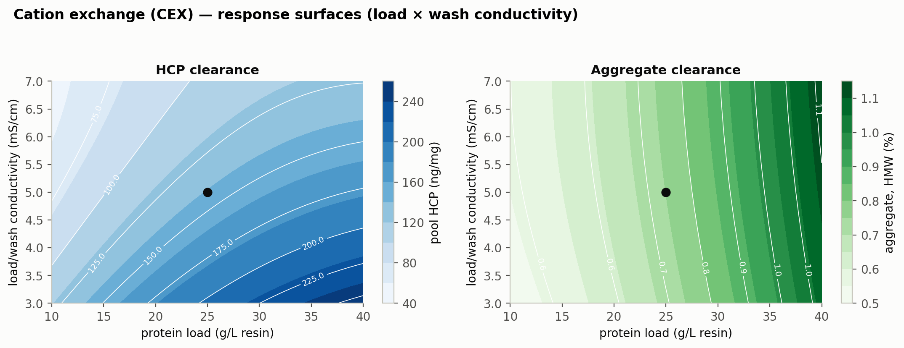

```{python}
#| tags: [setup]
import sys, os
sys.path.insert(0, os.path.abspath("."))
from _pcpkg import *  # noqa: F401,F403
import doe_report as D
import matplotlib.pyplot as plt
import scipy.stats as sstat
import statsmodels.api as sm

DOC = "PCR-007"
UO = "cex"
UO_TITLE = "Cation Exchange Chromatography (Step 7)"

# --------------------------------------------------------------------------- #
# Doc-local derived scalars and lookups. Everything below is read from the      #
# seeded model (config -> outputs/ -> _pcpkg / doe_report); nothing is typed.   #
# --------------------------------------------------------------------------- #

# -- design structure -------------------------------------------------------- #
SCR = csv(f"doe_{UO}_screening.csv")
RSMD = csv(f"doe_{UO}_rsm.csv")
n_scr = doe_runs(UO, "screening")
n_rsm = doe_runs(UO, "rsm")
n_scr_fact = int((SCR.run_type == "factorial").sum())
n_scr_cen = int((SCR.run_type == "center").sum())
n_rsm_fact = int((RSMD.run_type == "factorial").sum())
n_rsm_ax = int((RSMD.run_type == "axial").sum())
n_rsm_cen = int((RSMD.run_type == "center").sum())
n_fact = len(D.screening_factors(UO))
n_par = len(report_params(UO))
n_mv = int((report_params(UO)["Study"] == "multivariate").sum())
n_uv = n_par - n_mv
n_wccpp = int((report_params(UO)["Class"] == "WC-CPP").sum())
FCT = D.rsm_factors(UO)

# -- the step inside the nominal commercial-scale train ---------------------- #
PS = csv("process_summary.csv").set_index("step")
agg_in = float(PS.loc[6, "aggregate_out_pct"])
agg_out = float(PS.loc[7, "aggregate_out_pct"])
agg_fold = float(PS.loc[7, "aggregate_clearance_fold"])
hcp_in = float(PS.loc[5, "pool_hcp_ng_mg"])
hcp_out = float(PS.loc[7, "hcp_out_ng_mg"])
hcp_fold = float(PS.loc[7, "hcp_clearance_fold"])
aex_hcp_fold = float(PS.loc[8, "hcp_clearance_fold"])
aex_hcp_out = float(PS.loc[8, "hcp_out_ng_mg"])
dna_lrv = float(CFG.unit_op(UO).model["dna_lrv"])
lpa_lrv = float(CFG.unit_op(UO).model["leached_pa_lrv"])

# -- acceptance criteria and model predictions ------------------------------- #
acc_agg = D.acceptance_for(UO, "aggregate_out_pct")[1]
acc_hcp = D.acceptance_for(UO, "hcp_out_ng_mg")[1]
hcp_ceiling = acc_hcp * aex_hcp_fold   # CEX pool HCP the AEX step can still bring to spec
# the in-process limits the proven-acceptable-range analysis is measured against; both are
# the break-even ceiling divided by the assurance margin set in config (ipc_limits)
ipc_agg = D.effective_acceptance(UO, "aggregate_out_pct")[1]
ipc_hcp = D.effective_acceptance(UO, "hcp_out_ng_mg")[1]
ipc_hcp_margin = hcp_ceiling / ipc_hcp
DSG = D.design_space_grid(UO)
ds_pct = 100.0 * DSG["fraction"]


def pred(resp, **c):
    """Response-surface prediction at coded settings; omitted factors sit at coded 0."""
    return float(D.predict(UO, resp, coded={f: c.get(f, 0.0) for f in FCT})[0])


NORC = {f: [float(x) for x in D.to_coded(UO, f, CFG.unit_op(UO).param(f).nor)] for f in FCT}
SP = {p.key: float(p.setpoint) for p in CFG.unit_op(UO).parameters}
EDGE = {p.key: [float(x) for x in p.prange] for p in CFG.unit_op(UO).parameters}
NORE = {p.key: [float(x) for x in p.nor] for p in CFG.unit_op(UO).parameters}

agg_sp = pred("aggregate_out_pct")
hcp_sp = pred("hcp_out_ng_mg")
yld_sp = pred("step_yield")
agg_hi = pred("aggregate_out_pct", load=1, wash_cond=1, elution_ph=1, stop_collect=1)
agg_lo = pred("aggregate_out_pct", load=-1, wash_cond=-1, elution_ph=-1, stop_collect=-1)
agg_nor_hi = pred("aggregate_out_pct", **{f: NORC[f][1] for f in FCT})
agg_margin = acc_agg - agg_hi
hcp_hi = pred("hcp_out_ng_mg", load=1, wash_cond=-1, elution_ph=1, stop_collect=-1)
hcp_lo = pred("hcp_out_ng_mg", load=-1, wash_cond=1, elution_ph=-1, stop_collect=1)
hcp_nor_hi = pred("hcp_out_ng_mg", load=NORC["load"][1], wash_cond=NORC["wash_cond"][0],
                  elution_ph=NORC["elution_ph"][1], stop_collect=NORC["stop_collect"][0])
hcp_headroom = hcp_ceiling / hcp_hi
yld_hi_load = pred("step_yield", load=1)
yld_lo_load = pred("step_yield", load=-1)
# the load x conductivity interaction, read off the four corners of that plane
hcp_ab_hi = pred("hcp_out_ng_mg", load=1, wash_cond=-1) - pred("hcp_out_ng_mg", load=1, wash_cond=1)
hcp_ab_lo = pred("hcp_out_ng_mg", load=-1, wash_cond=-1) - pred("hcp_out_ng_mg", load=-1, wash_cond=1)

# -- fitted-model lookups ---------------------------------------------------- #
FS = {k: D.fit_summary_df(UO, k).set_index("Response") for k in ("screening", "rsm")}
EFFT = {r: D.screening_effects_df(UO, r).set_index("Term") for r in D.responses(UO)}
COEF = {r: D.rsm_coeff_df(UO, r).set_index("Term") for r in D.responses(UO)}
CENT = {k: D.center_cv_df(UO, k).set_index("Response") for k in ("screening", "rsm")}


def fitv(kind, resp, col):
    return float(FS[kind].loc[D.RESP_LABEL[resp], col])


def eff(resp, term, col="Effect"):
    return float(EFFT[resp].loc[term, col])


def coefv(resp, term, col="Coef."):
    return float(COEF[resp].loc[term, col])


def lofp(resp):
    d = D.anova_lof_df(UO, resp)
    return float(d.loc[d["Source"].str.strip() == "Lack of fit", "p-value"].iloc[0])


def cenv(kind, resp, col="%CV"):
    return float(CENT[kind].loc[D.RESP_LABEL[resp], col])


def capv(key, col="Cpk"):
    return float(cap[cap.key == key].iloc[0][col])


n_quad_sig = sum(int(COEF[r].loc[t, "p-value"] < 0.05)
                 for r in D.responses(UO)
                 for t in [D.factor_letters(UO)[f] + "²" for f in FCT])

# -- scale-down agreement at the centre point -------------------------------- #
sdm_agg_rel = 100 * abs(agg_sp - agg_out) / agg_out
sdm_hcp_sd = abs(hcp_sp - hcp_out) / cenv("rsm", "hcp_out_ng_mg", "SD")

# -- deviation diagnostics --------------------------------------------------- #
def zres(kind, resp, run):
    f = D.fit(UO, kind, resp)
    i = list(f["df"]["run"]).index(run)
    return float(f["model"].resid.values[i] / f["rmse"])


def sig_changes(kind, resp, run):
    """How many model terms change significance at the 5% level when a run is excluded."""
    f = D.fit(UO, kind, resp)
    m = f["model"]
    keep = [i for i, rr in enumerate(f["df"]["run"]) if rr != run]
    m2 = sm.OLS(m.model.endog[keep], m.model.exog[keep]).fit()
    import numpy as _np
    return int(((_np.asarray(m.pvalues)[1:] < 0.05) != (_np.asarray(m2.pvalues)[1:] < 0.05)).sum())


n_dev = len(dev_facts(DOC))
dev1_run = 6
dev2_run = 14
dev1_z = max(abs(zres("screening", r, dev1_run)) for r in D.responses(UO))
dev1_changes = sum(sig_changes("screening", r, dev1_run) for r in D.responses(UO))
_f14 = D.fit(UO, "rsm", "aggregate_out_pct")
_i14 = list(_f14["df"]["run"]).index(dev2_run)
dev2_obs = float(_f14["df"]["aggregate_out_pct"].iloc[_i14])
dev2_pred = float(_f14["model"].fittedvalues.values[_i14])
dev2_rel = 100 * abs(dev2_obs - dev2_pred) / dev2_pred
dev2_changes = sum(sig_changes("rsm", r, dev2_run) for r in D.responses(UO))


# -- appendix D: analytical method performance ------------------------------- #
def methods_table():
    m = csv("dev_methods.csv").set_index("id")
    rows = []
    for aid, title in list(CEX_AMV_REFS) + [("AMV-3221", "")]:
        name = str(m.loc[aid, "name"]) if aid in m.index else title
        if aid in m.index:
            r = m.loc[aid]
            rows.append([aid, name, f"{r['precision_pct']:g}", f"{r['loq']:g} {r['loq_unit']}",
                         f"{r['accuracy_pct']:g}"])
        else:
            rows.append([aid, name, "qualified", "qualified", "qualified"])
    return pd.DataFrame(rows, columns=["Method", "Analytical procedure", "Precision (%RSD)",
                                       "Limit of quantitation", "Accuracy (%)"])
```

```{python}
#| output: asis
print(title_block(DOC, UO_TITLE))
print()
print(SYN_BANNER)
```

## Approvals {.unnumbered}

| Role | Function | Name (synthetic) | Signature | Date |
|---|---|---|---|---|
| Author | Process Development / MSAT | — | — | — |
| Reviewer | Analytical Development | — | — | — |
| Reviewer | Manufacturing Science | — | — | — |
| Reviewer | Statistics | — | — | — |
| Approver | Quality Assurance | — | — | — |

: Approval record (synthetic; signatures not applied). {#tbl-appr}

## Abbreviations {.unnumbered}

AEX, anion exchange chromatography; AMV, analytical method validation; BLA, Biologics
License Application; CCD, central composite design; CEX, cation exchange chromatography;
CPP, critical process parameter; Cpk, process capability index; CQA, critical quality
attribute; CV, coefficient of variation; DNA, deoxyribonucleic acid; DoE, design of
experiments; DS, drug substance; ELISA, enzyme-linked immunosorbent assay; GPP, general
process parameter; HCP, host cell protein; HMW, high molecular weight; ICH, International
Council for Harmonisation; IgG1, immunoglobulin G subclass 1; KPP, key process parameter;
LOQ, limit of quantitation; MSAT, Manufacturing Science and Technology; MVM, minute virus
of mice; NOR, normal operating range; OD, optical density; PAR, proven acceptable range;
PCMR, process characterization master report; PCP, process characterization plan; PCR,
process characterization report; qPCR, quantitative polymerase chain reaction; RA, risk
assessment; RSD, relative standard deviation; RSM, response-surface methodology; SD,
standard deviation; SDM, scale-down model; SEC-HPLC, size-exclusion high-performance liquid
chromatography; SOP, standard operating procedure; UV, ultraviolet; WC-CPP, well-controlled
critical process parameter; XMuLV, xenotropic murine leukaemia virus.



# Executive summary {.unnumbered}

Cation exchange chromatography is the first of the two polishing steps in the A-Mab drug
substance process (Step 7), and it is the only step in the train that reduces aggregate. The
step is operated in bind and elute mode on a strong cation exchange resin, with a step elution
and a defined end of collection on the descending edge of the product peak. This report covers
the characterization study executed under PCP-007 in a qualified scale-down model, on the risk
basis established in RA-001. The study addressed `{python} f"{n_par}"` process parameters, of
which `{python} f"{n_mv}"` were taken into a multivariate design of `{python} f"{n_scr}"`
screening runs and `{python} f"{n_rsm}"` response-surface runs, while the remaining parameter
(the elution flow rate) was assessed univariately in a separate block. The work follows the
lifecycle approach to process validation [@fda2011] and the enhanced development approach of
ICH Q8, Q9 and Q11, and it takes the process description, the attribute set and the
criticality framework from the A-Mab case study [@amab2009].

The step sets no quality attribute of its own. It clears four of them: aggregate (high
molecular weight species by size-exclusion chromatography), host cell protein (HCP), residual
DNA and leached Protein A. Aggregate is the attribute the step carries, because no later unit
operation in the train reduces it. In the nominal commercial-scale run the step took the pool
from `{python} f"{agg_in:.2f}"` % to `{python} f"{agg_out:.2f}"` % high molecular weight
species, a reduction of `{python} f"{agg_fold:.1f}"`-fold, and the response-surface model
built here predicts a pool aggregate no higher than `{python} f"{agg_hi:.2f}"` % anywhere
inside the characterized region, against a drug substance limit of `{python} f"{acc_agg:g}"` %
(@tbl-cqa). Aggregate stays within its limit at every corner of the ranges studied, so the
operating region defined in @sec-designspace is bounded by those ranges and not by the
aggregate limit.

Pool host cell protein is the response that moves most across the design, and the step is
judged on the clearance factor it delivers and not on a drug substance release criterion. In
the nominal commercial-scale run the step reduced host cell protein
`{python} f"{hcp_fold:.0f}"`-fold, from `{python} f"{hcp_in:,.0f}"` ng/mg in the Protein A pool
to `{python} f"{hcp_out:.0f}"` ng/mg. That pool value is above the drug substance criterion of
`{python} f"{acc_hcp:g}"` ng/mg, which is the expected position for an intermediate, because
the drug substance does not exist until anion exchange chromatography has run. Anion exchange
clears a further factor of `{python} f"{aex_hcp_fold:.1f}"` to
`{python} f"{aex_hcp_out:.1f}"` ng/mg (PCR-008), and the cumulative position across the train
is consolidated in PCMR-001. Pool host cell protein rises with protein load, falls as the
conductivity of the load and wash buffer rises, and the two parameters act together, so the
least favourable corner of the characterized region (high protein load with low conductivity)
is the one the step must still satisfy. The model predicts
`{python} f"{hcp_hi:.0f}"` ng/mg there, against a step-level ceiling of
`{python} f"{hcp_ceiling:.0f}"` ng/mg derived in @sec-designspace from the anion exchange
clearance factor.

Commercial-scale capability was estimated by Monte-Carlo simulation of
`{python} f"{V['n_monte_carlo']:,}"` batches operated within their normal operating ranges
(NOR). Of the four attributes the step governs, the tightest capability belongs to host cell
protein, at a Cpk of `{python} f"{capv('hcp'):.1f}"` against a mean of
`{python} f"{capv('hcp','mean'):.1f}"` ng/mg. Aggregate is far wider, at a Cpk of
`{python} f"{capv('aggregates_hmw'):.1f}"` on a mean of
`{python} f"{capv('aggregates_hmw','mean'):.2f}"` % high molecular weight species. Both
figures are conditional on operation within the normal operating ranges and on the validity of
the scale-down model, and neither is a statement about behaviour at the edges of the region
defined in @sec-designspace.

All `{python} f"{n_wccpp}"` multivariate parameters are classified as well-controlled critical
process parameters (WC-CPP), and the elution flow rate is a general process parameter (GPP).
No parameter at this step required classification as a critical process parameter, and none is
a key process parameter. The campaign recorded `{python} f"{n_dev}"` deviations during
execution, both were investigated and dispositioned as retained, and neither altered a fitted
effect, an operating region boundary or a classification (@sec-deviations). No viral clearance claim is
made for this step, and no claim is made for modification of charge or glycan variants. The
outcomes of the study roll up into the master report PCMR-001.

# Introduction

## Product and unit operation

A-Mab is a humanized immunoglobulin G subclass 1 monoclonal antibody produced in a fed-batch
mammalian cell culture. Its principal mechanism of action is antibody-dependent cellular
cytotoxicity, so the glycan attributes that govern effector function (afucosylation,
galactosylation and high mannose) are formed in the production bioreactor and are not altered
downstream [@amab2009]. The drug substance process comprises eight steps, listed with their
control-strategy roles in @tbl-train. Cation exchange chromatography is Step 7. It receives
the neutralized pool from low-pH viral inactivation (Step 6, reported in PCR-006) and delivers
the load for anion exchange chromatography (Step 8, reported in PCR-008).

```{python}
#| output: asis
show(process_steps_df())
```

: The A-Mab drug substance process train and the principal role of each step. {#tbl-train}

The step uses a strong cation exchange resin in bind and elute mode. The load and wash buffer
is held at a conductivity low enough for the antibody to bind, while weakly retained process
impurities (host cell protein above all) pass into the flow-through and the wash. Product is
recovered by a step elution, and collection ends at a defined criterion on the descending edge
of the elution peak. Three mechanisms give the step its clearance. The first of them is the
reason the step carries the aggregate claim, since aggregated species carry a higher surface
charge density than monomer, bind more strongly, and are enriched in the descending edge of
the peak, so that a pool cut placed before that tail removes most of them. Host cell protein
species that bind through weaker electrostatic interactions are removed by the ionic strength
of the load and the wash. Residual DNA and leached Protein A are removed by those same two
mechanisms and are credited to the step at fixed nominal levels (@sec-cqascope).

The step is a polishing operation and forms no quality attribute. It is nonetheless the step
on which the aggregate content of the drug substance depends, since none of the operations
that follow it (anion exchange chromatography, small-virus retentive filtration and
ultrafiltration) reduces aggregate. The characterization is built around the aggregate
response for that reason, and the acceptance argument in @sec-designspace is made against the
drug substance aggregate limit and not against an in-process limit.

## Objectives

The study was executed to meet the objectives set out in PCP-007. They were:

- (i) Quantify the relationship between each process parameter and the measured responses over
  ranges wider than the normal operating range.
- (ii) Resolve the interactions between parameters that prior knowledge indicated were likely,
  in particular between protein load and the conductivity of the load and wash buffer.
- (iii) Define the multivariate operating region over which the attributes the step governs
  remain within their acceptance criteria.
- (iv) Establish a proven acceptable range for each parameter against each governed attribute,
  both at the set-point and with the remaining parameters varying within their normal operating
  ranges.
- (v) Classify each parameter and state the resulting contribution of the step to the control
  strategy for commercial manufacture.

## Regulatory and scientific basis

The study is a Stage 1 activity under the lifecycle approach to process validation, in which
Stage 1 is process design and Stage 2 is process qualification [@fda2011]. It provides the
process understanding on which the Stage 2 ranges (the ranges qualified for the commercial
step) and the commercial control strategy are built. The enhanced development approach of ICH
Q8(R2) supplies the design space concept used in @sec-designspace, and ICH Q11 supplies the
link from process understanding to the control strategy [@ichq8; @ichq11]. Criticality is
treated as a continuum in the sense of ICH Q9(R1), so that quality attributes carry a graded
criticality (from very low to very high) and each process parameter carries a class that
reflects both its demonstrated effect on those attributes and the reliability with which it
can be held inside the operating region [@ichq9]. The process model, the attribute set and the
criticality framework are those of the A-Mab case study [@amab2009].

No viral clearance claim is made for this step. Cation exchange chromatography can contribute
to enveloped-virus removal, but the modular clearance claims for A-Mab rest on low-pH
inactivation, anion exchange chromatography and small-virus retentive filtration (Steps 6, 8
and 9), and they are evaluated under ICH Q5A(R2) in PCR-006, PCR-008 and PCR-009 [@ichq5a].
The documents that frame, scope and consolidate this report are listed in @tbl-related.

```{python}
#| output: asis
print(related_docs_md(DOC))
```

: Related documents in the A-Mab characterization package. {#tbl-related}

# Prior knowledge and quality risk basis {#sec-prior}

## Platform and prior-product knowledge

The cation exchange polishing step is a platform operation. It has been operated at
commercial scale for three earlier humanized immunoglobulin G subclass 1 products (X-Mab,
Y-Mab and Z-Mab) and through the A-Mab clinical campaigns, on the same resin chemistry and the
same buffer system. The accumulated experience shows that the step reduces aggregate and host
cell protein reproducibly, and that its performance is governed by the loading and the elution
conditions and not by the resin lot. Characterization was therefore designed to confirm and
bound the platform behaviour for A-Mab, and not to discover it.

Prior knowledge also fixed the direction expected of each parameter, which is what makes the
study a test and not a survey. Protein load was expected to raise both pool aggregate and pool
host cell protein, because a column operated closer to its capacity resolves the strongly
bound aggregate and the weakly bound impurity less completely, and it was also expected to
lower step yield as product began to appear in the flow-through. The conductivity of the load
and wash buffer was expected to reduce pool host cell protein, since raising the ionic
strength disrupts the weaker electrostatic interactions that retain impurity while leaving the
antibody bound. Elution buffer pH and the elution stop collect criterion were expected to act
on aggregate through the position and the width of the collected peak, and to act on host cell
protein very little, because host cell protein is removed before the elution begins. The
elution flow rate was expected to act on cycle time alone. These expectations are examined
against the data in @sec-mechanism.

## Quality attributes in scope {#sec-cqascope}

This step forms no quality attribute, so the register of attributes it sets is empty. The
attributes it controls are the four impurity and size-variant attributes listed in @tbl-cqa,
each of which enters the step from an upstream operation and leaves it reduced. Aggregate
carries a high criticality and is measured as high molecular weight species by size-exclusion
chromatography (AMV-3011). Host cell protein carries a moderate to high criticality and is
measured by immunoassay (AMV-3012). Residual DNA and leached Protein A carry low criticality
and large capability margins, and they are reported here for completeness of the clearance
account rather than because this step governs them.

```{python}
#| output: asis
show(cqas_by_keys(["aggregates_hmw", "hcp", "residual_dna", "leached_protein_a"]))
```

: Quality attributes controlled and cleared by the cation exchange step, with their drug substance acceptance criteria and criticality. {#tbl-cqa}

Two of the four attributes were measured as responses across the designed experiments.
Aggregate and host cell protein vary with the operating conditions over the ranges studied and
were modelled. Residual DNA and leached Protein A are removed to a nominal
`{python} f"{dna_lrv:.1f}"` and `{python} f"{lpa_lrv:.1f}"` log reduction respectively at this
step, and neither was carried as a design response, because the clearance credited to the step
is small beside the margin those attributes hold at the drug substance stage (see @tbl-cap).
Their commercial-scale capability is given in @sec-capability, and the steps that carry the
larger part of their clearance are named there.

Aggregate is the attribute for which this step is the last opportunity. No further reduction
or clearance step for aggregate exists downstream of cation exchange, so whatever aggregate
leaves this pool is the aggregate content of the drug substance, and the acceptance argument
for the attribute has to be made here in full rather than shared with a later operation. Host
cell protein, residual DNA and leached Protein A are treated differently, because anion
exchange chromatography reduces all three again (PCR-008), and Protein A chromatography
carries the largest single share of the host cell protein and DNA reduction (PCR-005).

## Risk-based prioritization and parameter selection

The scope of this study was fixed by the pre-characterization risk assessment RA-001, which
ranked every parameter of the step on its potential effect on the governed attributes and on
its potential to interact with other parameters. Parameters that scored high on either axis
were assigned to a multivariate study, and parameters that scored low on both were assigned to
a univariate assessment. `{python} f"{n_mv}"` parameters met the multivariate criterion:
protein load, the conductivity of the load and wash buffer, elution buffer pH and the elution
stop collect criterion. The elution flow rate did not, because prior knowledge places its
action on residence time and on cycle time, and not on the binding chemistry that governs the
separation.

The ranges taken into the study are wider than the ranges the step will be operated within.
Each characterization range spans the normal operating range and extends beyond both of its
edges, which is what allows the study to describe process behaviour at conditions the
commercial process will not routinely see, and to support later movement within the operating
region. The ranges and their relationship to the set-points and the normal operating ranges are
given in @tbl-params. Two of them were set by specific prior constraints. The protein load
range was extended upward to a value well above the routine load (its upper edge is
`{python} f"{EDGE['load'][1]:g}"` g/L resin against a set-point of
`{python} f"{SP['load']:g}"` g/L resin), so that the approach to the dynamic binding capacity
of the resin would be visible in both the aggregate and the yield responses. The elution pH
range was kept narrow, because the elution buffer is prepared to a tight specification and a
wider excursion would move the elution position far enough to make the collected peak
unrepresentative of the commercial operation.

# Materials and methods

## Scale-down model and its qualification

All characterization runs were performed in a qualified scale-down model of the commercial
cation exchange step, operated under SOP-2010 and qualified under SOP-1001. The model
preserves the parameters that determine chromatographic behaviour. Bed height, linear flow
velocity, protein load per unit resin volume, and the load, wash and elution volumes expressed
in column volumes are all held at their commercial values, so that the residence time and the
number of column volumes seen by the resin match at both scales. Column packing quality was
confirmed before each block by plate count and peak asymmetry under SOP-2008. Buffer systems,
resin lot handling and the sanitization regime were the commercial ones, so that the only
deliberate differences between the model and the commercial step are the column diameter and
the absolute volumes handled.

Qualification of the model rests on the agreement of its output attributes with the
commercial-scale process at equivalent operating conditions. At the centre point the model
returns a pool aggregate of `{python} f"{agg_sp:.2f}"` % high molecular weight species against
`{python} f"{agg_out:.2f}"` % for the nominal commercial-scale run, a relative difference of
`{python} f"{sdm_agg_rel:.1f}"` %. The corresponding pool host cell protein values are
`{python} f"{hcp_sp:.0f}"` ng/mg and `{python} f"{hcp_out:.0f}"` ng/mg, which differ by
`{python} f"{sdm_hcp_sd:.1f}"` standard deviations of the centre-point replicate spread of that
response (@tbl-cv). The aggregate agreement is the material one, because aggregate is the
attribute the step carries and no later step can correct it, and the host cell protein
difference is smaller than the reproducibility of the immunoassay used to measure it. The
model is accordingly regarded as representative of the commercial step for the purpose of
defining operating ranges. It is not used to support any viral clearance claim, and the
qualification record is held with the study data referenced in PCP-007.

## Operation

Each run was executed as a complete chromatographic cycle. The column was equilibrated in the
load and wash buffer at the conductivity assigned to the run, loaded to the assigned protein
load, washed with the same buffer, and eluted with the elution buffer at the assigned pH.
Collection of the pool began at a fixed criterion on the ascending edge of the elution peak and
ended at the assigned stop collect criterion on the descending edge. Between runs the
column was cleaned and sanitized under SOP-2008. Inputs that are controlled to a platform
specification (the resin, the buffer components and the water quality) were verified against
those specifications and were not varied as study factors, because they are identity and
quality controlled and carry no residual uncertainty that this study could reduce.

The load material for every run was cation exchange load derived from a single low-pH viral
inactivation pool, so that the impurity and aggregate content of the feed was held constant
across the design. Holding the feed constant is what allows the fitted effects to be
attributed to the operating parameters. It also bounds the study, since the effect of a feed
with a different aggregate or host cell protein content is outside the region the models
describe. That bound is stated again in @sec-discussion.

## Analytical methods

Every response was measured by a validated method. Pool aggregate was measured as high
molecular weight species by size-exclusion chromatography (SEC-HPLC) under AMV-3011, host cell
protein by immunoassay (ELISA) under AMV-3012, residual DNA by quantitative polymerase chain
reaction (qPCR) under AMV-3014 and leached Protein A by immunoassay under AMV-3016. Step yield
was calculated from the product mass in the pool and the product mass in the load, each
determined by ultraviolet absorbance (A280). The controlled documents governing the step and
its methods are listed in @tbl-sop, and method performance characteristics are summarized in
Appendix D.

```{python}
#| output: asis
print(sop_table(sops=CEX_SOP_REFS, amvs=CEX_AMV_REFS))
```

: Controlled documents and validated analytical methods applied to the cation exchange characterization. {#tbl-sop}

The host cell protein immunoassay is the least precise of the methods used here (a relative
standard deviation of `{python} f"{amv_3012_precision:g}"` %), and its contribution to the
observed variation is quantified in @sec-centerpoint. That is a property of the method and not
of the process, and it is the reason the host cell protein model is interpreted through its
fitted effects and not through individual run values.

## Sampling plan

One pool sample was taken from every run and assayed for aggregate, host cell protein,
residual DNA and leached Protein A. Load samples were taken from each load preparation and
assayed for the same four attributes, so that clearance across the step could be calculated
run by run and not only as a difference of block means. Flow-through and wash fractions were
retained but were not assayed routinely. The screening block carried
`{python} f"{n_scr_cen}"` centre-point runs and the response-surface block carried
`{python} f"{n_rsm_cen}"`, distributed through the run order so that the replicate spread
reflects the full execution period (and therefore any slow drift in the column or the assays)
and not a single session.

## Statistical methods

All models were fitted on coded factors. Each factor was scaled so that its characterization
range maps to the interval from minus one to plus one, with the set-point at zero (for all four
multivariate factors the set-point is also the midpoint of the characterization range), which
makes the estimated coefficients directly comparable across parameters with different units.
The screening data were fitted with a model containing all main effects and all two-factor
interactions, and effects are reported as twice the coded coefficient, so that an effect is the
change in the response across the full characterization range of its factor. The
response-surface data were fitted with the full quadratic model in the same four factors.
Significance was assessed at the 5 % level throughout.

Model adequacy was judged on four grounds: the coefficient of determination and its adjusted
form, the predicted coefficient of determination computed from the prediction error sum of
squares, the overall F test, and an analysis of variance that partitions the residual into lack
of fit and pure error. The pure-error term comes from the replicated centre points, so the lack
of fit test asks whether the model misses structure that the replicates say is real, and a
model that passes it is one whose unexplained variation is no larger than the reproducibility
of the step itself. A response for which no factor reaches significance is reported as robust
over the ranges studied and is retained in the knowledge space on that basis.

Commercial-scale capability was estimated by Monte-Carlo simulation of
`{python} f"{V['n_monte_carlo']:,}"` batches, with each parameter drawn within its normal
operating range and the attribute computed from the process model. Capability is expressed as a
one-sided Cpk against the relevant drug substance criterion, since all four attributes governed
here are impurities with an upper limit only. Proven acceptable ranges were derived from the
fitted response-surface models in two forms (at the set-point and with the other parameters
varying within their normal operating ranges), and both are described in @sec-par.

# Study design

## Factors, ranges and the knowledge space

The design covers `{python} f"{n_par}"` parameters, of which `{python} f"{n_mv}"` were studied
multivariately and `{python} f"{n_uv}"` univariately. @tbl-params gives the set-point, the
normal operating range, the characterization range, the final classification and the study type
for each. The characterization range is the knowledge space edge for that parameter. It is not
in itself a proven acceptable range, which is a per-attribute quantity derived in @sec-par.

```{python}
#| output: asis
show(report_params(UO))
```

: Cation exchange process parameters, with set-points, normal operating ranges, characterization ranges, final classification and study type. {#tbl-params}

The four multivariate factors are coded A to D throughout the effect and coefficient tables.
@tbl-legend gives the mapping and shows that all four were carried from the screening design
into the response-surface design.

```{python}
#| output: asis
show(D.factor_legend_df(UO))
```

: Coded factor legend for the cation exchange designs. {#tbl-legend}

Each range was chosen against a stated constraint. The protein load range spans a wide band
around the set-point (from `{python} f"{EDGE['load'][0]:g}"` to
`{python} f"{EDGE['load'][1]:g}"` g/L resin), because load is the parameter with the largest
expected effect and because the upper edge has to approach the working capacity of the resin
for the study to describe an overloaded column. The conductivity range for the load and wash
buffer is set by the two failure modes that bound it, since too low a conductivity retains
impurity that the wash should remove, while too high a conductivity begins to compete with
product binding and would cost yield. The elution pH range is narrow for the reason given in
the risk section. The stop collect range spans a band on either side of the platform criterion
(from `{python} f"{EDGE['stop_collect'][0]:g}"` to
`{python} f"{EDGE['stop_collect'][1]:g}"`) that is wide enough to move a visible amount of the
descending edge into and out of the pool.

## Screening design

The screening design was a two-level full factorial in the four multivariate factors,
augmented with centre points. It comprises `{python} f"{n_scr_fact}"` factorial runs and
`{python} f"{n_scr_cen}"` centre-point runs, for `{python} f"{n_scr}"` runs in total, executed
in randomized order. A full factorial in four factors estimates every main effect and every
two-factor interaction without aliasing, which is what the risk assessment required, since the
interaction between protein load and load and wash conductivity was expected in advance. The
centre points provide the pure-error estimate and a test for curvature. The coded design matrix
and the measured responses are given in Appendix A.

The purpose of this block is to identify which factors matter, and it is used for that purpose
only. The model it supports contains eleven terms fitted to `{python} f"{n_scr}"` runs, so the
residual degrees of freedom are few, the fitted magnitudes are correspondingly uncertain, and
the design is not able to separate curvature in one factor from curvature in another. The
predictive model for this step is the response-surface model described next.

## Response-surface design

The response-surface design was a face-centred central composite design in the same four
factors. It comprises `{python} f"{n_rsm_fact}"` factorial runs, `{python} f"{n_rsm_ax}"`
axial runs placed on the faces of the design cube and `{python} f"{n_rsm_cen}"` centre-point
runs, for `{python} f"{n_rsm}"` runs in total. Placing the axial points on the faces keeps every
run inside the characterization ranges, so that no run is executed at a condition the design
does not claim to describe. The axial points supply the information needed to estimate the four
quadratic terms and so to test whether any response curves over its range. The coded design
matrix and the measured responses are given in Appendix B.

This design is the basis of every predictive statement in this report. The operating region in
@sec-designspace, the proven acceptable ranges in @sec-par and the worst-case predictions
quoted in the executive summary all come from the fitted quadratic models, and not from the
screening fit.

## Univariate assessment

The elution flow rate was assessed univariately across its characterization range (from
`{python} f"{EDGE['flow'][0]:g}"` to `{python} f"{EDGE['flow'][1]:g}"` cm/hr) with the four
multivariate factors held at their set-points. Flow rate acts on residence time, and residence
time affects the sharpness of the elution peak and not the binding chemistry that determines
where impurity and aggregate partition. No effect on pool aggregate, pool host cell protein or
step yield was detected across the range assessed, which is the basis for the classification
given in @sec-classification. Keeping the parameter out of the multivariate design also kept
that design small enough to execute in a single campaign, which is the practical reason
risk-based prioritization is applied at all.

# Results

## Centre-point performance and reproducibility {#sec-centerpoint}

The step reproduces well at its set-point, and the residual variation differs sharply between
the three responses. @tbl-cv gives the mean, the standard deviation and the coefficient of
variation of the `{python} f"{n_rsm_cen}"` centre-point runs of the response-surface block.

```{python}
#| output: asis
show(D.center_cv_df(UO, "rsm"), floatfmt=".3f")
```

: Centre-point reproducibility in the response-surface block, and the pure-error basis for the lack-of-fit tests. {#tbl-cv}

Step yield is the most reproducible response, at a coefficient of variation of
`{python} f"{cenv('rsm','step_yield'):.1f}"` %. Pool aggregate follows at
`{python} f"{cenv('rsm','aggregate_out_pct'):.1f}"` %. Pool host cell protein is the least
precise at `{python} f"{cenv('rsm','hcp_out_ng_mg'):.1f}"` %, which is close to the relative
standard deviation of `{python} f"{amv_3012_precision:g}"` % established for the immunoassay
under AMV-3012, so most of the centre-point spread in that response is analytical variation
and not process variation. The same pattern holds in the screening block, where the aggregate
and host cell protein coefficients of variation were
`{python} f"{cenv('screening','aggregate_out_pct'):.1f}"` % and
`{python} f"{cenv('screening','hcp_out_ng_mg'):.1f}"` %. Both blocks are less precise for host
cell protein than for the other two responses by the same factor, which is what a method
limitation looks like and what a process instability would not. These replicate spreads are the
pure-error terms used in the lack-of-fit tests reported in @sec-rsm.

## Screening: factor effects

The screening block identified protein load as the dominant parameter for every response, and
resolved the two interactions that the risk assessment had anticipated. @tbl-scrfit summarizes
the fit of the screening models.

```{python}
#| output: asis
show(D.fit_summary_df(UO, "screening"), floatfmt=".4g")
```

: Screening model fit summary for the three measured responses. {#tbl-scrfit}

Pool aggregate is affected by protein load, elution buffer pH and the stop collect criterion,
and by three interactions among them. The six significant terms are given in @tbl-eff-agg.
Protein load has the largest effect, at `{python} f"{eff('aggregate_out_pct','A'):.2f}"`
percentage points of high molecular weight species across its characterization range. Elution
buffer pH and the stop collect criterion follow, at
`{python} f"{eff('aggregate_out_pct','C'):.2f}"` and `{python} f"{eff('aggregate_out_pct','D'):.2f}"`
points, and all three raise pool aggregate as they increase. The interaction between protein
load and elution buffer pH is significant at `{python} f"{eff('aggregate_out_pct','AC'):.2f}"`
points, and the interactions of protein load and of elution pH with the stop collect criterion
are significant and smaller (@tbl-eff-agg). The conductivity of the load and wash buffer has no
detectable effect on pool aggregate at all, at
`{python} f"{eff('aggregate_out_pct','B'):.3f}"` points and a p-value of
`{python} f"{eff('aggregate_out_pct','B','p-value'):.2f}"`, and that null result is carried
forward as evidence that the aggregate and host cell protein controls act through different
parameters.

```{python}
#| output: asis
show(D.screening_effects_df(UO, "aggregate_out_pct", top=6), floatfmt=".4g")
```

: Screening effect estimates for pool aggregate, the six largest by absolute magnitude. Effects are expressed across the full characterization range of each factor. {#tbl-eff-agg}

Pool host cell protein is affected by the conductivity of the load and wash buffer, by protein
load, and by the interaction between them (@tbl-eff-hcp). Conductivity has the largest effect,
reducing pool host cell protein by `{python} f"{abs(eff('hcp_out_ng_mg','B')):.0f}"` ng/mg
across its range. Protein load raises it by `{python} f"{eff('hcp_out_ng_mg','A'):.0f}"` ng/mg
across its range, which is a comparable magnitude in the opposite direction. The interaction is
significant at `{python} f"{eff('hcp_out_ng_mg','AB'):.0f}"` ng/mg, and its negative sign means
that raising the conductivity removes more host cell protein when the column is loaded heavily
than when it is loaded lightly, which is the effect the risk assessment predicted and the
reason these two parameters were taken into a multivariate design together. Neither elution
buffer pH nor the stop collect criterion has a significant effect on pool host cell protein
(p-values of `{python} f"{eff('hcp_out_ng_mg','C','p-value'):.2f}"` and
`{python} f"{eff('hcp_out_ng_mg','D','p-value'):.2f}"`), which is consistent with a separation
that takes place during the load and the wash and not during the elution.

```{python}
#| output: asis
show(D.screening_effects_df(UO, "hcp_out_ng_mg", top=6), floatfmt=".4g")
```

: Screening effect estimates for pool host cell protein, the six largest by absolute magnitude. {#tbl-eff-hcp}

Step yield depends on protein load alone. The effect is
`{python} f"{eff('step_yield','A'):.3f}"` across the load range, and no other term reaches
significance. That is a null result for three of the four factors, and it is retained as such,
because the conductivity of the load and wash buffer, the elution pH and the stop collect
criterion may all be moved across their whole characterization ranges without a measurable
yield penalty. Their inactivity is evidence of robustness and is carried into the
classification in @sec-classification.

The screening block is used to identify the active factors and nothing more. Its models fit
eleven terms to `{python} f"{n_scr}"` runs, and the predicted coefficient of determination for
pool host cell protein is only `{python} f"{fitv('screening','hcp_out_ng_mg','Pred. R²'):.2f}"`,
against `{python} f"{fitv('screening','hcp_out_ng_mg','R²'):.2f}"` for the raw coefficient of
determination (@tbl-scrfit). The gap between those two figures is what a near-saturated design
produces, and it is the reason no operating range and no proven acceptable range is drawn from
this block. The effect magnitudes are refined by the response-surface models below, and it is
those models that carry every predictive claim in this report.

## Response-surface models {#sec-rsm}

The response-surface models describe pool aggregate and pool host cell protein well, and step
yield only in part. @tbl-rsmfit gives the fit summary for all three.

```{python}
#| output: asis
show(D.fit_summary_df(UO, "rsm"), floatfmt=".4g")
```

: Response-surface model fit summary. {#tbl-rsmfit}

Pool aggregate is described by a model with a coefficient of determination of
`{python} f"{fitv('rsm','aggregate_out_pct','R²'):.3f}"`, an adjusted value of
`{python} f"{fitv('rsm','aggregate_out_pct','Adj. R²'):.3f}"` and a predicted value of
`{python} f"{fitv('rsm','aggregate_out_pct','Pred. R²'):.3f}"`. Pool host cell protein is
described almost as well, at `{python} f"{fitv('rsm','hcp_out_ng_mg','R²'):.3f}"` and a
predicted value of `{python} f"{fitv('rsm','hcp_out_ng_mg','Pred. R²'):.3f}"`. The closeness of
the predicted value to the adjusted value in both models is the property that matters for a
predictive claim, because it says the models keep their accuracy on data they have not seen,
and both models are used for prediction in this report on that basis. The step yield model
reaches significance overall, at a p-value of
`{python} f"{fitv('rsm','step_yield','p-value'):.4f}"`, but its predicted coefficient of
determination is only `{python} f"{fitv('rsm','step_yield','Pred. R²'):.2f}"`. The yield model
is therefore used to state the direction and the approximate size of the load effect, and it is
not used to predict yield at any given condition. Yield is a process performance response and
carries no quality claim, so that limitation does not touch the acceptance argument in
@sec-designspace.

```{python}
#| output: asis
show(D.rsm_coeff_df(UO, "aggregate_out_pct"), floatfmt=".4g")
```

: Full quadratic coefficients for pool aggregate, in model order. Coefficients are on coded factors. {#tbl-coef-agg}

The aggregate coefficients in @tbl-coef-agg confirm the screening picture and sharpen it.
Protein load carries a coefficient of `{python} f"{coefv('aggregate_out_pct','A'):.3f}"`, elution
buffer pH `{python} f"{coefv('aggregate_out_pct','C'):.3f}"` and the stop collect criterion
`{python} f"{coefv('aggregate_out_pct','D'):.3f}"`, all significant and all positive, and the
three significant interactions (load with elution pH, load with stop collect, and elution pH
with stop collect) are the same three the screening block found. The conductivity of the load
and wash buffer remains inactive, at a p-value of
`{python} f"{coefv('aggregate_out_pct','B','p-value'):.2f}"`. No quadratic term is significant
for any of the three responses, and the largest of them (the load quadratic in the aggregate
model) reaches only `{python} f"{coefv('aggregate_out_pct','A²','p-value'):.2f}"`. Over the
ranges studied the surfaces are accordingly planes with an interaction twist, and there is no
interior optimum and no edge of failure inside the region.

```{python}
#| output: asis
show(D.rsm_coeff_df(UO, "hcp_out_ng_mg"), floatfmt=".4g")
```

: Full quadratic coefficients for pool host cell protein, in model order. {#tbl-coef-hcp}

The host cell protein coefficients in @tbl-coef-hcp reproduce the two dominant main effects and
the protein load interaction with conductivity, and they add a second interaction that the
screening block did not resolve. The coefficient for conductivity with elution buffer pH is
`{python} f"{coefv('hcp_out_ng_mg','BC'):.1f}"` at a p-value of
`{python} f"{coefv('hcp_out_ng_mg','BC','p-value'):.4f}"`, against a screening p-value of
`{python} f"{eff('hcp_out_ng_mg','BC','p-value'):.2f}"` for the same term (@tbl-appc2). The
larger design and its lower residual variance are the reason the term is now visible, and the
change should be read as better resolution and not as a different result. The effect is modest
beside the two main effects, and it is reported here because it is real and because it slightly
changes the shape of the acceptable region at the low conductivity edge.

```{python}
#| output: asis
show(D.anova_lof_df(UO, "aggregate_out_pct"))  # auto format: sums of squares stay plain, p-values stay scientific
```

: Analysis of variance for the pool aggregate response-surface model, with the residual partitioned into lack of fit and pure error. {#tbl-anova-agg}

```{python}
#| output: asis
show(D.anova_lof_df(UO, "hcp_out_ng_mg"))  # auto format: sums of squares stay plain, p-values stay scientific
```

: Analysis of variance for the pool host cell protein response-surface model. {#tbl-anova-hcp}

Neither model shows a significant lack of fit. For pool aggregate the lack-of-fit F test
returns a p-value of `{python} f"{lofp('aggregate_out_pct'):.2f}"` (@tbl-anova-agg), and for
pool host cell protein `{python} f"{lofp('hcp_out_ng_mg'):.2f}"` (@tbl-anova-hcp). In both
cases the unexplained variation is of the same size as the replicate variation, so the models
do not miss structure that the centre points say is present. The lack-of-fit test for step
yield is likewise not significant, at `{python} f"{lofp('step_yield'):.2f}"`, and the full
coefficient table for that response is in Appendix C.

```{python}
#| label: fig-contours-cond
#| fig-cap: "Response-surface predictions over protein load and load/wash conductivity, with elution buffer pH and the stop collect criterion held at their set-points."
fig = D.fig_rsm_contours(UO, "load", "wash_cond")
plt.show()
```

```{python}
#| label: fig-contours-ph
#| fig-cap: "Response-surface predictions over protein load and elution buffer pH, with load/wash conductivity and the stop collect criterion held at their set-points."
fig = D.fig_rsm_contours(UO, "load", "elution_ph")
plt.show()
```

The two planes that carry the argument are shown in @fig-contours-cond and @fig-contours-ph.
In the load and conductivity plane the host cell protein surface is strongly tilted and visibly
twisted, which is the interaction seen in the coefficient table (@tbl-coef-hcp). The aggregate
surface in the same plane is almost flat along the conductivity axis, so the two attributes are
governed by different parameters and can be controlled independently of one another. In the
load and elution pH plane the aggregate surface tilts along both axes, and the twist between
them is the load and elution pH interaction. The aggregate panels carry no contour at the drug
substance limit, because no part of that surface comes close to it, and the host cell protein
panels sit above the drug substance criterion throughout, for the reason set out in
@sec-designspace.

```{python}
#| label: fig-diag-agg
#| fig-cap: "Model diagnostics for the pool aggregate response-surface model: standardized residuals against predicted values, normal quantile plot and actual against predicted."
fig = D.fig_diagnostics(UO, "aggregate_out_pct")
plt.show()
```

```{python}
#| label: fig-diag-hcp
#| fig-cap: "Model diagnostics for the pool host cell protein response-surface model."
fig = D.fig_diagnostics(UO, "hcp_out_ng_mg")
plt.show()
```

The diagnostics in @fig-diag-agg and @fig-diag-hcp support the two fits. The standardized
residuals show no trend with the predicted value and no change of spread across the fitted
range, so the constant-variance assumption holds. The normal quantile plots are close to
linear, with no point far from the line. The actual against predicted plots lie on the identity
line across the whole range of each response, including the extreme corners, which is the plot
that matters when a model is used to predict at a corner of the region.

## Mechanistic interpretation {#sec-mechanism}

The surfaces behave as the binding chemistry of the step predicts, and that agreement is what
allows the models to be used at conditions between the ones actually run. Protein load acts on
both governed attributes for the same underlying reason. As the load rises toward the working
capacity of the resin, the column has less capacity available to resolve species that differ
only slightly in their affinity for the resin. Aggregate, which binds more strongly than
monomer because it carries a higher surface charge density, is displaced forward into the
collected peak instead of remaining in the descending edge. Weakly bound host cell protein,
which would otherwise be displaced by the antibody and removed in the wash, competes more
successfully for the sites that remain. Step yield falls over the same range, from
`{python} f"{yld_lo_load:.3f}"` at the low load edge to `{python} f"{yld_hi_load:.3f}"` at the
high load edge, because product begins to appear in the flow-through as the column approaches
capacity. All three responses accordingly move together with load, and the direction of each is
the one prior knowledge expected (see @sec-prior).

The load and conductivity plane of the seeded process model is shown in @fig-model-cex for
comparison with the fitted surfaces. It reproduces the same two features: a strongly curved
host cell protein surface with its worst region at high load and low conductivity, and an
aggregate surface that depends on load alone.

{#fig-model-cex}

The conductivity of the load and wash buffer acts on host cell protein alone, and the split is
mechanistically clean. Raising the ionic strength weakens all electrostatic interactions with
the resin, but it weakens the weak ones first. Host cell protein species retained by low
avidity contacts are released and washed out, while the antibody, which binds through many
contacts at once, stays on the column. Aggregate and monomer differ from each other in charge
density and not in the number of weak contacts, so raising the conductivity moves the two
species together and changes their separation very little. Conductivity is accordingly the
parameter that governs pool host cell protein, and it has no detectable effect on pool
aggregate (@tbl-coef-agg).

The interaction between protein load and conductivity has the same origin, expressed as a
quantity. The amount of host cell protein presented to the column scales with the amount of
material loaded, so the absolute quantity that a given wash strength can remove also scales with
the load. Reading the fitted surface at the edges of the two ranges makes the size of the effect
plain. At the high load edge, raising the conductivity from its low edge to its high edge lowers
pool host cell protein by `{python} f"{hcp_ab_hi:.0f}"` ng/mg, while at the low load edge the
same change in conductivity lowers it by only `{python} f"{hcp_ab_lo:.0f}"` ng/mg. The wash is
worth roughly twice as much at the top of the load range as at the bottom, which is the
practical content of the interaction and the reason the two parameters cannot be given
independent univariate ranges.

Elution buffer pH and the stop collect criterion act on aggregate through the elution itself.
Raising the elution pH lowers the net positive charge on the antibody and weakens its
interaction with the resin, so the product elutes earlier and in a sharper front, and the
aggregate that trails the monomer is pulled forward into the collected pool. Extending the stop
collect criterion further down the descending edge collects more of the tail in which that
aggregate sits. The two parameters act together, which is the significant interaction between
them (term CD in @tbl-coef-agg), because the amount of aggregate available to be collected in
the tail depends on how far forward the elution pH has already moved it. Both are therefore
aggregate parameters, and neither has a significant effect on host cell protein, which has
already been removed by the time the elution begins.

# Design space {#sec-designspace}

The design space for this step is the part of the characterized four-dimensional region in
which both governed attributes stay within their in-process limits. It is
`{python} f"{ds_pct:.0f}"` % of that region, evaluated on an evenly spaced grid over the four
parameters. The claim rests on the two response-surface models, and it is bounded in three
ways that are stated at the end of this section.

Aggregate is the governing attribute, and the reason is structural. No unit operation
downstream of cation exchange reduces aggregate, so the pool leaving this step determines the
aggregate content of the drug substance. Its in-process limit of
`{python} f"{ipc_agg:.2f}"` % is the drug substance criterion of `{python} f"{acc_agg:g}"` %
divided by an assurance margin, and because no later step helps, that margin is the only
protection the attribute has. The highest pool aggregate the model predicts anywhere inside
the characterized ranges is `{python} f"{agg_hi:.2f}"` %, at the corner where protein load,
load and wash conductivity, elution buffer pH and the stop collect criterion are all at their
upper edges. That corner is above the in-process limit and is outside the design space,
though it remains below the drug substance criterion by
`{python} f"{agg_margin:.2f}"` percentage points. The lowest predicted value, at the opposite corner, is
`{python} f"{agg_lo:.2f}"` %, and within the normal operating ranges the worst corner falls to
`{python} f"{agg_nor_hi:.2f}"` %. The whole surface therefore sits in the lower part of the
available range, and there is no edge of failure for aggregate inside the knowledge space.

Host cell protein does not bound the region either, but the argument for it is different and
depends on the step that follows. The drug substance criterion of
`{python} f"{acc_hcp:g}"` ng/mg does not apply to the cation exchange pool, which is an
in-process intermediate, and applying it here would require this step to deliver the whole
host cell protein reduction on its own. What this step must deliver instead is a clearance
factor, and a pool that anion exchange chromatography can finish. Anion exchange reduces pool
host cell protein by a further factor of `{python} f"{aex_hcp_fold:.1f}"`, from
`{python} f"{hcp_out:.0f}"` ng/mg to `{python} f"{aex_hcp_out:.1f}"` ng/mg in the nominal
commercial-scale run (PCR-008). Multiplying the drug substance criterion by that clearance
factor gives `{python} f"{hcp_ceiling:.0f}"` ng/mg as the cation exchange pool concentration
from which the criterion can still be met. Dividing that ceiling by the assurance margin
gives the in-process limit of `{python} f"{ipc_hcp:.0f}"` ng/mg used in @sec-par, which is
the concentration this step is actually controlled to. The worst corner of the characterized region for host
cell protein is at high protein load with low conductivity, where the model predicts
`{python} f"{hcp_hi:.0f}"` ng/mg, a factor of `{python} f"{hcp_headroom:.1f}"` below that
ceiling, and within the normal operating ranges the same corner falls further to
`{python} f"{hcp_nor_hi:.0f}"` ng/mg. The cumulative host cell protein position across the
whole train is consolidated in PCMR-001.

The two worst-case corners are not the same corner, and both were identified separately because
the governing parameters differ. Aggregate is worst when every parameter is at its upper edge.
Host cell protein is worst when protein load is high and the load and wash conductivity is low.
The region has to satisfy both corners, and it does, with the margins given above. The normal
operating ranges in @tbl-params sit inside the characterized region on every axis, and the
characterized region sits inside the knowledge space that the multivariate design and the
univariate assessment together cover. This is the nesting that ICH Q8(R2) describes, and the
design space claimed here is the multivariate region and not the set of univariate ranges
[@ichq8].

Movement within the region is not a change in the regulatory sense, and it does not require
prior approval [@ichq8]. It remains subject to the change management system of the
pharmaceutical quality system, so a planned move is assessed prospectively before it is made
[@ichq10]. Operation outside the region is a change and is handled through change control.

Three bounds apply to this claim, and none of them is removed by the data in this report.
First, the region is defined over the ranges studied and says nothing about behaviour outside
them, and the edges of the design space have not been confirmed at commercial scale. Second,
the models predict mean responses, so the assurance that an individual batch meets the
criterion comes from the capability analysis in @sec-capability and not from the surfaces
themselves. Third, all runs were executed on load material derived from a single low-pH viral
inactivation pool, so the region describes the step for feed of that character and does not
describe its response to a feed with a different aggregate or impurity burden. The aggregate
and host cell protein content of the load is controlled by the upstream steps (PCR-003, PCR-005
and PCR-006) and is monitored as an input attribute, as described in @sec-control.

# Proven acceptable ranges {#sec-par}

Every characterized parameter range is a proven acceptable range for aggregate. None is a
proven acceptable range for host cell protein when that attribute is judged against the drug
substance criterion, and the reason is the cross-step dependency described in
@sec-designspace and not any shortcoming of the step.

The acceptance basis is the drug substance specification in both cases, taken from @tbl-cqa.
Neither response is a viral clearance response, so no back-calculation from a cumulative
requirement is involved, and the criterion applied to each is the in-process limit for this
step rather than the criterion the drug substance itself must meet. The two are not the same.
The cation exchange pool is an intermediate, and anion exchange still has to run, so the
drug substance criterion of `{python} f"{acc_hcp:g}"` ng/mg does not describe what this pool
has to achieve. The in-process limits used here are
`{python} f"{ipc_agg:.2f}"` % for aggregate and `{python} f"{ipc_hcp:.0f}"` ng/mg for host
cell protein. Each is the concentration from which the remaining steps can still reach the
drug substance criterion, divided by an assurance margin, and the derivation is given in
@sec-designspace. Two analyses were run for each combination of attribute and parameter. The first
holds the other three parameters at their set-points (coded zero) and scans the parameter of
interest across its characterization range. The second varies the other three within their
normal operating ranges by Monte-Carlo simulation of the fitted response-surface model, and
asks over what part of the range the 95 % predictive interval of the attribute stays inside the
criterion. The second analysis is the stricter of the two, because it requires the parameter to
remain acceptable while the rest of the operating point moves around it. Both are given in
@tbl-par.

```{python}
#| output: asis
show(D.par_table(UO))
```

: Proven acceptable ranges for each governed attribute and each multivariate parameter, at the set-point and with the remaining parameters varying within their normal operating ranges. {#tbl-par}

For aggregate the two analyses separate, and the separation is the informative part. Held at
their set-points, the load and wash conductivity and the elution buffer pH and the stop
collect criterion are all acceptable across their whole studied ranges, and only protein load
is bounded, at the top of its range. Once the other three parameters are allowed to move
within their normal operating ranges, three of the four ranges close in. Protein load loses
most, the elution buffer pH and the stop collect criterion lose the upper part of their
ranges, and only the load and wash conductivity still spans the range it was studied over.
The narrowing is not a failure. It says that the acceptable setting of one parameter depends
on where the others sit, which is the condition the commercial process will actually meet,
and it is the reason the design space in @sec-designspace is stated as a region and not as
four independent ranges.

```{python}
#| label: fig-par-agg
#| fig-cap: "Proven acceptable range for pool aggregate against protein load. The left panel holds the other parameters at their set-points; the right panel varies them within their normal operating ranges by Monte-Carlo simulation. The acceptable region is shaded green."
fig = D.fig_par(UO, "aggregate_out_pct", D.governing_factor(UO, "aggregate_out_pct"))
plt.show()
```

@fig-par-agg shows the analysis for aggregate against protein load, which is the parameter with
the largest effect on that attribute (@tbl-eff-agg). The predicted response rises across the
load range and crosses the in-process limit near the top of it, so the shaded acceptable
region stops short of the right-hand edge in the left panel. In the right panel it stops
earlier still. The upper edge of the predictive interval carries the variation of the other
three parameters as well as the residual spread of the model, so it reaches the limit at a
lower load than the mean response does. The difference between the two panels is the cost of
letting the rest of the operating point move, and it is why the design space is not simply
the characterized rectangle.

```{python}
#| label: fig-par-hcp
#| fig-cap: "Pool host cell protein against load/wash conductivity, analysed against the in-process limit for this step. The acceptable region is shaded green. The limit is the pool concentration from which anion exchange can still reach the drug substance criterion, divided by an assurance margin."
fig = D.fig_par(UO, "hcp_out_ng_mg", D.governing_factor(UO, "hcp_out_ng_mg"))
plt.show()
```

For host cell protein the analysis returns a range for every parameter, and @fig-par-hcp shows
the parameter that governs. The load and wash conductivity is bounded at the bottom of its
studied range and not at the top, which is the direction the mechanism predicts. A lower
conductivity weakens the wash, more host cell protein stays bound to the product and elutes
with it, and the pool concentration rises. The elution buffer pH and the stop collect
criterion are acceptable across their whole studied ranges under both analyses, and protein
load is acceptable across its whole range at the set-point. Under normal operating range
variation protein load closes in from the top, because a heavier load and a weak wash push in
the same direction.

The step is also judged on its clearance factor, which is
`{python} f"{hcp_fold:.0f}"`-fold in the nominal commercial-scale run. The in-process limit
and the clearance factor are two statements of the same requirement. The worst corner of the
characterized region, at high load with a weak wash, is predicted at
`{python} f"{hcp_hi:.0f}"` ng/mg, which is above the in-process limit of
`{python} f"{ipc_hcp:.0f}"` ng/mg. That corner is therefore outside the operating region this
step claims, and it is excluded by the design space in @sec-designspace rather than by any
single univariate range. The limit itself sits a factor of
`{python} f"{ipc_hcp_margin:.1f}"` below the `{python} f"{hcp_ceiling:.0f}"` ng/mg from which
anion exchange could still reach the drug substance criterion, so a batch at the limit is
still comfortably recoverable. The margin is what makes the limit a control rather than a
break-even point. This conclusion is conditional on the anion exchange clearance factor
holding, which is a claim of PCR-008 and not of this report, and the cumulative outcome is
reported in PCMR-001.

The proven acceptable ranges above and the design space in @sec-designspace are different
claims, and they are stated separately here so that neither is read as the other. The proven
acceptable ranges are univariate, made either at the set-point or under normal operating range
variation of the other parameters. The design space is the multivariate region, and it is the
region that governs. Where a proven acceptable range is narrower than the range that was
characterized, as several are here, the univariate limit and the edge of the characterized
space both bind, and the design space is the smaller of the two. Both claims are bounded by
the ranges studied and by the fitted response-surface models, and neither extends to
conditions outside the characterization ranges given in @tbl-params.

# Process capability and robustness {#sec-capability}

The four attributes this step governs all meet their drug substance criteria at commercial
scale with wide margins. Capability was estimated by Monte-Carlo simulation of
`{python} f"{V['n_monte_carlo']:,}"` batches, with every process parameter in the train drawn
within its normal operating range, and is reported as a one-sided Cpk against the relevant
criterion in @tbl-cap.

```{python}
#| output: asis
show(cap_for(["aggregates_hmw", "hcp", "residual_dna", "leached_protein_a"]), floatfmt=".2f")
```

: Commercial-scale capability for the quality attributes governed by the cation exchange step. {#tbl-cap}

Aggregate has a Cpk of `{python} f"{capv('aggregates_hmw'):.1f}"`, on a simulated mean of
`{python} f"{capv('aggregates_hmw','mean'):.2f}"` % high molecular weight species against a
limit of `{python} f"{acc_agg:g}"` %. The margin between the mean and the limit is
`{python} f"{acc_agg - capv('aggregates_hmw','mean'):.2f}"` percentage points, or more than
`{python} f"{(acc_agg - capv('aggregates_hmw','mean')) / capv('aggregates_hmw','sd'):.0f}"`
standard deviations of the simulated batch distribution (the simulated standard deviation is
`{python} f"{capv('aggregates_hmw','sd'):.3f}"` %). This capability belongs to the cation
exchange step alone, because no other step in the train changes the attribute.

Host cell protein has the tightest capability of the four, at a Cpk of
`{python} f"{capv('hcp'):.1f}"` on a mean of `{python} f"{capv('hcp','mean'):.1f}"` ng/mg
against a limit of `{python} f"{acc_hcp:g}"` ng/mg. That figure is a whole-train result and the
credit for it is shared across three steps. Protein A chromatography removes the largest single
share and is reported in PCR-005, this step removes a further
`{python} f"{hcp_fold:.0f}"`-fold in the nominal commercial-scale run, and anion exchange
chromatography removes a further `{python} f"{aex_hcp_fold:.1f}"`-fold and is reported in
PCR-008. Residual DNA and leached Protein A have Cpk values of
`{python} f"{capv('residual_dna'):.1f}"` and `{python} f"{capv('leached_protein_a'):.0f}"`.
Both are dominated by the Protein A step (PCR-005) and by anion exchange chromatography
(PCR-008), and the contribution credited to cation exchange is `{python} f"{dna_lrv:.1f}"` and
`{python} f"{lpa_lrv:.1f}"` log reduction respectively.

The tightest capability in the drug substance process as a whole is not one of these four. It
is `{python} f"{V['min_cpk']:.2f}"`, and it belongs to the cumulative viral clearance
attributes (XMuLV and MVM), which this step does not claim and which are consolidated in
PCMR-001. A wide capability at this step therefore says nothing about the tightest constraint
on the process, and the two should not be read together.

Two bounds apply to the capability figures. They are computed with every parameter inside its
normal operating range, so they describe routine operation and not operation at the edge of the
design space defined in @sec-designspace. They also rest on the scale-down model being
representative of the commercial step, which is argued in the materials and methods section and
confirmed at the centre point only.

# Parameter classification {#sec-classification}

Each parameter was classified from its demonstrated effect on the governed attributes and from
the reliability with which it can be held inside the operating region, following SOP-4001. The
classifications are given in the last column of @tbl-params and are reasoned individually
below.

- Protein load is a well-controlled critical process parameter (WC-CPP). It has the largest
  effect on pool aggregate, which is the attribute this step carries, and the second largest on
  pool host cell protein. It is classified as well controlled and not as critical because it is
  set by a calculation from the measured load concentration and the packed resin volume, both of
  which are determined before the cycle begins, so the risk of an unnoticed excursion outside
  the design space is low.
- Load and wash conductivity is a well-controlled critical process parameter. It governs pool
  host cell protein and has no detectable effect on pool aggregate (p =
  `{python} f"{coefv('aggregate_out_pct','B','p-value'):.2f}"`). It is measured in line
  throughout the load and the wash, so an excursion is detected while the cycle is running and
  can be corrected before the elution.
- Elution buffer pH is a well-controlled critical process parameter. It has the second largest
  effect on pool aggregate and it interacts with protein load. The buffer is prepared to a
  specification and released before use, and the pH is verified in line at the column inlet,
  which is why the parameter is well controlled despite its narrow range
  (`{python} f"{EDGE['elution_ph'][0]:g}"` to `{python} f"{EDGE['elution_ph'][1]:g}"`).
- The stop collect criterion is a well-controlled critical process parameter. It affects pool
  aggregate through how much of the descending edge enters the pool, and it is enforced by the
  ultraviolet detector and the collection logic, so it cannot drift between cycles.
- Elution flow rate is a general process parameter (GPP). The univariate assessment found no
  effect on any governed attribute across its characterization range, and prior knowledge places
  its action on cycle time. It is retained in the knowledge space as evidence that the
  separation is insensitive to residence time over that range.

Three factors that showed no effect on a given response are retained in the same way. Load and
wash conductivity has no effect on pool aggregate, and elution buffer pH and the stop collect
criterion have no effect on pool host cell protein. Those null results simplify the control
strategy, because they mean the aggregate and the host cell protein controls act through
different parameters and do not have to be traded against one another. They are also evidence
of robustness over the ranges screened, and they are recorded as such rather than dropped.

No parameter at this step is a critical process parameter, and none is a key process parameter.
All `{python} f"{n_wccpp}"` quality-linked parameters are well controlled, and the one remaining
parameter (the elution flow rate) is a general process parameter. Across the drug substance
process the classification counts are
`{python} ", ".join(f"{k} {v}" for k, v in sorted(class_counts().items()))`, and the single
critical process parameter belongs to the low-pH viral inactivation step (PCR-006), where the
pH range is narrow and the consequence of an excursion is a loss of viral inactivation.

# Contribution to the control strategy {#sec-control}

The cation exchange step contributes four elements to the control strategy for A-Mab drug
substance, and it is the sole source of one of them. Aggregate control is the element it holds
alone. Because no downstream operation reduces aggregate, the operating region defined in
@sec-designspace and the pool release testing described below are together the entire assurance
that the drug substance meets its aggregate criterion.

The first element is parametric control. The four well-controlled critical process parameters
are held within the normal operating ranges given in @tbl-params, under SOP-2010, and
classification is applied under SOP-4001. Movement within the wider design space is permitted
under the change management provisions described in @sec-designspace.

The second element is in-process monitoring of the pool. Pool aggregate is measured by
size-exclusion chromatography (AMV-3011) on every batch, and pool host cell protein by
immunoassay (AMV-3012). Residual DNA and leached Protein A are monitored under AMV-3014 and
AMV-3016 at the frequency set in the control strategy. The aggregate result is the in-process
control that confirms, batch by batch, the assurance the design space provides prospectively,
and it is the only such confirmation the attribute receives, since no later step can correct an
out-of-trend result.

The third element is control of the material entering the step. The aggregate content of the
load is set upstream, at the production bioreactor (PCR-003) and through the low-pH hold
(PCR-006), and it was held constant across this study. It is monitored as an input attribute so
that a load outside the characterized range is detected before the cycle begins. The host cell
protein content of the load is set by Protein A chromatography (PCR-005) and is monitored on
the same basis.

The fourth element is life-cycle control of the resin. Packing quality, cycle number,
sanitization and storage are governed by SOP-2008. The characterization runs reported here were
executed on resin within its qualified cycle range, so the operating region is claimed for
resin in that condition and not beyond it, and resin performance at the end of its qualified
life is addressed by the life-cycle programme and not by this study.

Three things this step does not do should be stated alongside those it does. It makes no viral
clearance claim, and the cumulative clearance for A-Mab rests on low-pH inactivation, anion
exchange chromatography and virus filtration (PCR-006, PCR-008 and PCR-009). It does not
deliver the host cell protein, DNA or leached Protein A criteria on its own, and the credit for
those is shared as described in @sec-capability. It does not modify charge variants or glycan
variants, and no claim is made for either, because those attributes are formed at the
production bioreactor (PCR-003) and were not measured across this study. All four contributions
and the three non-claims are consolidated in PCMR-001.

# Discussion {#sec-discussion}

The step is now understood in the terms the control strategy needs. Two attributes vary
measurably with the operating conditions, and each is governed by a different set of
parameters. Aggregate follows protein load, elution buffer pH and the stop collect criterion,
which are the parameters that determine where the collected pool sits relative to the
aggregate-enriched tail of the elution peak. Host cell protein follows protein load and the
conductivity of the load and wash buffer, which are the parameters that determine what is
removed before the elution begins. Protein load is the only parameter the two sets share, and
the separation of the rest is a useful property, because it means the two controls do not
compete for the same setting.

The most consequential single finding is that the aggregate limit is not approached anywhere
inside the characterized region. The highest predicted value is `{python} f"{agg_hi:.2f}"` %
against a limit of `{python} f"{acc_agg:g}"` %, and the commercial-scale capability is a Cpk of
`{python} f"{capv('aggregates_hmw'):.1f}"` (@tbl-cap). That is a comfortable position for the
attribute on which this step has sole responsibility, and it should not be read as a claim that
the step is robust without qualification. The result holds over the ranges studied, for load
material of the character used in this study, and for the mean response predicted by the fitted
models.

Three limitations qualify the conclusions, and each is managed forward rather than resolved
here. The first is the feed. Every run used load derived from a single low-pH viral
inactivation pool, so the study characterizes the response of the step to its operating
parameters and not to variation in the aggregate or impurity content of its load. That variation
is real, and it is controlled at source and monitored as an input attribute, as set out in
@sec-control. The second is scale, because the scale-down model was qualified against the
commercial step at the centre point only, and the design space edges have not been confirmed at
commercial scale. The third is the resin life cycle, which is outside the scope of this study
and is covered by the programme under SOP-2008.

The step yield model deserves a separate comment, because its adequacy is materially weaker
than that of the two attribute models. Its predicted coefficient of determination is
`{python} f"{fitv('rsm','step_yield','Pred. R²'):.2f}"`, which is too low for the model to be
used for prediction at a stated condition. What the yield data do support is the direction and
the approximate magnitude of the load effect, and the finding that no other parameter affects
yield measurably (@tbl-appc3). Yield is a process performance response and not a quality
attribute, so this limitation constrains process economics and not the quality claim.

The `{python} f"{n_dev}"` deviations recorded during execution are described in
@sec-deviations. Neither changed the fitted effects, neither altered a classification, and both
were dispositioned as retained. No parameter at this step required the most stringent control
class. All `{python} f"{n_wccpp}"` quality-linked parameters are held either by instruments that
read during the cycle or by calculations completed before it starts, which is why each is
classified as well controlled and not as critical.

# Conclusions

The cation exchange step is well characterized, and the operating region it needs for
commercial manufacture is defined. Over the four multivariate parameters the response-surface
models describe pool aggregate and pool host cell protein with a predicted coefficient of
determination of `{python} f"{fitv('rsm','aggregate_out_pct','Pred. R²'):.2f}"` and
`{python} f"{fitv('rsm','hcp_out_ng_mg','Pred. R²'):.2f}"`, and neither shows a significant
lack of fit. The design space is `{python} f"{ds_pct:.0f}"` % of the characterized region,
bounded by the in-process limits on pool aggregate and pool host cell protein.

Aggregate meets its drug substance criterion at commercial scale with a Cpk of
`{python} f"{capv('aggregates_hmw'):.1f}"`, and this step carries that attribute alone. Host
cell protein, residual DNA and leached Protein A meet their criteria with the credit shared
across Protein A chromatography, this step and anion exchange chromatography. The tightest
capability among the four attributes governed here is host cell protein, at a Cpk of
`{python} f"{capv('hcp'):.1f}"`.

All `{python} f"{n_wccpp}"` multivariate parameters are classified as well-controlled critical
process parameters, and the elution flow rate is a general process parameter. Most proven
acceptable ranges span the full characterization range of their parameter at the set-point,
and most do not under normal operating range variation of the others. The campaign recorded
`{python} f"{n_dev}"` deviations, both of which were investigated and dispositioned as
retained, without effect on any fitted model or any classification. No viral clearance is claimed for this step, and no claim is made for
modification of charge or glycan variants. These conclusions hold over the ranges studied, for
the scale-down model as qualified, and for load material of the character used here. They roll
up into PCMR-001.

# Deviations from the plan {#sec-deviations}

The campaign recorded `{python} f"{n_dev}"` deviations from PCP-007 during execution. Each was
investigated to a root cause, assessed for impact on the study conclusions, and dispositioned.
Both were dispositioned as retained, which means the affected run stayed in the analysis rather
than being excluded or repeated. Neither was found during execution: one was raised in the
post-execution documentation review and the other in the equipment history review, so both were
assessed against data that had already been collected. The register is given in @tbl-dev, and
each event is described below.

```{python}
#| output: asis
print(dev_register(DOC))
```

: Register of deviations recorded during execution of PCP-007. {#tbl-dev}

## DEV-007-01 — expired buffer lot used in a screening run

A buffer lot that had passed its expiry date was used to prepare one screening run. Lot
LOT-BUF-2287 of the Tris load and wash buffer carried an expiry date of
`{python} lot_buf_2287_expiry` and was used in screening run `{python} f"{dev1_run}"`, which is
a factorial run at low protein load and high load and wash conductivity. The lot was not
checked against its expiry date at the point of preparation, which is the recorded root cause.
The event was found in the post-execution documentation review, after the screening block had
been executed and analysed.

Retained material from the lot was re-tested under SOP-2103, which authorises retained-sample
testing when an expiry deviation is raised. The re-test returned a pH of
`{python} f"{dev_007_01_retest_ph:.2f}"` and a conductivity of
`{python} f"{dev_007_01_retest_cond:.2f}"` mS/cm. Neither result indicates that the buffer had
changed in a way that would alter the binding or the wash behaviour of the step.

The impact on the study was assessed against the fitted screening models. The largest
standardized residual of run `{python} f"{dev1_run}"` across the three responses is
`{python} f"{dev1_z:.2f}"`, so the run agrees with the fitted models to well within one
residual standard deviation. Refitting each screening model with the run excluded changes the
significance of `{python} f"{dev1_changes}"` model terms at the 5 % level, which is the check
that matters here, because the screening block exists to identify the active factors and
nothing in that identification depends on the run. The run was accordingly retained in the
analysis. The preparation record for the step has since been amended to require an expiry check
at buffer preparation.

## DEV-007-02 — column inlet temperature excursion in a response-surface run

The column inlet temperature was not held at its set-point during one response-surface run.
During run `{python} f"{dev2_run}"` the inlet temperature rose to
`{python} f"{dev_007_02_tmax:.1f}"` °C and remained above the chamber set-point for
`{python} f"{dev_007_02_duration:.0f}"` minutes. The cause was a controller set-point drift on
the temperature-controlled chromatography chamber (EQ-CHR-118), and the event was found in the
equipment history review. The chamber was inside its calibration interval at the time of
execution, with calibration due on `{python} eq_chr_118_cal_due`, so the drift was a control
fault and not a measurement fault.

An elevated temperature during chromatography can promote aggregation, so the assessment
focused on the aggregate response of the affected run. `{python} f"{dev_007_02_ver_n:.0f}"`
verification runs were executed at the run `{python} f"{dev2_run}"` condition with the chamber
under control, and their pools were assayed for aggregate by the verification-qualified
size-exclusion method AMV-3221 (relative standard deviation
`{python} f"{amv_3221_precision:g}"` %, limit of quantitation
`{python} f"{amv_3221_loq:g}"` % high molecular weight species). The relative 95 % confidence
half-width of the verification set mean is `{python} f"{dev_007_02_ci_hw:.2f}"` %, and that
figure is the resolution of the comparison that follows.

The measured aggregate for run `{python} f"{dev2_run}"` differs from the value predicted by the
response-surface model by `{python} f"{dev2_rel:.1f}"` %, which is inside that resolution. The
excursion accordingly produced no aggregate signal the study could detect, and the run was
retained. Refitting each response-surface model with the run excluded changes the significance
of `{python} f"{dev2_changes}"` model terms at the 5 % level, so no coefficient, no operating
region boundary and no classification depends on it. The controller has been recalibrated and
an alarm limit added to the chamber control loop.



# Appendices A–D

The appendices carry the complete design matrices, the full effect and coefficient tables for
every response, and the analytical method performance summary. Tables shown in the results
sections are subsets of these.

## Appendix A — Screening design matrix and responses

The coded screening design and its measured responses are given in @tbl-appa. Factor codes are
those of @tbl-legend, and the coded levels are minus one, zero and plus one.

```{python}
#| output: asis
show(D.coded_matrix_df(UO, "screening"))  # per-column auto format: coded levels stay integers, response magnitudes stay plain
```

: Screening design matrix in coded factors, with the measured responses. {#tbl-appa}

## Appendix B — Response-surface design matrix and responses

The coded response-surface design and its measured responses are given in @tbl-appb. Axial runs
are placed on the faces of the design cube, so every coded setting is minus one, zero or plus
one.

```{python}
#| output: asis
show(D.coded_matrix_df(UO, "rsm"))  # per-column auto format: coded levels stay integers, response magnitudes stay plain
```

: Response-surface design matrix in coded factors, with the measured responses. {#tbl-appb}

## Appendix C — Full effect and coefficient tables

@tbl-appc1 to @tbl-appc3 give the complete screening effect tables for all three responses, and
@tbl-appc4 gives the response-surface coefficient table for step yield. The response-surface
coefficient tables for pool aggregate and pool host cell protein are in the results section.

```{python}
#| output: asis
show(D.screening_effects_df(UO, "aggregate_out_pct"), floatfmt=".4g")
```

: Complete screening effect table for pool aggregate. {#tbl-appc1}

```{python}
#| output: asis
show(D.screening_effects_df(UO, "hcp_out_ng_mg"), floatfmt=".4g")
```

: Complete screening effect table for pool host cell protein. {#tbl-appc2}

```{python}
#| output: asis
show(D.screening_effects_df(UO, "step_yield"), floatfmt=".4g")
```

: Complete screening effect table for step yield. {#tbl-appc3}

```{python}
#| output: asis
show(D.rsm_coeff_df(UO, "step_yield"), floatfmt=".4g")
```

: Response-surface coefficient table for step yield. {#tbl-appc4}

```{python}
#| output: asis
show(D.anova_lof_df(UO, "step_yield"))  # auto format: sums of squares stay plain, p-values stay scientific
```

: Analysis of variance for the step yield response-surface model. {#tbl-appc5}

## Appendix D — Analytical methods summary

@tbl-appd lists the validated methods applied to the responses of this study with their
reported performance characteristics. AMV-3221 is the verification-qualified size-exclusion
method used for the deviation assessment in @sec-deviations.

```{python}
#| output: asis
show(methods_table())
```

: Analytical methods applied to the cation exchange characterization, with reported performance characteristics. {#tbl-appd}

# References {.unnumbered}

::: {#refs}
:::
