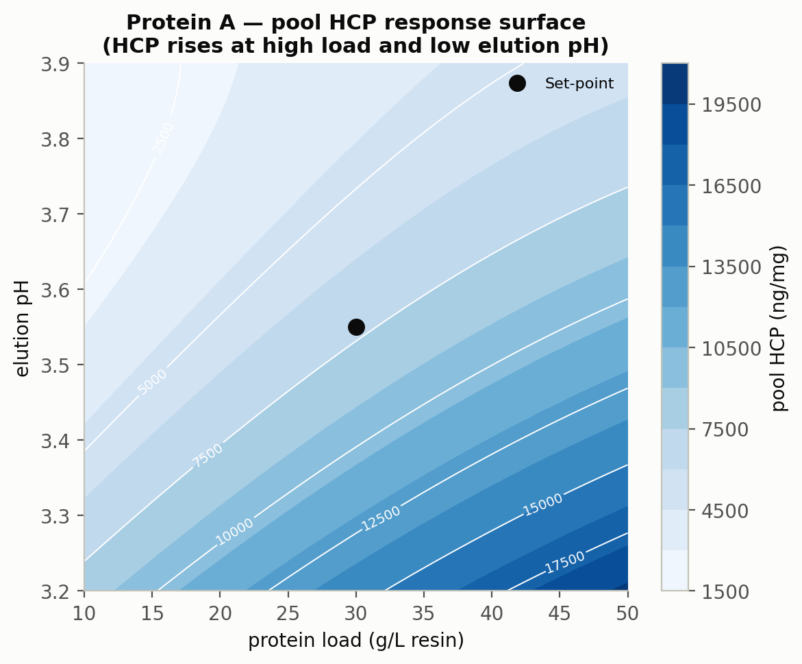
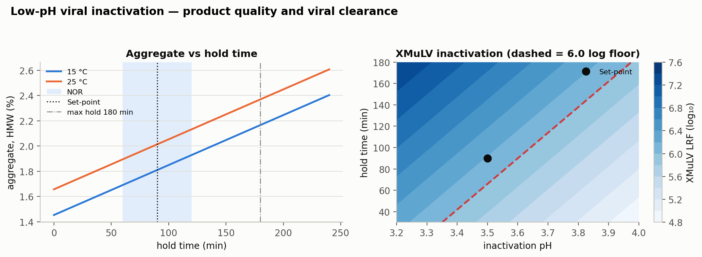
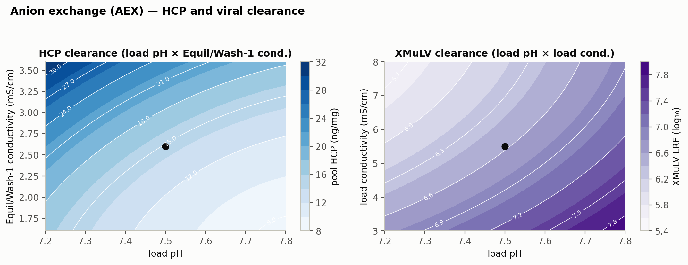
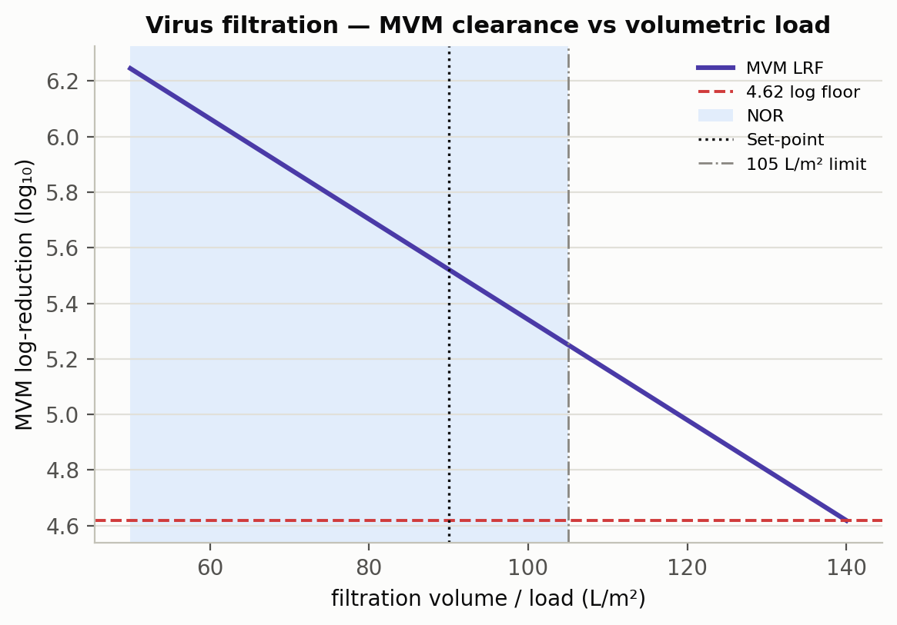

```{python}
#| tags: [setup]
import os, sys, json
import numpy as np
import pandas as pd
sys.path.insert(0, os.path.abspath(".."))
from amab_process import load_config
from amab_process import studies as st

CFG = load_config()
DATA = os.path.join("..", "outputs", "data")
FIG  = "../outputs/figures"

def csv(name): return pd.read_csv(os.path.join(DATA, name))
V = json.load(open(os.path.join("..", "outputs", "report_values.json")))

param_reg = csv("parameter_classification.csv")
cqa_reg   = csv("cqa_register.csv")
cap       = csv("capability.csv")
ppq       = csv("ppq_batches.csv")
vclear    = csv("viral_clearance.csv")

def pct(x): return f"{100*x:.1f}%"

def show(df, floatfmt=None):
    """Emit a DataFrame as a GitHub markdown table (rendered by Quarto to docx/pdf)."""
    print(df.to_markdown(index=False, floatfmt=floatfmt or ".3g"))

def step_params(key, cols=None):
    uo = CFG.unit_op(key)
    d = param_reg[param_reg.unit_operation == uo.name].copy()
    d["NOR"] = d.apply(lambda r: f"{r.nor_low:g}–{r.nor_high:g}", axis=1)
    d["PAR"] = d.apply(lambda r: f"{r.par_low:g}–{r.par_high:g}", axis=1)
    d = d.rename(columns={"parameter": "Parameter", "unit": "Unit", "setpoint": "Set-point",
                          "classification": "Class", "study": "Study"})
    return d[["Parameter", "Unit", "Set-point", "NOR", "PAR", "Class", "Study"]]

def top_effects(key, response, n=6):
    e = csv(f"effects_{key}.csv")
    e = e[e.response == response].copy().head(n)
    e["term"] = e["term"].str.replace(":", " × ", regex=False)
    e["signif."] = np.where(e.p_value < 0.05, "yes", "")
    out = e[["term", "effect", "p_value", "signif."]].rename(
        columns={"term": "Term", "effect": "Effect", "p_value": "p-value"})
    return out
```



# Executive summary {.unnumbered}

This report documents the process characterization (Stage 1, Process Design) of the
A-Mab drug-substance manufacturing process, a humanized IgG1 monoclonal antibody whose
principal mechanism of action is antibody-dependent cell-mediated cytotoxicity (ADCC).
The work follows the lifecycle approach to process validation of the FDA 2011 guidance,
PDA Technical Report 60 [@pdatr60] and the ISPE Good Practice Guide [@ispegpg2023],
and applies the Quality-by-Design principles of ICH Q8, Q9 and Q11
[@ichq8; @ichq9; @ichq11]. The methodology and quality-attribute framework are those of
the A-Mab case study [@amab2009].

Eight unit operations were modelled and characterized — production bioreactor, harvest,
Protein A capture, low-pH viral inactivation, cation-exchange (CEX) and anion-exchange
(AEX) chromatography, small-virus retentive filtration, and ultrafiltration/diafiltration
(UF/DF). Scale-down models were used to execute screening and response-surface designs
of experiments (DoE) that relate process parameters to critical quality attributes
(CQAs) and to define proven acceptable ranges (PARs), design spaces and the control
strategy.

```{python}
#| output: asis
n_cpp = V["n_cpp"]; n_par = V["n_parameters"]
cc = V["param_class_counts"]
print(f"""
**Key outcomes**

- **{n_par} process parameters** were classified. **{n_cpp}** are critical
  (CPP or well-controlled CPP, WC-CPP); the remainder are key (KPP) or general (GPP)
  process parameters.
- All drug-substance CQAs meet their acceptance criteria at set-point, and a
  Monte-Carlo simulation of **{V['n_monte_carlo']:,} commercial-scale batches**
  gives a minimum process-capability index of **Cpk = {V['min_cpk']}** across all CQAs.
- Cumulative viral clearance is **{V['total_lrv_xmulv']} log₁₀ (XMuLV, requirement > 16.7)**
  and **{V['total_lrv_mvm']} log₁₀ (MVM, requirement > 8.6)**.
- Overall product step-yield is **{pct(V['overall_yield'])}**, giving
  **{V['ds_mass_kg']} kg** of drug substance per {V['commercial_scale_l']:,} L batch
  at {V['ds_conc_g_per_l']} g/L.
- The accompanying post-characterization FMEA shows the median risk priority number
  falling by ~85% once the characterized ranges and control strategy are in place —
  the quantitative demonstration of enhanced process understanding.
""")
```

The process is demonstrated to be well understood and robust, and is considered ready to
proceed to Stage 2 (Process Performance Qualification).



# Purpose and scope

**Purpose.** This report is the Process Design Report for A-Mab drug substance as
defined in PDA TR 60 §3.11 [@pdatr60]. It consolidates the critical quality attributes
and their supporting risk assessments, the process description and parameter ranges, the
classification of each parameter for its risk of impact to CQAs and process performance,
the design spaces established by multivariate experimentation, and the justification and
data supporting every parameter range. It is the repository that links the risk
assessments, characterization studies and control strategy, and it provides the
justification for the Stage 2 (PPQ) ranges and acceptance criteria.

**Scope.** The drug-substance process, Steps 3–10 (production bioreactor through UF/DF),
operated at the `{python} f"{V['commercial_scale_l']:,}"`-L commercial scale. Seed-train expansion
(Steps 1–2) is addressed only where it was shown capable of affecting the production
bioreactor (Section 4). UF/DF is included for mass balance; its formulation
characterization is reported separately with the drug product. Analytical method
validation, facility/equipment qualification and drug-product processing are out of
scope.

**Raw materials and critical material attributes (CMAs).** Consistent with the A-Mab
platform approach, raw-material and cell-culture-medium attributes are controlled to
established platform specifications and are treated as identity/quality-controlled
inputs rather than characterized variables in this study; where a material attribute was
a potential CQA driver (e.g. medium concentration) it was included in the bioreactor
characterization (Section 6.1). Formal CMA characterization and supplier controls are
managed under the raw-material control programme and are out of scope of this report.

**Basis.** The process model, quality-attribute framework and risk methodology follow
the A-Mab case study [@amab2009]; the report structure and statistical approach follow
PDA TR 60 [@pdatr60] and the ISPE Good Practice Guide [@ispegpg2023]; the QbD framework
follows ICH Q8/Q9/Q11 [@ichq8; @ichq9; @ichq11].

# Product and process background

## Quality target product profile (QTPP)

```{python}
#| output: asis
qtpp = pd.DataFrame([
 ["Dosage form", "Sterile liquid for intravenous infusion"],
 ["Drug substance", f"Humanized IgG1 mAb, {V['ds_conc_g_per_l']} g/L, iso-osmolar formulation"],
 ["Mechanism of action", "Antibody-dependent cell-mediated cytotoxicity (ADCC); CDC contributory"],
 ["Manufacturing scale", f"{V['commercial_scale_l']:,} L fed-batch production bioreactor"],
 ["Purity / safety", "Aggregates, HCP, DNA, leached Protein A within acceptance; validated viral clearance"],
 ["Potency", "ADCC 70–130% of reference; governed by Fc glycosylation"],
], columns=["Attribute", "Target"])
show(qtpp)
```

: Quality target product profile for A-Mab. {#tbl-qtpp}

## Process description and flow

The A-Mab drug substance is produced by a platform monoclonal-antibody process
(@fig-flow). Product quality is established in the production bioreactor
(glycosylation, charge variants and the initial size-variant and impurity load) and is
subsequently purified: Protein A captures the antibody and clears the bulk of host-cell
protein (HCP) and DNA; low-pH viral inactivation provides enveloped-virus safety; CEX is
the principal aggregate- and HCP-polishing step; AEX in flow-through mode removes
residual HCP, DNA and leached Protein A and provides an orthogonal viral-clearance claim;
small-virus retentive filtration provides a size-based, modular viral-clearance claim;
and UF/DF concentrates and formulates the drug substance.

{#fig-flow width=100%}

## Process description, in-process controls and outputs

Each unit operation is summarized in @tbl-desc (mode/scale, estimated step yield and the
principal hold time/condition). The inputs to each step are the process parameters and
their ranges (Section 6); the step *outputs* — in-process tests, limits and in-process
specifications — are given in @tbl-ipc. Final drug-substance acceptance criteria and the
statistically-justified PPQ sampling plans are established in Stage 2 (Section 8).

```{python}
#| output: asis
yw = csv("yield_waterfall.csv").sort_values("step")
desc = {
 3:  ("Fed-batch cell culture, 15,000 L", "15–19 day culture; harvest on viability/titer/quality"),
 4:  ("Centrifugation + depth/sterile filtration", "≤ 24 h post-harvest hold, 2–8 °C"),
 5:  ("Protein A affinity, bind–elute, multi-cycle", "Low-pH eluate held for viral inactivation"),
 6:  ("Low-pH batch incubation", "pH 3.5, 60–120 min, 15–25 °C"),
 7:  ("Cation exchange, bind–elute", "Eluate pool hold ≤ 24 h, 2–8 °C"),
 8:  ("Anion exchange, flow-through", "Single-cycle flow-through"),
 9:  ("Small-virus retentive filtration", "Volumetric load ≤ 105 L/m²"),
 10: ("Ultrafiltration/diafiltration (TFF)", "Formulate to 75 g/L; DS hold 2–8 °C"),
}
rows = [[int(r.step), r.unit_operation.split(" (")[0], desc[r.step][0],
         f"{r.step_yield*100:.0f}%", desc[r.step][1]] for _, r in yw.iterrows()]
show(pd.DataFrame(rows, columns=["Step", "Unit operation", "Mode / scale",
                                 "Est. step yield", "Principal hold / condition"]))
```

: Process description and estimated per-step performance. {#tbl-desc}

```{python}
#| output: asis
ipc = pd.DataFrame([
 ["Production Bioreactor", "Culture viability & titer at harvest", "Harvest criteria on viability, titer and quality"],
 ["Harvest", "Post-clarification turbidity; bioburden", "Turbidity trended; bioburden action limit per programme"],
 ["Protein A", "Step yield (A280); pool HCP (trend)", "Yield ≥ 75%; HCP trended"],
 ["Low-pH Viral Inactivation", "Inactivation pH; hold time", "pH 3.4–3.6; hold ≥ 60 min (action)"],
 ["Low-pH Viral Inactivation", "Pool aggregate (SEC)", "≤ 3.1% (action)"],
 ["CEX", "Step yield; pool aggregate (SEC)", "Yield ≥ target; aggregate ≤ release-linked limit"],
 ["AEX", "Eluate endotoxin", "Alert ≥ 5 EU/mL; action ≥ 10 EU/mL"],
 ["AEX", "Eluate bioburden", "Alert ≥ 10 CFU/10 mL; action ≥ 50 CFU/10 mL"],
 ["AEX", "Pool HCP; residual DNA", "HCP trended to release limit; DNA < LOQ"],
 ["Virus Filtration", "Pre/post-use filter integrity test; volumetric load", "Integrity test: pass; load ≤ 105 L/m²"],
 ["UF/DF", "Drug-substance concentration; endotoxin/bioburden", "70–80 g/L; per DS specification"],
], columns=["Unit operation", "In-process test / output", "Alert / action limit or in-process specification"])
show(ipc)
```

: In-process controls, tests and outputs by unit operation (representative alert/action limits; final specifications set in Stage 2). {#tbl-ipc}

# Critical quality attributes and criticality

CQAs were identified and their criticality assessed on a continuum (ICH Q9) using the
A-Mab Tool #1 risk score = Impact × Uncertainty, where impact is scored on
efficacy/biological activity, PK/PD, immunogenicity and safety, and uncertainty reflects
the strength of the supporting knowledge [@amab2009]. Attributes rated High (H) or Very
High (VH) are treated as *Critical*. @tbl-cqa summarizes the CQAs, their acceptance
criteria and criticality; @fig-flow indicates where each is set or controlled.

```{python}
#| output: asis
d = cqa_reg.copy()
d["Acceptance"] = d.apply(lambda r: f"{r.acc_low:g}–{r.acc_high:g} {r.unit}", axis=1)
d = d.rename(columns={"cqa": "CQA", "category": "Category", "criticality": "Criticality",
                      "tool1_score": "Tool#1 score", "set_by": "Set/controlled by"})
show(d[["CQA", "Category", "Acceptance", "Criticality", "Tool#1 score", "Set/controlled by"]])
```

: A-Mab critical quality attributes and criticality (Tool #1 = Impact × Uncertainty; H/VH = Critical). {#tbl-cqa}

The glycosylation attributes (afucosylation, high mannose, non-glycosylated heavy chain,
galactosylation) are the most critical because they govern ADCC and CDC potency; they are
determined in cell culture and are not modified by downstream processing. Aggregates and
HCP are managed by the purification train. Viral safety is assured by process design
(three orthogonal clearance steps) because it cannot be measured in the final product.

# Risk-assessment strategy

Process characterization was directed by a lifecycle of iterative quality risk
assessments (ICH Q9), consistent with A-Mab Risk Assessments #1–#4 [@amab2009] and the
Stage-1 risk flow of PDA TR 60 [@pdatr60]:

1. **Initial risk assessment (RA#1–#2)** — prior platform knowledge and early development
   experience prioritized the process steps and parameters carrying the greatest
   potential impact to CQAs, and set the characterization scope (which parameters, which
   ranges, which interactions).
2. **Process characterization** — screening DoE (two-level factorial / resolution-V
   fractional factorial) identified the significant parameters; response-surface designs
   (face-centred central-composite) quantified main effects, interactions and curvature
   and defined the design space.
3. **Post-characterization risk assessment (RA#3–#4)** — the study results re-scored the
   process risk and fixed the parameter classification and control strategy. This is the
   subject of the accompanying post-PC FMEA (RPN = Severity × Occurrence × Detection).
   **CPP status is set by the pre-control risk of impacting a CQA** — a parameter that
   affects a CQA with Severity ≥ 8 **or** an initial (pre-mitigation) RPN > 72 is a CPP.
   The control strategy then determines whether that CPP is a *well-controlled CPP*
   (WC-CPP, low risk of leaving the design space) or remains a CPP requiring the most
   stringent control. The *residual* RPN reflects the post-control Occurrence and
   Detection; a high-severity attribute retains an elevated residual RPN even when well
   controlled — which is precisely why it is designated (WC-)CPP and enhanced-controlled.

Parameter designations follow the A-Mab continuum: **CPP** (variability impacts a CQA;
high risk of leaving the design space), **WC-CPP** (impacts a CQA but well controlled,
low risk), **KPP** (impacts process performance/consistency, not product quality), and
**GPP** (general parameter, no meaningful impact over a wide range).

**Prior knowledge and manufacturing history.** The characterization ranges are supported
not only by the scale-down studies reported here but by prior platform knowledge from
related antibodies (X-Mab, Y-Mab, Z-Mab) and by A-Mab clinical and engineering
manufacturing experience — the basis for the CQA acceptance ranges (Section 3), the
modular viral-clearance claims (Sections 6.4, 6.6, 6.8) and the set-point selection. For
a regulatory filing this section would summarize the clinical, engineering and
process-evaluation batch history (batch records, campaign summaries and comparability
data) that corroborates each proven acceptable range; that history is referenced here and
maintained in the development report set.

# Scale-down model qualification

All characterization studies were performed on qualified scale-down models (SDMs): a 2 L
bioreactor for the production culture and bench-scale columns/devices for the downstream
steps, each operated at the commercial bed height, linear velocity and load/wash/elution
column-volumes (or membrane device equivalents). SDM qualification compared operational
parameters and, critically, the input and output quality attributes (titer, viability,
HCP, DNA, aggregate, charge and glycan profiles, and log-reduction values) against
at-scale reference data, confirming the models are representative and suitable to support
design-space and PAR claims [@pdatr60]. Viral-clearance claims additionally leverage the
A-Mab modular approach across related antibodies.

# Process characterization studies

Each unit operation was characterized against the CQAs and performance attributes it
affects. For each step the following subsections give the study design, the parameters
and ranges studied, the significant effects, the resulting design space, and the
parameter classification.

## Production bioreactor (Step 3)

The production bioreactor establishes the glycosylation, charge-variant and initial
size-variant/impurity profile of A-Mab and is the sole upstream step used to define the
upstream design space. A five-factor resolution-V screening design followed by a
face-centred central-composite response-surface design characterized culture pH,
temperature, dissolved CO₂, osmolality and culture duration (dissolved oxygen, inoculation
density, medium concentration and feed volume were assessed for process performance).

```{python}
#| output: asis
show(step_params("bioreactor"))
```

: Production-bioreactor process parameters, ranges and classification. {#tbl-br}

The nominal fed-batch profile (@fig-br-tc) reaches a peak viable cell density of
`{python} V['peak_vcd_e6']` ×10⁶ cells/mL and a harvest titer of
`{python} V['nominal_titer_g_per_l']` g/L at `{python} V['final_viability_pct']`% final
viability. Screening identified culture pH, temperature, CO₂, osmolality and duration as
significant for the glycosylation and charge-variant CQAs (@fig-br-pareto,
@tbl-br-eff); the response-surface model reproduces the multivariate, interacting
behaviour of the A-Mab design space [@amab2009].

{#fig-br-tc width=100%}

{#fig-br-pareto width=100%}

```{python}
#| output: asis
show(top_effects("bioreactor", "afucosylation", 6), floatfmt=".3g")
```

: Largest standardized effects on afucosylation (bioreactor screening DoE). {#tbl-br-eff}

Lower pH and lower temperature increase specific productivity, culture duration and
titer, with a modest increase in afucosylation and a decrease in galactosylation; extended
culture duration lowers afucosylation and galactosylation and raises the harvest HCP and
DNA load as viability declines. Within the characterized ranges all cell-culture CQAs
remain within acceptance simultaneously, defining a robust multivariate design space
(@fig-br-ds). Culture pH, temperature, CO₂, osmolality and duration are classified
**WC-CPP** (significant CQA effects, but reliably controlled within the design space);
dissolved oxygen, inoculation density and feed volume are **KPP**; medium concentration
is **GPP**.

{#fig-br-ds width=85%}

## Harvest and clarification (Step 4)

Harvest (centrifugation followed by depth and sterile filtration) clarifies the culture
and defines the feed to Protein A. No product-quality impact was demonstrated; the step
parameters (centrifugation g-force, depth-filter load, post-clarification turbidity) are
KPP/GPP controlled for process performance and feed consistency [@amab2009].

## Protein A affinity chromatography (Step 5)

Protein A captures the antibody and clears the bulk of HCP and DNA. A six-factor
resolution-IV screening design and a response-surface design characterized protein load,
elution pH, load flow rate and end-of-pool collection.

```{python}
#| output: asis
show(step_params("protein_a"))
```

: Protein A process parameters, ranges and classification. {#tbl-pa}

Pool HCP is the quality-determining response: it increases with higher protein load and
lower elution pH (@fig-pa), reproducing A-Mab Figure 4.2, while remaining well below the
levels the CEX and AEX steps subsequently clear. Load flow rate and end-of-pool collection
affect product yield (high load × high flow reduces recovery) but not quality. Protein
load and elution pH are therefore **WC-CPP** (impact HCP, controlled within the design
space); flow rate and end-collection are **KPP**; the remaining parameters are **GPP**.

{#fig-pa width=70%}

## Low-pH viral inactivation (Step 6)

Low-pH incubation inactivates enveloped virus (XMuLV). pH, hold time, temperature and
protein concentration were characterized against XMuLV log-reduction and product quality
(aggregation).

```{python}
#| output: asis
show(step_params("viral_inactivation"))
```

: Low-pH viral inactivation process parameters, ranges and classification. {#tbl-vi}

pH is the defining parameter: above pH 4.0 inactivation of XMuLV within the hold is not
assured, while below pH 3.2 the antibody may aggregate or precipitate — a narrow,
high-consequence range that makes pH a **CPP**. Aggregate increases modestly with hold
time and temperature (@fig-vi, left) but remains below acceptance across the range, and is
further polished by CEX; the XMuLV log-reduction surface (@fig-vi, right) exceeds the
required clearance throughout the acceptable pH × time region. Hold time and temperature
are **WC-CPP**; protein concentration (≤ 35 g/L) is **GPP**.

{#fig-vi width=100%}

## Cation exchange chromatography — CEX (Step 7)

CEX operates in bind-and-elute mode and is the principal aggregate-polishing step; it also
reduces HCP and clears DNA and leached Protein A. A fractional-factorial screen and a
response-surface design characterized protein load, load/wash conductivity, elution pH and
elution stop-collect.

```{python}
#| output: asis
show(step_params("cex"))
```

: CEX process parameters, ranges and classification. {#tbl-cex}

Aggregate clearance (2–3×) weakens at higher protein load and wider elution stop-collect,
and HCP clearance (50–100×) weakens at higher load and lower load/wash conductivity, with
a significant load × conductivity interaction (@fig-cex). Because there is no downstream
aggregate-reduction step, a worst-case aggregate feed (linked to the low-pH hold) confirmed
that CEX reduces aggregate below acceptance across all conditions. Protein load, load/wash
conductivity, elution pH and stop-collect are **WC-CPP**; elution flow rate is **GPP**.

{#fig-cex width=100%}

## Anion exchange chromatography — AEX (Step 8)

AEX operates in flow-through mode: the antibody passes through while HCP, DNA, leached
Protein A and endotoxin bind. AEX also provides an orthogonal viral-clearance claim
(XMuLV and MVM). Load pH, Equilibration/Wash-1 conductivity, load conductivity and protein
load were characterized.

```{python}
#| output: asis
show(step_params("aex"))
```

: AEX process parameters, ranges and classification. {#tbl-aex}

HCP removal and viral clearance both decline as load pH decreases and conductivity
increases (@fig-aex); the quality design space (pH 7.2–7.8, Equil/Wash-1 conductivity
1.6–3.6 mS/cm) is narrower than the validated viral-clearance ranges, so operation is
constrained by the quality requirement. Load pH, both conductivities, protein load and
flow rate are **WC-CPP**.

{#fig-aex width=100%}

## Small-virus retentive filtration (Step 9)

Size-based filtration provides an orthogonal, modular clearance claim for small
non-enveloped virus (MVM) and larger enveloped virus (XMuLV). MVM log-reduction declines
with volumetric load; a load limit of 105 L/m² preserves LRV ≥ 4.62 (@fig-vf). Filtration
volume and pressure are **WC-CPP**; the pre/post-use integrity test is a procedural
control.

{#fig-vf width=70%}

## Ultrafiltration / diafiltration (Step 10)

UF/DF concentrates and buffer-exchanges the antibody to the drug-substance target of
`{python} V['ds_conc_g_per_l']` g/L. Consistent with the A-Mab case study, formulation
characterization is reported with the drug product; the step is included here for mass
balance only, and its parameters (diavolumes, transmembrane pressure, final concentration)
are controlled as KPP.

# Parameter classification summary

Across the drug-substance train, `{python} V['n_parameters']` process parameters were
classified (@fig-class, @tbl-class). `{python} V['n_cpp']` are critical (CPP or WC-CPP),
concentrated in the bioreactor (glycosylation and charge control), the chromatography
steps (aggregate and HCP control) and the viral-safety steps.

{#fig-class width=90%}

```{python}
#| output: asis
cc = param_reg["classification"].value_counts()
rows = [[c, int(cc.get(c, 0))] for c in ["CPP", "WC-CPP", "KPP", "GPP", "non-CPP"] if c in cc.index]
rows.append(["Total", int(len(param_reg))])
show(pd.DataFrame(rows, columns=["Classification", "Number of parameters"]))
```

: Process-parameter classification summary. {#tbl-class}

The complete post-characterization FMEA — one row per parameter with failure mode,
severity/occurrence/detection scores, RPN before and after characterization, designation,
control strategy and residual risk — is provided as the accompanying workbook,
*A-Mab_Post-PC_Process_Risk_Assessment.xlsx*.

# Process capability and Stage-2 readiness

A Monte-Carlo simulation of `{python} f"{V['n_monte_carlo']:,}"` commercial-scale batches,
with every parameter varied within its normal operating range, was used to estimate the
drug-substance quality distribution and process capability (@fig-cap, @tbl-cap). Capability
is evaluated one-sided for impurities (upper limit) and for viral clearance (lower
requirement), and two-sided for target-range attributes.

{#fig-cap width=100%}

```{python}
#| output: asis
d = cap.copy()
d["Acceptance"] = d.apply(lambda r: f"{r.acc_low:g}–{r.acc_high:g}", axis=1)
d["Mean ± SD"] = d.apply(lambda r: f"{r['mean']:.3g} ± {r['sd']:.2g}", axis=1)
d = d.rename(columns={"cqa": "CQA", "criticality": "Crit.", "spec_type": "Spec"})
show(d[["CQA", "Crit.", "Spec", "Acceptance", "Mean ± SD", "Cpk"]], floatfmt=".2f")
```

: Commercial-scale process capability by CQA (n = simulated batches). {#tbl-cap}

The minimum capability across all CQAs is **Cpk = `{python} V['min_cpk']`**
(`{python} "all CQAs ≥ 1.33" if V['all_cpk_ge_1_33'] else "acidic variants and viral clearance are the tightest"`).
A representative PPQ campaign of `{python} V['n_ppq']` batches (@tbl-ppq) meets all
acceptance criteria.

```{python}
#| output: asis
d = ppq[["batch", "overall_yield", "afucosylation", "galactosylation", "aggregates_hmw",
         "hcp", "lrv_xmulv", "lrv_mvm"]].copy()
d = d.rename(columns={"batch": "Batch", "overall_yield": "Yield", "afucosylation": "aFuc %",
                      "galactosylation": "Gal %", "aggregates_hmw": "HMW %", "hcp": "HCP (ng/mg)",
                      "lrv_xmulv": "XMuLV LRV", "lrv_mvm": "MVM LRV"})
show(d, floatfmt=".3g")
```

: Representative PPQ-campaign drug-substance results. {#tbl-ppq}

Viral clearance is delivered by three orthogonal steps (@fig-vc, @tbl-vc): cumulative
clearance of **`{python} V['total_lrv_xmulv']` log₁₀ (XMuLV)** and
**`{python} V['total_lrv_mvm']` log₁₀ (MVM)** exceeds the requirements of > 16.7 and > 8.6
with margin. Product step-yield across the train is **`{python} pct(V['overall_yield'])`**
(@fig-yield).

{#fig-vc width=100%}

```{python}
#| output: asis
show(vclear.rename(columns={"step": "Step"}), floatfmt=".2f")
```

: Viral log-reduction by step and cumulative total. {#tbl-vc}

{#fig-yield width=85%}

# Control strategy

The control strategy is the sum of the individual CQA control strategies (ICH Q10),
built from the characterization understanding above. Each CQA is controlled by a defined
combination of input-material controls, procedural controls, process-parameter set-points
and proven acceptable ranges, in-process controls and release testing (@tbl-cs). Glycan
CQAs are controlled predominantly at the bioreactor; aggregate at CEX (with the low-pH
hold bounded); HCP across Protein A, CEX and AEX; and viral safety by three orthogonal
clearance steps plus the low-pH inactivation.

```{python}
#| output: asis
cs = pd.DataFrame([
 ["Afucosylation / high mannose / galactosylation", "Bioreactor pH, temperature, CO₂, osmolality, duration (design space)", "Released glycan map; in-process culture control"],
 ["Aggregates (HMW)", "CEX (load, conductivity, elution pH, stop-collect); low-pH hold bounded", "SEC at CEX pool and release"],
 ["Acidic charge variants", "Bioreactor set-points; CEX/AEX collection", "Charge-variant assay at release"],
 ["Host cell protein (HCP)", "Protein A (load, elution pH); CEX; AEX (load pH, conductivity)", "HCP ELISA at AEX pool and release"],
 ["Residual DNA", "Protein A + AEX clearance (modular)", "qPCR at release"],
 ["Leached Protein A", "CEX + AEX clearance", "Leached Protein A assay at release"],
 ["Viral safety (XMuLV / MVM)", "Low-pH inactivation; AEX; virus filtration (validated ranges)", "Validated clearance; in-process bioburden/endotoxin"],
], columns=["CQA", "Principal process controls", "Testing"])
show(cs)
```

: Overall control strategy — principal controls per CQA. {#tbl-cs}

# Conclusions and readiness for Stage 2

The A-Mab drug-substance process is well understood and robust:

- Every CQA meets its acceptance criterion at set-point, with a minimum capability of
  **Cpk = `{python} V['min_cpk']`** across `{python} f"{V['n_monte_carlo']:,}"` simulated
  commercial batches.
- The relationships between process parameters and CQAs are quantified by DoE, design
  spaces are established for the bioreactor and the chromatography and viral-safety steps,
  and every parameter range is justified by data.
- `{python} V['n_parameters']` parameters are classified; `{python} V['n_cpp']` are
  critical (CPP/WC-CPP) with a defined control strategy, and the post-characterization
  FMEA shows the median risk priority number falling by ~85% relative to the initial
  assessment.
- Viral clearance exceeds requirements with margin
  (`{python} V['total_lrv_xmulv']` / `{python} V['total_lrv_mvm']` log₁₀ for XMuLV/MVM).

The process design (Stage 1) is complete. The characterized ranges, design spaces and
control strategy provide the basis for the Stage 2 Process Performance Qualification
protocol, acceptance criteria and sampling plans. The process is recommended for
progression to PPQ.

# Reproducibility {.unnumbered}

Every figure, table and number in this report is generated from a seeded process model
(master seed `{python} V['seed']`). The report is regenerated end-to-end with
`make all` (see the repository README): the model produces the datasets
(`outputs/data/`) and figures (`outputs/figures/`), and Quarto renders this document to
Word and PDF from the same sources.

# References {.unnumbered}

::: {#refs}
:::
